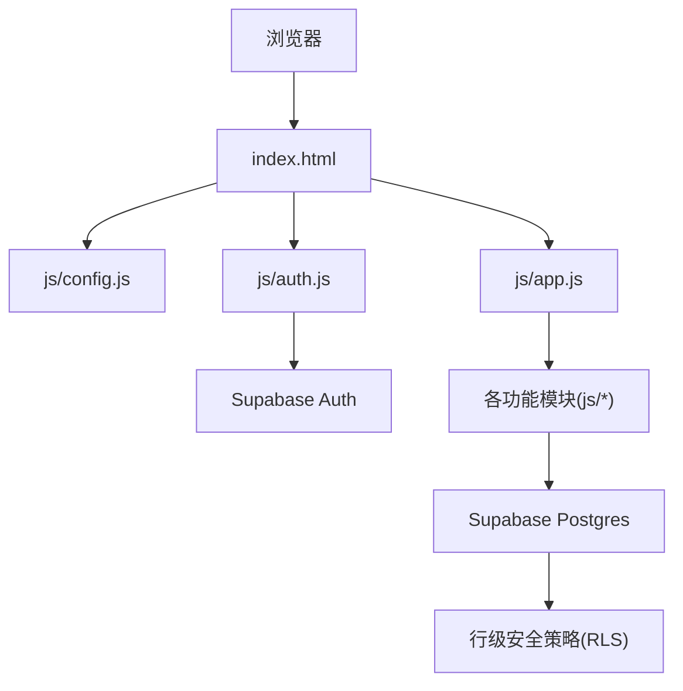
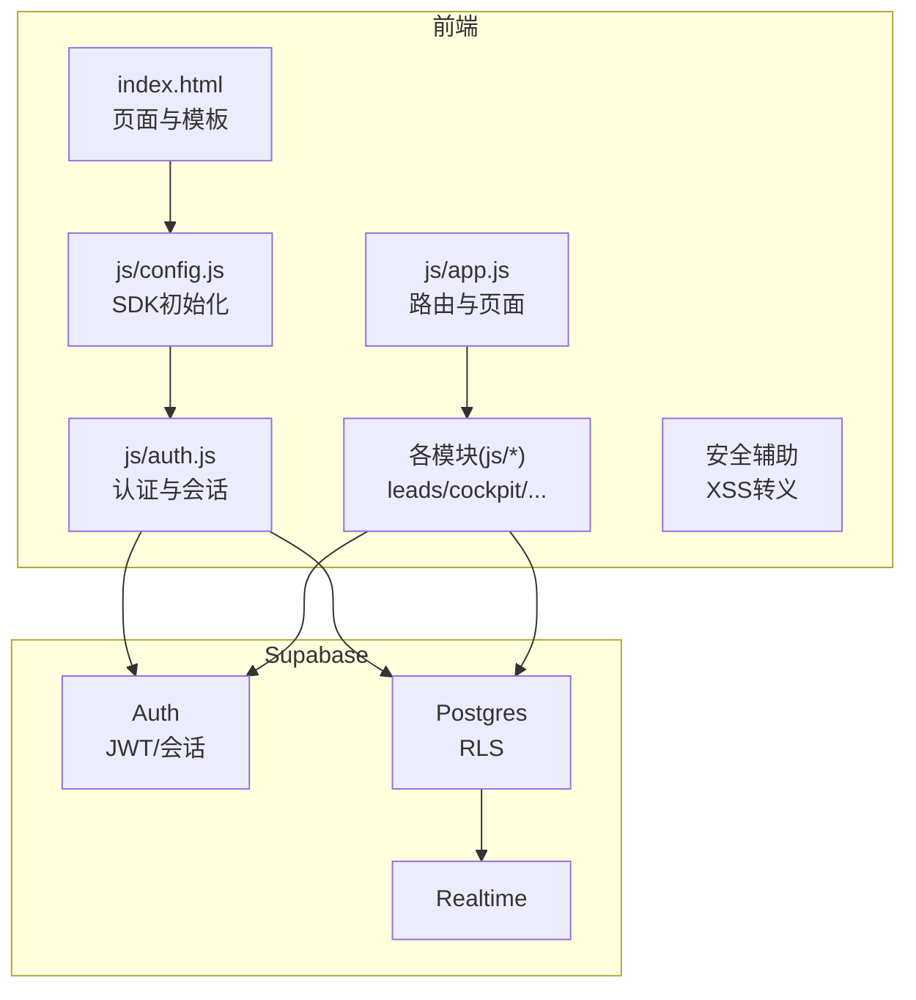
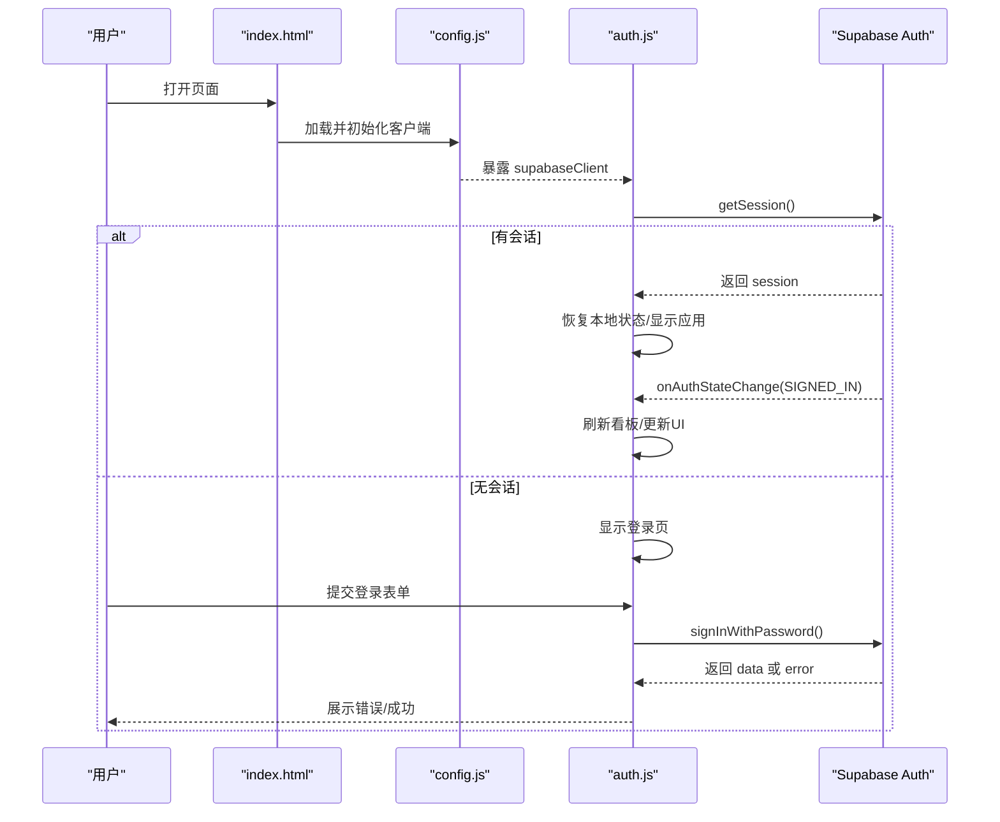
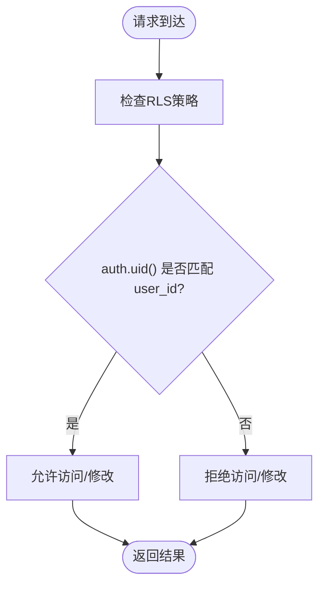
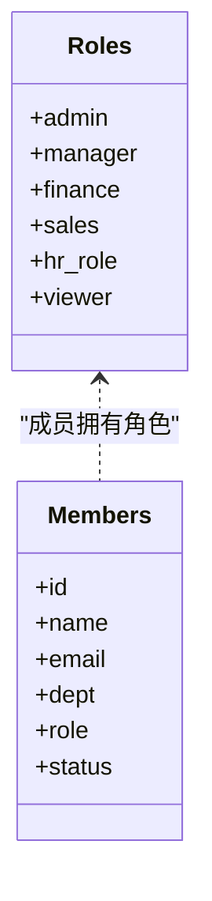
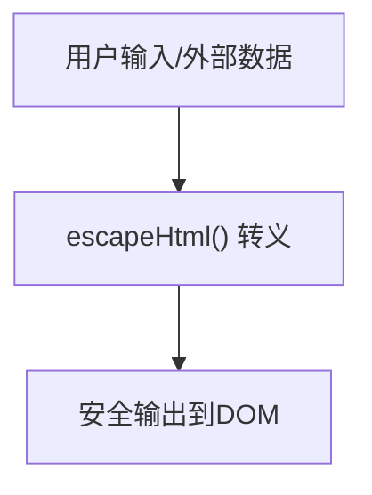
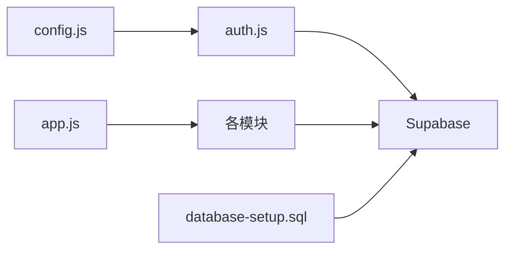
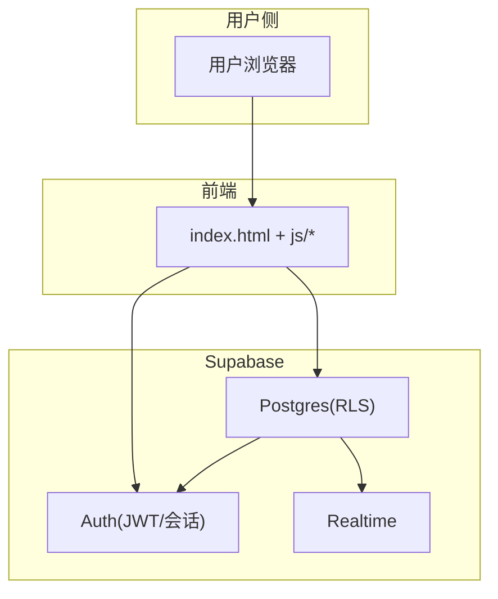

# 安全架构设计

<cite>
**本文引用的文件**
- [index.html](file://index.html)
- [README.md](file://README.md)
- [DEPLOY.md](file://DEPLOY.md)
- [database-setup.sql](file://database-setup.sql)
- [js/auth.js](file://js/auth.js)
- [js/config.js](file://js/config.js)
- [js/cloud-storage.js](file://js/cloud-storage.js)
- [js/system-permissions.js](file://js/system-permissions.js)
- [js/app.js](file://js/app.js)
- [js/leads.js](file://js/leads.js)
- [js/cockpit.js](file://js/cockpit.js)
- [js/home.js](file://js/home.js)
- [js/mt-core.js](file://js/mt-core.js)
</cite>

## 目录
1. [引言](#引言)
2. [项目结构](#项目结构)
3. [核心组件](#核心组件)
4. [架构总览](#架构总览)
5. [详细组件分析](#详细组件分析)
6. [依赖关系分析](#依赖关系分析)
7. [性能考量](#性能考量)
8. [故障排查指南](#故障排查指南)
9. [结论](#结论)
10. [附录](#附录)

## 引言
本文件面向“陈苗系统”的安全架构，围绕基于 Supabase Auth 的用户认证与授权、JWT 令牌管理、会话状态维护、权限控制系统、行级安全策略（RLS）实现、密码加密存储、CSRF/XSS 防护、安全配置最佳实践、审计日志与异常安全处理等主题进行系统化梳理，并提供安全架构图与威胁模型分析，帮助读者全面理解系统的安全边界与风险控制点。

## 项目结构
项目采用前端单页应用（SPA）架构，结合 Supabase 提供的认证与数据库能力：
- 前端入口与模板：index.html
- 认证与配置：js/auth.js、js/config.js
- 数据库初始化与 RLS：database-setup.sql
- 系统管理与权限：js/system-permissions.js
- 应用路由与页面切换：js/app.js
- 安全辅助（XSS 转义）：js/leads.js、js/cockpit.js、js/home.js、js/mt-core.js
- 云存储占位：js/cloud-storage.js

图表来源
- [index.html](file://index.html)
- [js/config.js](file://js/config.js)
- [js/auth.js](file://js/auth.js)
- [js/app.js](file://js/app.js)
- [database-setup.sql](file://database-setup.sql)

章节来源
- [index.html](file://index.html)
- [README.md](file://README.md)
- [DEPLOY.md](file://DEPLOY.md)

## 核心组件
- Supabase 配置与客户端初始化：负责建立与 Supabase 的连接，提供认证与数据库访问能力。
- 认证模块：封装登录、注册、登出、会话监听、本地会话恢复等逻辑。
- 数据库初始化与 RLS：启用行级安全策略，确保每条记录仅对所属用户可见。
- 权限管理：前端模拟的角色与权限体系，用于界面级权限控制与数据访问限制。
- 安全辅助：XSS 转义函数与安全输出策略，降低前端渲染风险。
- 云存储占位：为未来云端数据同步预留接口。

章节来源
- [js/config.js](file://js/config.js)
- [js/auth.js](file://js/auth.js)
- [database-setup.sql](file://database-setup.sql)
- [js/system-permissions.js](file://js/system-permissions.js)
- [js/leads.js](file://js/leads.js)
- [js/cockpit.js](file://js/cockpit.js)
- [js/home.js](file://js/home.js)
- [js/mt-core.js](file://js/mt-core.js)
- [js/cloud-storage.js](file://js/cloud-storage.js)

## 架构总览
系统采用“浏览器前端 + Supabase 后端”的云原生架构。Supabase 提供认证（JWT）、数据库（PostgreSQL）、对象存储与实时订阅等能力；前端通过 Supabase JS SDK 完成用户交互与数据访问。

图表来源
- [index.html](file://index.html)
- [js/config.js](file://js/config.js)
- [js/auth.js](file://js/auth.js)
- [js/app.js](file://js/app.js)
- [database-setup.sql](file://database-setup.sql)

## 详细组件分析

### 认证与会话管理（Supabase Auth）
- 初始化与本地会话恢复：优先从本地存储恢复会话，若不可用则查询 Supabase 当前会话，监听认证状态变化，自动切换登录/应用视图。
- 登录/注册/登出：通过 Supabase SDK 完成密码认证；注册成功后若无需邮箱验证则自动登录。
- 会话状态维护：监听 onAuthStateChange，登录后刷新看板，登出后清空本地状态并返回登录页。
- 本地模式降级：当 Supabase SDK 未加载时，进入本地模式，保留基础交互（演示用途）。

图表来源
- [js/auth.js](file://js/auth.js)
- [js/config.js](file://js/config.js)
- [index.html](file://index.html)

章节来源
- [js/auth.js](file://js/auth.js)
- [js/config.js](file://js/config.js)
- [index.html](file://index.html)

### 行级安全策略（RLS）
- 启用 RLS：对 customers、contracts、finances、invoices 四张核心表启用行级安全。
- 策略规则：FOR ALL USING(auth.uid() = user_id) 与 WITH CHECK(auth.uid() = user_id)，确保用户仅能访问/修改自己插入的数据。
- 索引优化：为 user_id 字段建立索引，保障查询性能。
- 触发器：统一更新 updated_at 字段，便于审计与排序。

图表来源
- [database-setup.sql](file://database-setup.sql)

章节来源
- [database-setup.sql](file://database-setup.sql)

### 权限控制系统（前端角色与权限）
- 角色定义：超级管理员、部门经理、财务人员、业务人员、人事专员、只读用户等，分别赋予不同模块访问权限。
- 成员管理：支持添加、编辑、启用/禁用成员，角色变更即时生效。
- 权限映射：权限标签与模块名称一一对应，便于界面级权限控制与导航显隐。
- 注意：当前为前端权限控制，不替代后端 RLS；生产环境建议结合后端 RBAC 与 Supabase Auth 的角色/声明使用。

图表来源
- [js/system-permissions.js](file://js/system-permissions.js)

章节来源
- [js/system-permissions.js](file://js/system-permissions.js)

### 密码加密存储与传输
- 传输加密：部署于 Vercel，通过 HTTPS 传输，满足最小可用性要求。
- 存储加密：Supabase 使用 PostgreSQL 存储用户凭证与业务数据，数据库层面具备加密能力；前端不直接接触明文密码。
- 最佳实践建议：启用 Supabase 的邮箱认证与邮箱验证开关，结合强口令策略与二次验证（TOTP）提升安全性。

章节来源
- [DEPLOY.md](file://DEPLOY.md)
- [README.md](file://README.md)

### CSRF 防护
- 当前实现：前端通过 Supabase SDK 发起请求，未显式使用 CSRF Token；Supabase Auth 默认使用 JWT 作为会话凭证，配合 HTTPS 与 SameSite Cookie 策略（由 Supabase 后端管理）。
- 建议：若引入自定义后端或第三方 API，务必在请求头中携带 CSRF Token 并在服务端校验；前端统一拦截器注入与服务端签名验证。

章节来源
- [js/auth.js](file://js/auth.js)
- [js/config.js](file://js/config.js)

### XSS 防护
- XSS 转义：多个模块提供 escapeHtml 函数，对用户输入与动态渲染内容进行 HTML 转义，避免脚本注入。
- 使用场景：线索管理、看板、首页公告等模块均采用转义输出。
- 建议：统一在模板渲染层引入白名单过滤或安全渲染库，确保新增模块遵循相同策略。

图表来源
- [js/leads.js](file://js/leads.js)
- [js/cockpit.js](file://js/cockpit.js)
- [js/home.js](file://js/home.js)
- [js/mt-core.js](file://js/mt-core.js)

章节来源
- [js/leads.js](file://js/leads.js)
- [js/cockpit.js](file://js/cockpit.js)
- [js/home.js](file://js/home.js)
- [js/mt-core.js](file://js/mt-core.js)

### 云存储与数据同步（占位）
- 当前状态：云存储模块为占位实现，isAvailable() 基于 supabaseClient 存在性判断。
- 建议：若启用云端同步，需在前端引入 Supabase Storage API，并在上传/下载路径上实施访问控制与鉴权；对敏感数据进行加密传输与存储。

章节来源
- [js/cloud-storage.js](file://js/cloud-storage.js)

### 审计日志与异常安全处理
- 审计日志：数据库层通过 updated_at 字段与触发器记录变更时间；建议在业务关键操作处增加审计事件（如登录、数据变更、权限变更），并记录用户标识、时间戳、IP（由 Supabase 提供）。
- 异常处理：认证模块对错误进行捕获与提示；前端 Toast 组件用于用户反馈；建议在生产环境接入统一错误上报与告警。

章节来源
- [database-setup.sql](file://database-setup.sql)
- [js/auth.js](file://js/auth.js)
- [js/leads.js](file://js/leads.js)

## 依赖关系分析
- js/auth.js 依赖 js/config.js 提供的 supabaseClient。
- js/app.js 负责页面路由与模块初始化，部分模块（如 cockpit、leads、multitable）在切换时销毁与重建。
- 数据访问通过 Supabase Postgres 与 RLS 控制，前端不直接操作数据库。
- 权限控制由前端角色体系与 RLS 共同实现，建议在后端补充 RBAC 与 Supabase Auth 的角色/声明。

图表来源
- [js/config.js](file://js/config.js)
- [js/auth.js](file://js/auth.js)
- [js/app.js](file://js/app.js)
- [database-setup.sql](file://database-setup.sql)

章节来源
- [js/config.js](file://js/config.js)
- [js/auth.js](file://js/auth.js)
- [js/app.js](file://js/app.js)
- [database-setup.sql](file://database-setup.sql)

## 性能考量
- RLS 查询：RLS 会增加查询开销，建议为 user_id 建立索引；对高频查询字段（如日期、类型）建立复合索引。
- 触发器：统一更新 updated_at 的触发器对写入性能有轻微影响，建议在高并发场景评估是否必要。
- 前端渲染：XSS 转义与大量 DOM 操作可能影响性能，建议采用虚拟滚动、分页与懒加载策略。

章节来源
- [database-setup.sql](file://database-setup.sql)
- [js/mt-core.js](file://js/mt-core.js)

## 故障排查指南
- 登录失败：检查 Supabase 凭据配置、网络连通性与浏览器控制台错误；确认邮箱验证开关与密码强度。
- 页面空白：检查 Supabase SDK 是否正确加载、config.js 是否被正确修改。
- 数据不可见：确认当前用户会话有效、RLS 策略未被误删、user_id 字段正确写入。
- 权限异常：核对前端角色与权限映射、模块访问控制逻辑。

章节来源
- [DEPLOY.md](file://DEPLOY.md)
- [js/auth.js](file://js/auth.js)
- [js/system-permissions.js](file://js/system-permissions.js)

## 结论
陈苗系统基于 Supabase 的认证与数据库能力构建，实现了用户会话管理、RLS 数据隔离与前端 XSS 防护。建议在生产环境中进一步完善：
- 后端 RBAC 与 Supabase Auth 角色/声明联动
- CSRF Token 与服务端签名验证
- 审计事件与异常上报
- 云存储访问控制与加密传输
- 强口令策略与二次验证（TOTP）

## 附录

### 安全架构图（概念）

[此图为概念示意，不直接映射具体源码文件]

### 威胁模型分析
- 内部威胁：前端角色体系可被绕过，RLS 为最终防线；建议引入后端 RBAC 与审计。
- 外部威胁：CSRF、XSS、中间人攻击；HTTPS 与 Supabase Auth 默认保护可缓解，建议补充 CSRF Token 与严格 CSP。
- 数据泄露：RLS 保证数据隔离，建议对敏感字段加密存储与传输。
- 会话劫持：依赖 Supabase Auth 的 JWT 与 HTTPS；建议启用更强的会话策略与二次验证。

[本节为概念性分析，不直接引用具体源码文件]