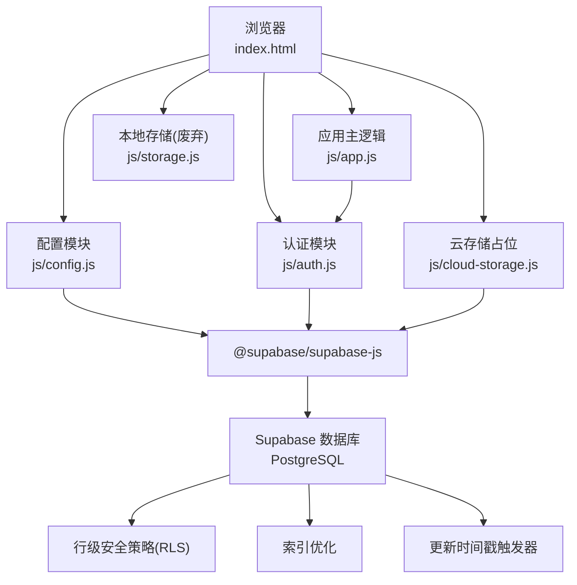
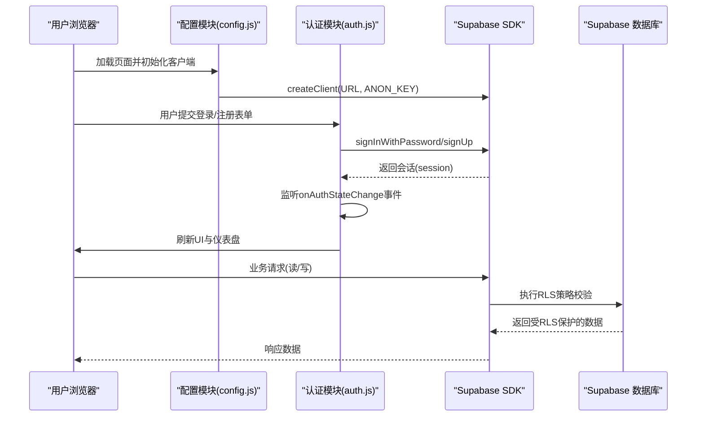
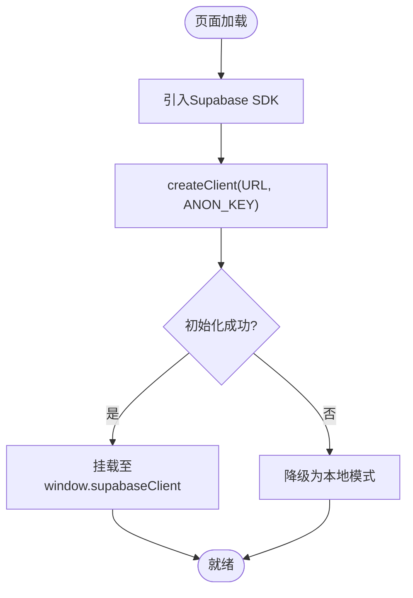
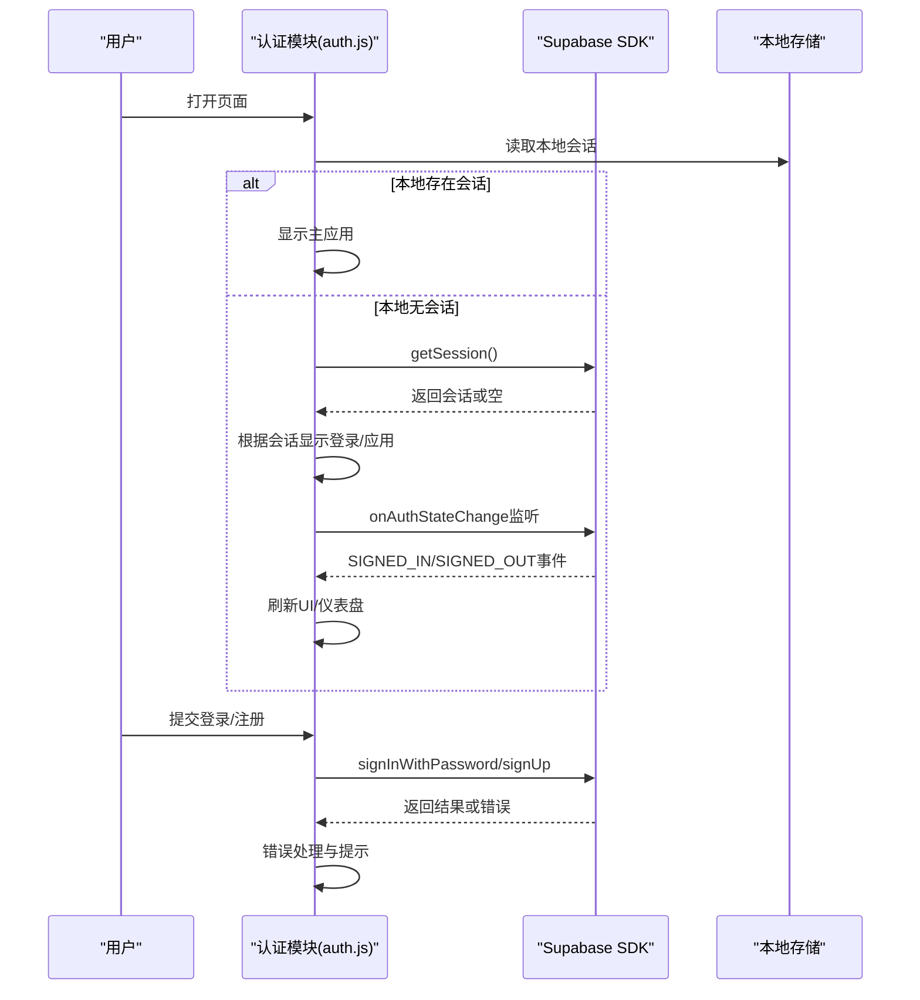
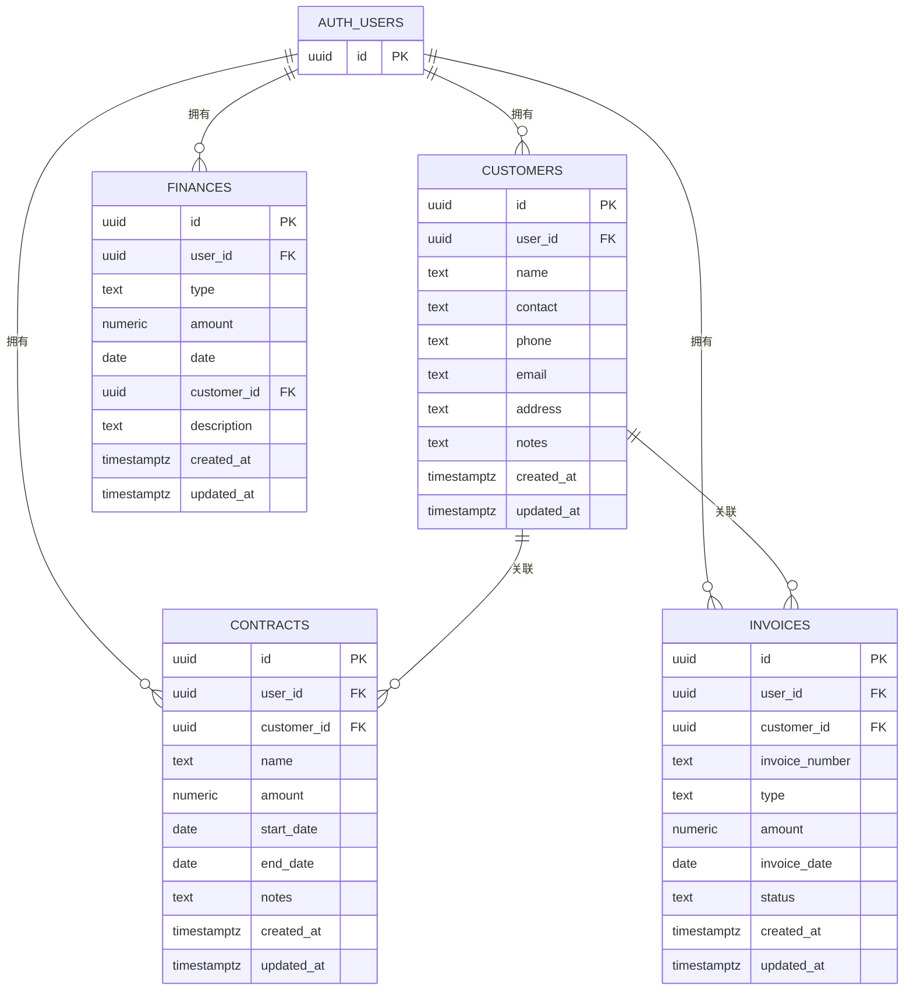
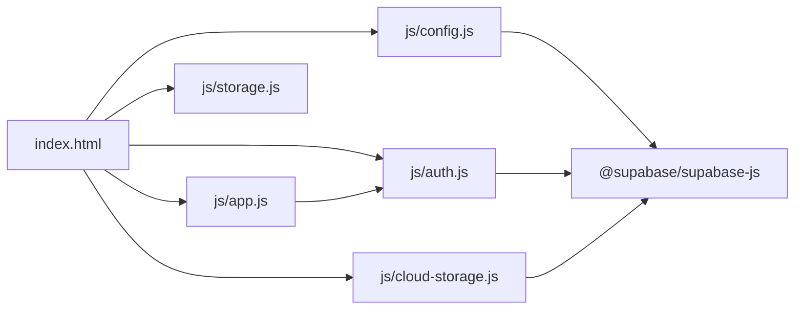

# 数据库集成架构

<cite>
**本文引用的文件**
- [README.md](file://README.md)
- [DEPLOY.md](file://DEPLOY.md)
- [database-setup.sql](file://database-setup.sql)
- [index.html](file://index.html)
- [js/config.js](file://js/config.js)
- [js/auth.js](file://js/auth.js)
- [js/cloud-storage.js](file://js/cloud-storage.js)
- [js/storage.js](file://js/storage.js)
- [js/app.js](file://js/app.js)
- [快速入门.md](file://快速入门.md)
</cite>

## 目录
1. [简介](#简介)
2. [项目结构](#项目结构)
3. [核心组件](#核心组件)
4. [架构总览](#架构总览)
5. [详细组件分析](#详细组件分析)
6. [依赖关系分析](#依赖关系分析)
7. [性能考虑](#性能考虑)
8. [故障排查指南](#故障排查指南)
9. [结论](#结论)
10. [附录](#附录)

## 简介
本文件面向陈苗系统的数据库集成架构，聚焦Supabase云数据库的集成方式与实现细节。内容覆盖：
- Supabase客户端初始化与连接配置
- 认证服务集成与会话管理
- 行级安全策略(RLS)的实现原理与配置
- 数据库操作封装与错误处理策略
- 查询优化与索引设计
- 数据流与事务处理机制
- 数据库架构图与API调用流程图

## 项目结构
系统采用前后端分离的静态站点架构，前端通过Supabase JS SDK与后端数据库进行交互；认证由Supabase Auth统一管理；数据库初始化脚本负责创建表结构、索引、RLS策略与触发器。

**图表来源**
- [index.html:11-12](file://index.html#L11-L12)
- [js/config.js:8-19](file://js/config.js#L8-L19)
- [js/auth.js:24-53](file://js/auth.js#L24-L53)
- [js/cloud-storage.js:4-8](file://js/cloud-storage.js#L4-L8)
- [database-setup.sql:66-140](file://database-setup.sql#L66-L140)

**章节来源**
- [README.md:48-65](file://README.md#L48-L65)
- [DEPLOY.md:3-7](file://DEPLOY.md#L3-L7)
- [index.html:11-12](file://index.html#L11-L12)

## 核心组件
- Supabase客户端初始化与连接
  - 在页面加载时引入Supabase SDK，并基于配置参数创建客户端实例，挂载至全局对象以便各模块复用。
  - 若SDK未加载或初始化失败，系统降级为“本地模式”，避免阻断功能。
- 认证服务集成
  - 使用Supabase Auth进行会话管理，监听认证状态变化，自动刷新UI与仪表盘。
  - 提供登录、注册、登出接口，并对错误进行统一处理。
- 数据库操作封装
  - 当前项目中，数据库操作主要通过Supabase SDK在各业务模块中调用；云存储模块目前为占位实现，未来将承载云端数据同步。
- 错误处理策略
  - 对认证初始化失败、登录/注册异常、登出异常等场景进行捕获与提示，保证用户体验与可观测性。
- 行级安全策略(RLS)
  - 通过PostgreSQL RLS策略强制实现“用户数据隔离”，确保每个用户仅能访问自身数据。
- 查询优化与索引
  - 针对常用查询字段建立索引，减少查询成本，提升响应速度。
- 触发器与时间戳
  - 通过触发器自动维护每张表的更新时间戳，简化业务逻辑。

**章节来源**
- [js/config.js:8-19](file://js/config.js#L8-L19)
- [js/auth.js:24-53](file://js/auth.js#L24-L53)
- [js/auth.js:57-82](file://js/auth.js#L57-L82)
- [js/cloud-storage.js:4-8](file://js/cloud-storage.js#L4-L8)
- [database-setup.sql:66-140](file://database-setup.sql#L66-L140)

## 架构总览
下图展示了从浏览器到Supabase数据库的整体数据流与交互路径，包括认证、数据读写与RLS生效的关键节点。

**图表来源**
- [index.html:11-12](file://index.html#L11-L12)
- [js/config.js:8-19](file://js/config.js#L8-L19)
- [js/auth.js:24-53](file://js/auth.js#L24-L53)
- [js/auth.js:57-82](file://js/auth.js#L57-L82)
- [database-setup.sql:78-107](file://database-setup.sql#L78-L107)

## 详细组件分析

### Supabase客户端初始化与连接
- 初始化时机：页面加载时引入Supabase SDK并在配置模块中创建客户端实例。
- 容错机制：若SDK未加载或初始化异常，系统记录警告并进入“本地模式”，避免阻断。
- 全局复用：客户端实例挂载至全局对象，供认证与业务模块共享使用。

**图表来源**
- [index.html:11-12](file://index.html#L11-L12)
- [js/config.js:8-19](file://js/config.js#L8-L19)

**章节来源**
- [js/config.js:8-19](file://js/config.js#L8-L19)

### 认证服务集成与会话管理
- 初始化流程：优先读取本地会话，若无则检查Supabase会话；监听认证状态变化，自动刷新UI。
- 登录/注册：调用Supabase Auth接口，对错误进行统一处理与提示。
- 登出：调用登出接口并清理本地状态。
- UI联动：登录成功后显示主应用并默认跳转首页；登出后回到登录页。

**图表来源**
- [js/auth.js:24-53](file://js/auth.js#L24-L53)
- [js/auth.js:57-82](file://js/auth.js#L57-L82)

**章节来源**
- [js/auth.js:24-53](file://js/auth.js#L24-L53)
- [js/auth.js:57-82](file://js/auth.js#L57-L82)

### 数据库操作封装与错误处理
- 当前实现：数据库操作通过Supabase SDK在各业务模块中直接调用；云存储模块为占位实现，尚未接入实际数据库读写。
- 错误处理：对认证初始化失败、登录/注册/登出异常进行捕获与提示；对网络异常与业务错误进行区分与反馈。
- 未来扩展：云存储模块将承担本地与云端数据的双向同步职责，需结合Supabase的实时订阅能力实现增量同步与冲突解决。

**章节来源**
- [js/cloud-storage.js:4-8](file://js/cloud-storage.js#L4-L8)
- [js/auth.js:132-136](file://js/auth.js#L132-L136)
- [js/auth.js:192-196](file://js/auth.js#L192-L196)

### 行级安全策略(RLS)实现原理与配置
- 设计目标：确保每个用户仅能访问自身数据，实现“数据完全隔离”。
- 实现方式：对四张核心表启用RLS，并为每张表创建“基于用户ID”的策略，限制所有操作的使用条件与检查条件。
- 生效机制：每次数据库读写请求均经过RLS策略校验，未满足条件的请求被拒绝。

**图表来源**
- [database-setup.sql:10-63](file://database-setup.sql#L10-L63)

**章节来源**
- [database-setup.sql:78-107](file://database-setup.sql#L78-L107)

### 查询优化与索引设计
- 索引策略：针对user_id、customer_id、type、date等高频过滤/排序字段建立索引，降低查询成本。
- 时间戳维护：通过触发器自动更新updated_at字段，便于按时间排序与审计追踪。

**章节来源**
- [database-setup.sql:66-75](file://database-setup.sql#L66-L75)
- [database-setup.sql:110-139](file://database-setup.sql#L110-L139)

### 事务处理机制
- 当前实现：数据库层面的事务由Supabase/PostgreSQL自动管理；应用层通过SDK的批量操作与错误回滚策略保障一致性。
- 未来扩展：在云存储模块中实现本地变更队列与云端批量同步，结合幂等写入与冲突检测，模拟事务语义。

**章节来源**
- [js/messages.js:44-60](file://js/messages.js#L44-L60)

## 依赖关系分析
- 外部依赖
  - @supabase/supabase-js：提供数据库读写、认证、实时订阅等能力。
  - Chart.js：用于数据看板的可视化展示。
- 内部依赖
  - config.js依赖window.supabase环境变量创建客户端。
  - auth.js依赖supabaseClient进行认证操作，并与UI模块协同。
  - cloud-storage.js作为云存储占位，未来将依赖supabaseClient进行数据同步。
  - app.js负责页面路由与模块初始化，间接依赖auth.js提供的用户状态。

**图表来源**
- [index.html:354-378](file://index.html#L354-L378)
- [js/config.js:8-19](file://js/config.js#L8-L19)
- [js/auth.js:24-53](file://js/auth.js#L24-L53)
- [js/cloud-storage.js:4-8](file://js/cloud-storage.js#L4-L8)

**章节来源**
- [index.html:354-378](file://index.html#L354-L378)

## 性能考虑
- 连接与初始化
  - 仅在页面加载时创建一次客户端实例，避免重复初始化带来的资源浪费。
  - 在SDK缺失时快速降级，保证首屏可用性。
- 查询优化
  - 为高频查询字段建立索引，减少全表扫描。
  - 合理使用LIMIT与分页，避免一次性返回大量数据。
- 缓存与离线
  - 本地存储用于演示与兼容，生产环境应以云端为主；未来可通过IndexedDB或Service Worker实现轻量缓存。
- 实时性
  - 当前未启用实时订阅；未来可结合Supabase Realtime实现增量同步与冲突解决。

## 故障排查指南
- 登录/注册失败
  - 检查config.js中的URL与ANON_KEY是否正确。
  - 查看浏览器控制台错误信息，确认Supabase SDK是否正常加载。
- 登录后页面空白
  - 确认认证初始化流程是否成功，检查onAuthStateChange事件是否触发。
- 数据无法保存或显示为空
  - 确认RLS策略是否生效，检查user_id是否与当前会话一致。
- 云存储功能异常
  - 当前云存储模块为占位实现，尚未接入数据库；请等待后续版本。

**章节来源**
- [js/config.js:8-19](file://js/config.js#L8-L19)
- [js/auth.js:50-53](file://js/auth.js#L50-L53)
- [js/auth.js:132-136](file://js/auth.js#L132-L136)
- [js/cloud-storage.js:4-8](file://js/cloud-storage.js#L4-L8)

## 结论
本项目基于Supabase实现了完整的云端数据库与认证集成，通过RLS确保数据隔离，通过索引与触发器提升性能与可维护性。当前认证与基础数据读写已具备完整闭环，云存储模块作为未来扩展点，将承载本地与云端数据的双向同步与实时能力。建议在后续版本中完善云存储模块、引入实时订阅与冲突解决机制，并持续优化查询性能与错误处理策略。

## 附录
- 快速开始与部署
  - 参考快速入门与部署文档，完成Supabase项目创建、数据库初始化与前端配置。
- 数据库初始化脚本
  - 包含表结构、索引、RLS策略与触发器的完整定义，确保系统上线即具备安全与性能基础。

**章节来源**
- [快速入门.md:1-61](file://快速入门.md#L1-L61)
- [DEPLOY.md:3-7](file://DEPLOY.md#L3-L7)
- [database-setup.sql:1-148](file://database-setup.sql#L1-L148)