# 数据流设计

<cite>
**本文档引用的文件**
- [index.html](file://index.html)
- [README.md](file://README.md)
- [database-setup.sql](file://database-setup.sql)
- [config.js](file://js/config.js)
- [auth.js](file://js/auth.js)
- [cloud-storage.js](file://js/cloud-storage.js)
- [storage.js](file://js/storage.js)
- [app.js](file://js/app.js)
- [home.js](file://js/home.js)
- [leads.js](file://js/leads.js)
- [messages.js](file://js/messages.js)
- [finance-journal.js](file://js/finance-journal.js)
- [multitable.js](file://js/multitable.js)
- [hr-employee.js](file://js/hr-employee.js)
</cite>

## 目录
1. [项目概述](#项目概述)
2. [系统架构概览](#系统架构概览)
3. [核心组件分析](#核心组件分析)
4. [数据流详细分析](#数据流详细分析)
5. [实时数据同步机制](#实时数据同步机制)
6. [数据验证与错误处理](#数据验证与错误处理)
7. [数据缓存策略](#数据缓存策略)
8. [离线处理能力](#离线处理能力)
9. [数据迁移方案](#数据迁移方案)
10. [性能优化建议](#性能优化建议)
11. [故障排除指南](#故障排除指南)
12. [结论](#结论)

## 项目概述

陈苗系统是一个基于Web的财务CRM管理系统，采用纯前端技术栈实现，支持用户认证、云端数据存储和多设备同步。系统基于HTML5 + CSS3 + JavaScript构建，使用Supabase作为后端服务，提供完整的数据管理功能。

### 系统特性
- **用户认证系统**：支持邮箱注册/登录，JWT会话管理
- **云端数据存储**：基于Supabase PostgreSQL数据库
- **多设备同步**：支持跨设备数据同步
- **数据安全隔离**：基于用户ID的数据访问控制
- **实时协作**：支持多用户同时操作

**章节来源**
- [README.md:1-135](file://README.md#L1-L135)
- [index.html:1-381](file://index.html#L1-L381)

## 系统架构概览

系统采用前后端分离架构，前端使用纯JavaScript实现，后端基于Supabase提供数据存储和认证服务。

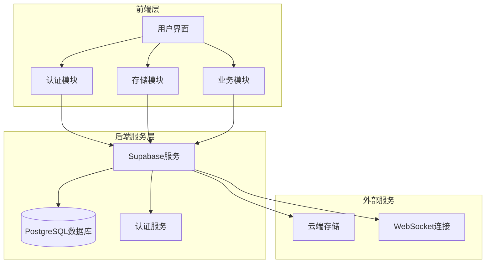
```mermaid
graph TB
subgraph "前端层"
UI[用户界面]
Auth[认证模块]
Storage[存储模块]
Business[业务模块]
end
subgraph "后端服务层"
Supabase[Supabase服务]
Database[(PostgreSQL数据库)]
AuthService[认证服务]
end
subgraph "外部服务"
Cloud[云端存储]
WebSocket[WebSocket连接]
end
UI --> Auth
UI --> Storage
UI --> Business
Auth --> Supabase
Storage --> Supabase
Business --> Supabase
Supabase --> Database
Supabase --> AuthService
Supabase --> Cloud
Supabase --> WebSocket
```

**图表来源**
- [config.js:1-20](file://js/config.js#L1-L20)
- [auth.js:1-259](file://js/auth.js#L1-L259)

**章节来源**
- [config.js:1-20](file://js/config.js#L1-L20)
- [auth.js:1-259](file://js/auth.js#L1-L259)

## 核心组件分析

### 认证系统组件

认证系统是整个数据流的核心，负责用户身份验证和会话管理。

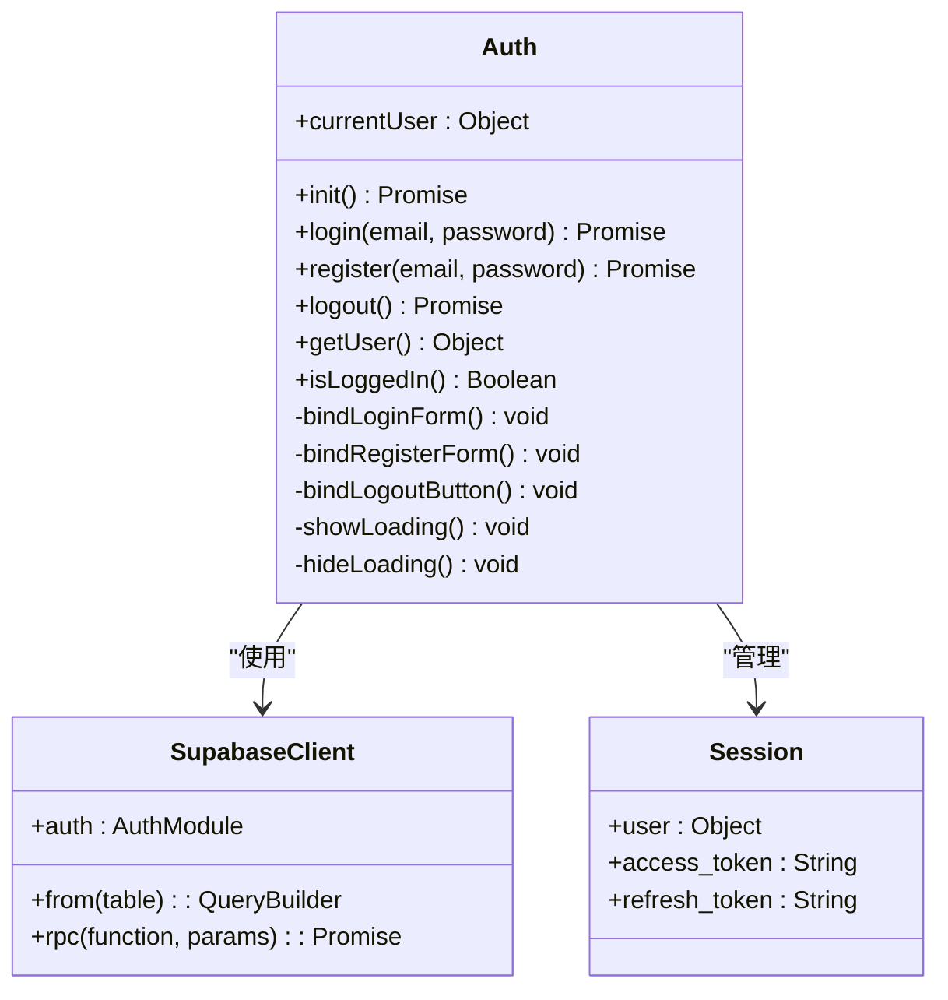
```mermaid
classDiagram
class Auth {
+currentUser : Object
+init() Promise
+login(email, password) Promise
+register(email, password) Promise
+logout() Promise
+getUser() Object
+isLoggedIn() Boolean
-bindLoginForm() void
-bindRegisterForm() void
-bindLogoutButton() void
-showLoading() void
-hideLoading() void
}
class SupabaseClient {
+auth : AuthModule
+from(table) : QueryBuilder
+rpc(function, params) : Promise
}
class Session {
+user : Object
+access_token : String
+refresh_token : String
}
Auth --> SupabaseClient : "使用"
Auth --> Session : "管理"
```

**图表来源**
- [auth.js:3-252](file://js/auth.js#L3-L252)
- [config.js:8-19](file://js/config.js#L8-L19)

### 数据存储组件

系统采用双重存储策略，既支持本地存储也支持云端存储。

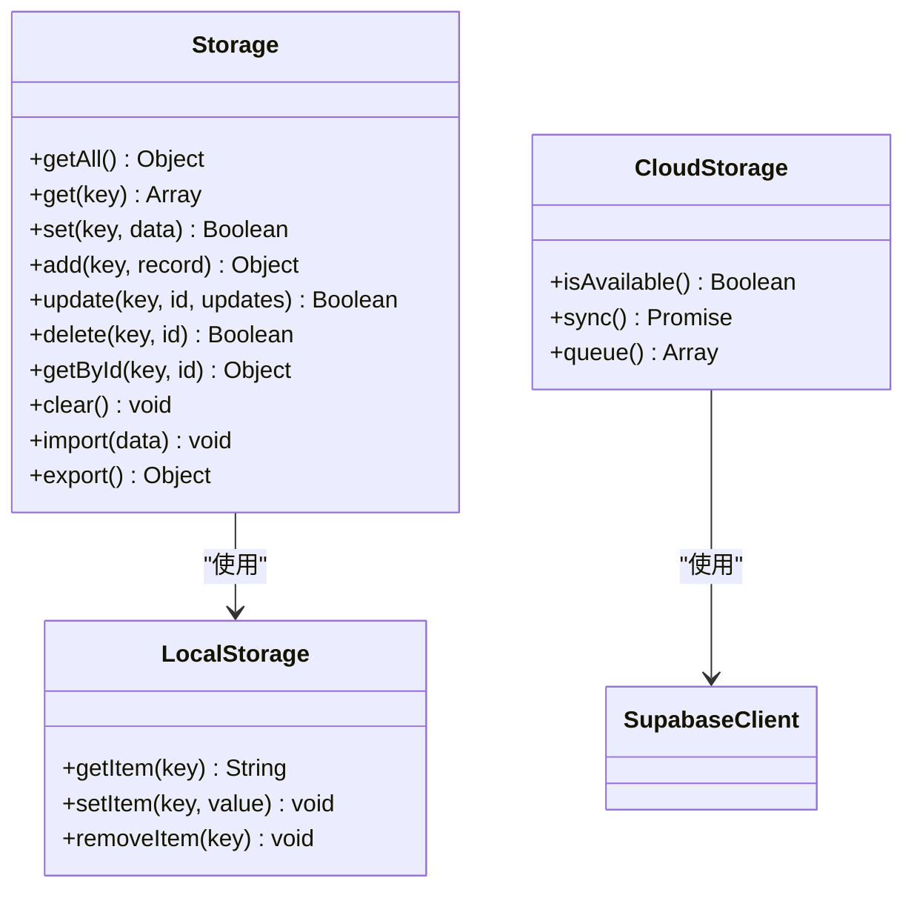
```mermaid
classDiagram
class Storage {
+getAll() Object
+get(key) Array
+set(key, data) Boolean
+add(key, record) Object
+update(key, id, updates) Boolean
+delete(key, id) Boolean
+getById(key, id) Object
+clear() void
+import(data) void
+export() Object
}
class CloudStorage {
+isAvailable() Boolean
+sync() Promise
+queue() Array
}
class LocalStorage {
+getItem(key) String
+setItem(key, value) void
+removeItem(key) void
}
Storage --> LocalStorage : "使用"
CloudStorage --> SupabaseClient : "使用"
```

**图表来源**
- [storage.js:3-88](file://js/storage.js#L3-L88)
- [cloud-storage.js:4-8](file://js/cloud-storage.js#L4-L8)

**章节来源**
- [auth.js:1-259](file://js/auth.js#L1-L259)
- [storage.js:1-208](file://js/storage.js#L1-L208)
- [cloud-storage.js:1-9](file://js/cloud-storage.js#L1-L9)

## 数据流详细分析

### 用户登录数据流

用户登录流程涉及前端认证、会话管理和数据同步三个主要阶段。

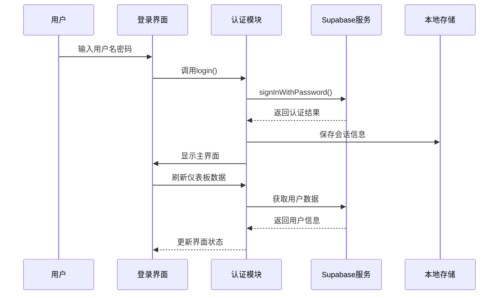
```mermaid
sequenceDiagram
participant User as 用户
participant LoginUI as 登录界面
participant Auth as 认证模块
participant Supabase as Supabase服务
participant LocalStorage as 本地存储
User->>LoginUI : 输入用户名密码
LoginUI->>Auth : 调用login()
Auth->>Supabase : signInWithPassword()
Supabase-->>Auth : 返回认证结果
Auth->>LocalStorage : 保存会话信息
Auth->>LoginUI : 显示主界面
LoginUI->>Auth : 刷新仪表板数据
Auth->>Supabase : 获取用户数据
Supabase-->>Auth : 返回用户信息
Auth-->>LoginUI : 更新界面状态
```

**图表来源**
- [auth.js:57-65](file://js/auth.js#L57-L65)
- [auth.js:255-258](file://js/auth.js#L255-L258)

### 数据持久化流程

系统支持多种数据类型的持久化，包括客户信息、合同管理、财务记录等。

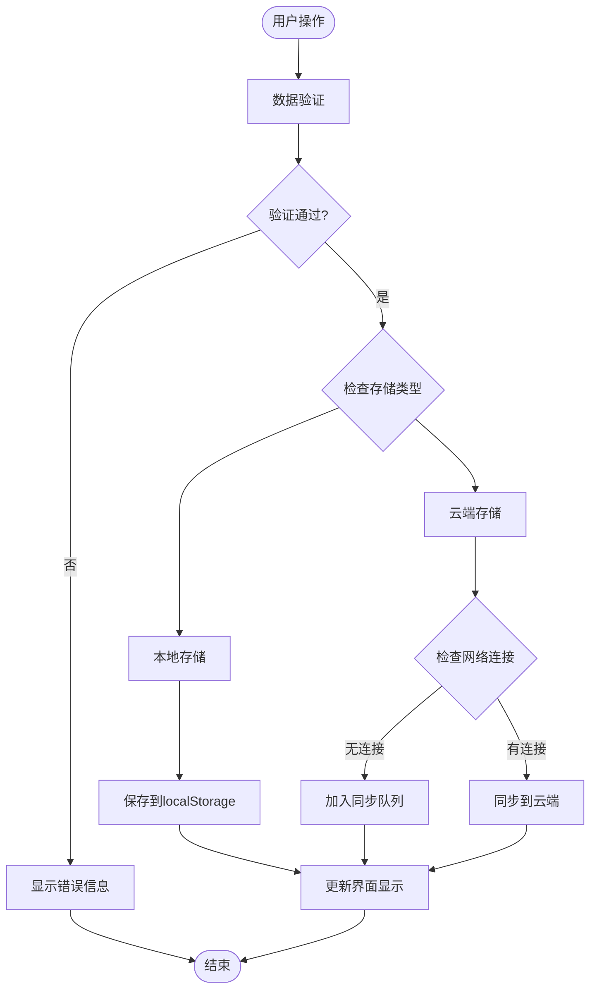
```mermaid
flowchart TD
Start([用户操作]) --> Validate[数据验证]
Validate --> Valid{验证通过?}
Valid --> |否| ShowError[显示错误信息]
Valid --> |是| CheckStorage{检查存储类型}
CheckStorage --> LocalStorage[本地存储]
CheckStorage --> CloudStorage[云端存储]
LocalStorage --> SaveLocal[保存到localStorage]
CloudStorage --> CheckConnection{检查网络连接}
CheckConnection --> |无连接| Queue[加入同步队列]
CheckConnection --> |有连接| SyncCloud[同步到云端]
SaveLocal --> UpdateUI[更新界面显示]
Queue --> UpdateUI
SyncCloud --> UpdateUI
ShowError --> End([结束])
UpdateUI --> End
```

**图表来源**
- [leads.js:478-487](file://js/leads.js#L478-L487)
- [messages.js:276-305](file://js/messages.js#L276-L305)

**章节来源**
- [auth.js:57-82](file://js/auth.js#L57-L82)
- [leads.js:1-679](file://js/leads.js#L1-L679)
- [messages.js:1-369](file://js/messages.js#L1-L369)

### 页面导航数据流

应用采用模块化页面架构，支持动态页面加载和数据传递。

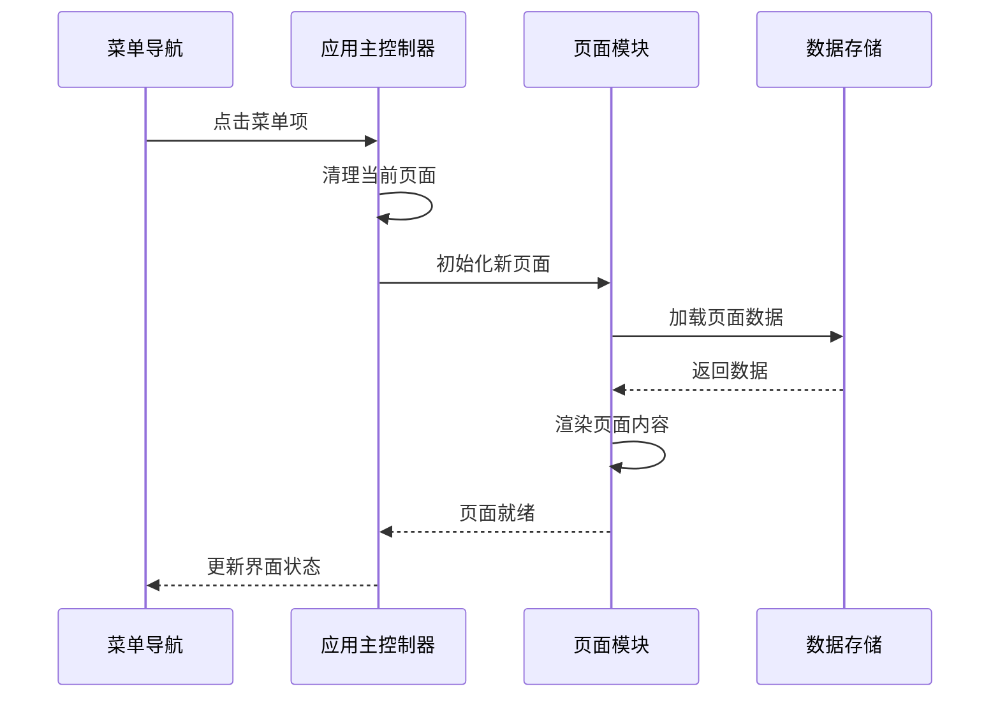
```mermaid
sequenceDiagram
participant Menu as 菜单导航
participant App as 应用主控制器
participant Page as 页面模块
participant Storage as 数据存储
Menu->>App : 点击菜单项
App->>App : 清理当前页面
App->>Page : 初始化新页面
Page->>Storage : 加载页面数据
Storage-->>Page : 返回数据
Page->>Page : 渲染页面内容
Page-->>App : 页面就绪
App-->>Menu : 更新界面状态
```

**图表来源**
- [app.js:85-135](file://js/app.js#L85-L135)

**章节来源**
- [app.js:1-156](file://js/app.js#L1-L156)

## 实时数据同步机制

### WebSocket连接管理

系统目前使用轮询方式实现数据同步，未来可扩展为WebSocket实现实时通信。

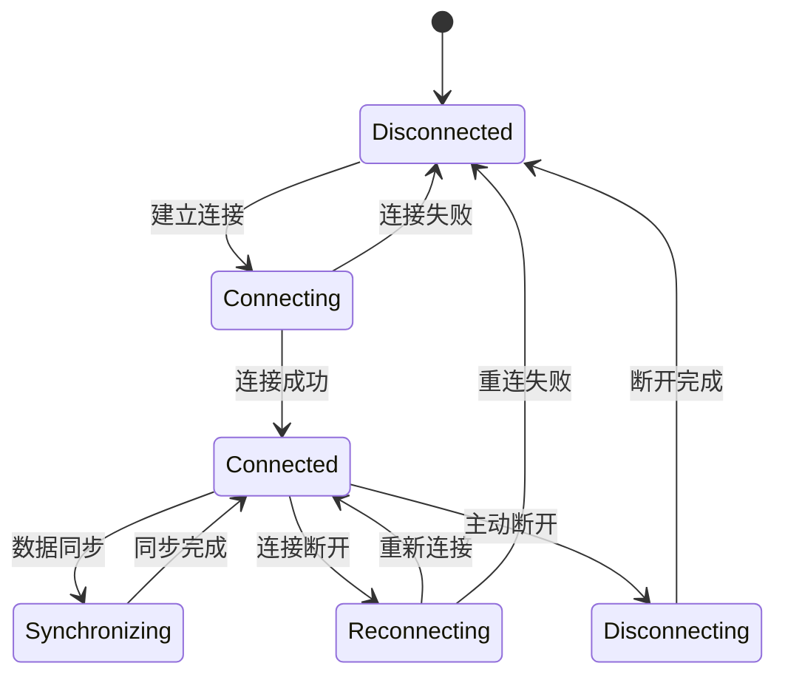
```mermaid
stateDiagram-v2
[*] --> Disconnected
Disconnected --> Connecting : 建立连接
Connecting --> Connected : 连接成功
Connecting --> Disconnected : 连接失败
Connected --> Synchronizing : 数据同步
Synchronizing --> Connected : 同步完成
Connected --> Reconnecting : 连接断开
Reconnecting --> Connected : 重新连接
Reconnecting --> Disconnected : 重连失败
Connected --> Disconnecting : 主动断开
Disconnecting --> Disconnected : 断开完成
```

**图表来源**
- [messages.js:50-60](file://js/messages.js#L50-L60)

### 数据变更通知

系统通过事件驱动的方式实现数据变更通知，支持局部更新和全量刷新。

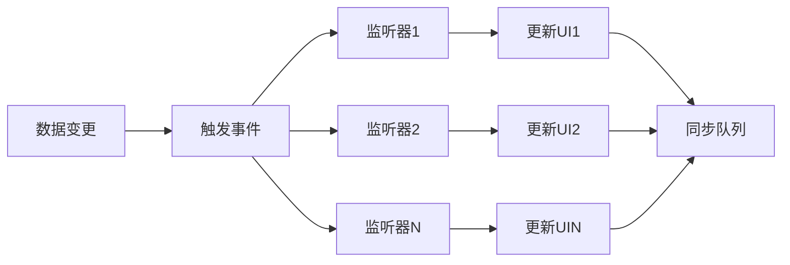
```mermaid
flowchart LR
DataChange[数据变更] --> Event[触发事件]
Event --> Listener1[监听器1]
Event --> Listener2[监听器2]
Event --> ListenerN[监听器N]
Listener1 --> UpdateUI1[更新UI1]
Listener2 --> UpdateUI2[更新UI2]
ListenerN --> UpdateUIN[更新UIN]
UpdateUI1 --> SyncQueue[同步队列]
UpdateUI2 --> SyncQueue
UpdateUIN --> SyncQueue
```

**图表来源**
- [multitable.js:25-28](file://js/multitable.js#L25-L28)

**章节来源**
- [messages.js:1-369](file://js/messages.js#L1-L369)
- [multitable.js:1-624](file://js/multitable.js#L1-L624)

## 数据验证与错误处理

### 前端数据验证

系统在多个层面实施数据验证，确保数据的完整性和一致性。

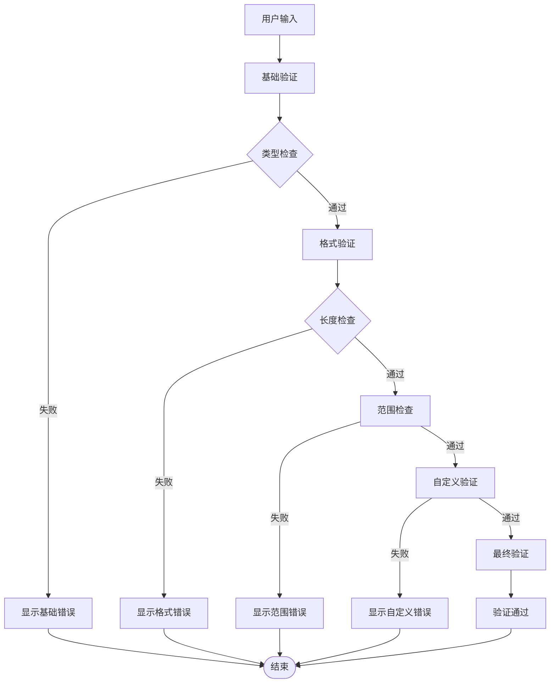
```mermaid
flowchart TD
Input[用户输入] --> BasicValidation[基础验证]
BasicValidation --> TypeCheck{类型检查}
TypeCheck --> |通过| FormatCheck[格式验证]
TypeCheck --> |失败| ShowBasicError[显示基础错误]
FormatCheck --> LengthCheck{长度检查}
LengthCheck --> |通过| RangeCheck[范围检查]
LengthCheck --> |失败| ShowFormatError[显示格式错误]
RangeCheck --> |通过| CustomValidation[自定义验证]
RangeCheck --> |失败| ShowRangeError[显示范围错误]
CustomValidation --> |通过| FinalValidation[最终验证]
CustomValidation --> |失败| ShowCustomError[显示自定义错误]
FinalValidation --> Success[验证通过]
ShowBasicError --> End([结束])
ShowFormatError --> End
ShowRangeError --> End
ShowCustomError --> End
Success --> End
```

**图表来源**
- [leads.js:164-173](file://js/leads.js#L164-L173)
- [hr-employee.js:418-421](file://js/hr-employee.js#L418-L421)

### 错误处理机制

系统采用多层次的错误处理策略，包括用户友好的错误提示和开发者调试信息。

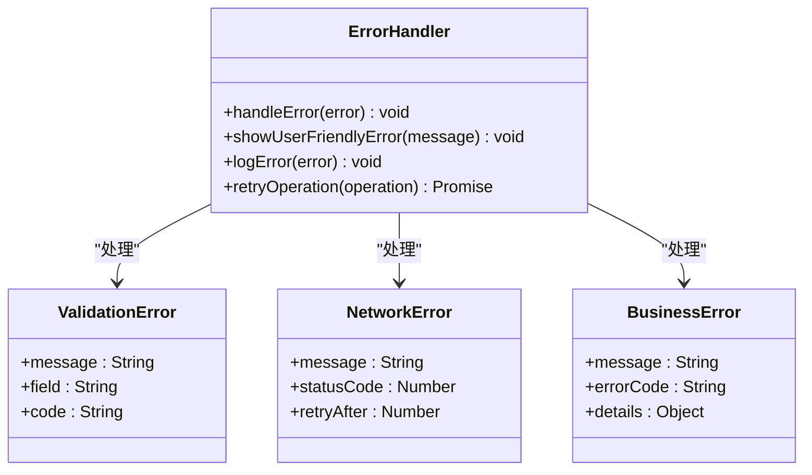
```mermaid
classDiagram
class ErrorHandler {
+handleError(error) void
+showUserFriendlyError(message) void
+logError(error) void
+retryOperation(operation) Promise
}
class ValidationError {
+message : String
+field : String
+code : String
}
class NetworkError {
+message : String
+statusCode : Number
+retryAfter : Number
}
class BusinessError {
+message : String
+errorCode : String
+details : Object
}
ErrorHandler --> ValidationError : "处理"
ErrorHandler --> NetworkError : "处理"
ErrorHandler --> BusinessError : "处理"
```

**图表来源**
- [auth.js:132-136](file://js/auth.js#L132-L136)
- [leads.js:670-677](file://js/leads.js#L670-L677)

**章节来源**
- [auth.js:108-198](file://js/auth.js#L108-L198)
- [leads.js:1-679](file://js/leads.js#L1-L679)

## 数据缓存策略

### 本地缓存架构

系统采用多层缓存策略，结合内存缓存、localStorage和IndexedDB实现高效的数据访问。

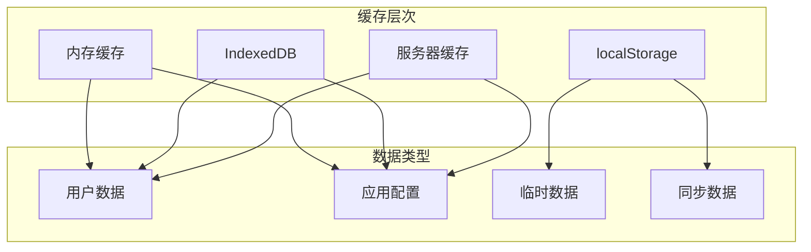
```mermaid
graph TB
subgraph "缓存层次"
MemoryCache[内存缓存]
LocalCache[localStorage]
IndexedDB[IndexedDB]
ServerCache[服务器缓存]
end
subgraph "数据类型"
UserData[用户数据]
AppData[应用配置]
TempData[临时数据]
SyncData[同步数据]
end
MemoryCache --> UserData
MemoryCache --> AppData
LocalCache --> TempData
LocalCache --> SyncData
IndexedDB --> UserData
IndexedDB --> AppData
ServerCache --> UserData
ServerCache --> AppData
```

**图表来源**
- [storage.js:3-88](file://js/storage.js#L3-L88)
- [messages.js:44-48](file://js/messages.js#L44-L48)

### 缓存更新策略

系统实现智能缓存更新机制，确保数据的一致性和时效性。

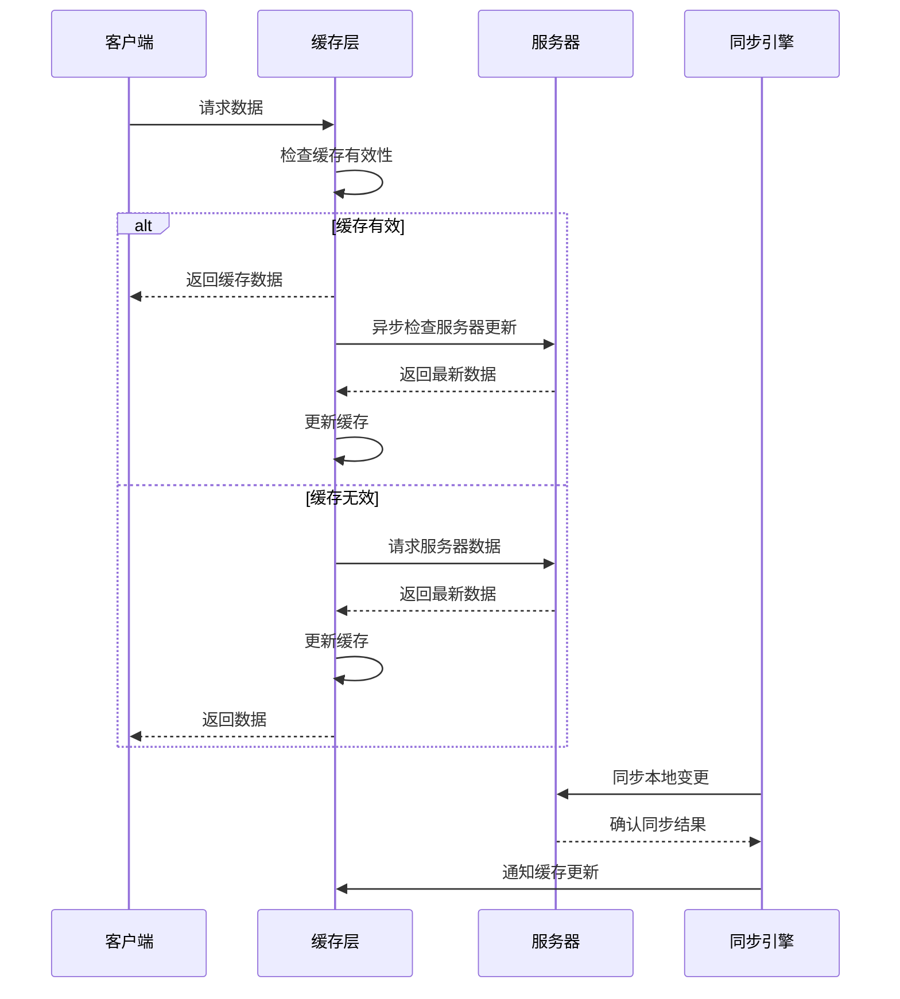
```mermaid
sequenceDiagram
participant Client as 客户端
participant Cache as 缓存层
participant Server as 服务器
participant Sync as 同步引擎
Client->>Cache : 请求数据
Cache->>Cache : 检查缓存有效性
alt 缓存有效
Cache-->>Client : 返回缓存数据
Cache->>Server : 异步检查服务器更新
Server-->>Cache : 返回最新数据
Cache->>Cache : 更新缓存
else 缓存无效
Cache->>Server : 请求服务器数据
Server-->>Cache : 返回最新数据
Cache->>Cache : 更新缓存
Cache-->>Client : 返回数据
end
Sync->>Server : 同步本地变更
Server-->>Sync : 确认同步结果
Sync->>Cache : 通知缓存更新
```

**图表来源**
- [storage.js:26-34](file://js/storage.js#L26-L34)
- [messages.js:50-60](file://js/messages.js#L50-L60)

**章节来源**
- [storage.js:1-208](file://js/storage.js#L1-L208)
- [messages.js:1-369](file://js/messages.js#L1-L369)

## 离线处理能力

### 离线数据管理

系统具备完善的离线处理能力，支持网络中断时的数据操作和后续同步。

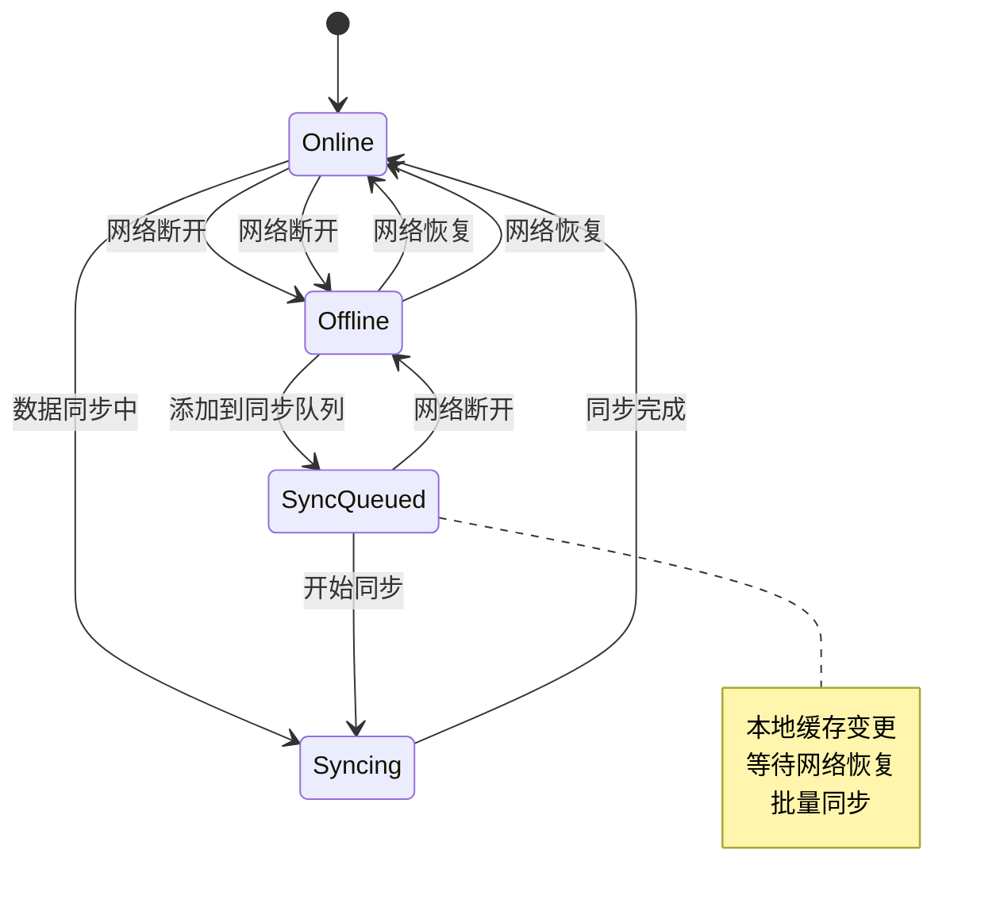
```mermaid
stateDiagram-v2
[*] --> Online
Online --> Offline : 网络断开
Online --> Syncing : 数据同步中
Offline --> Online : 网络恢复
Offline --> SyncQueued : 添加到同步队列
Syncing --> Online : 同步完成
SyncQueued --> Syncing : 开始同步
SyncQueued --> Offline : 网络断开
Online --> Offline : 网络断开
Offline --> Online : 网络恢复
note right of SyncQueued
本地缓存变更
等待网络恢复
批量同步
end note
```

**图表来源**
- [messages.js:50-60](file://js/messages.js#L50-L60)
- [cloud-storage.js:5-7](file://js/cloud-storage.js#L5-L7)

### 离线数据一致性

系统通过乐观锁和冲突解决机制确保离线操作后的数据一致性。

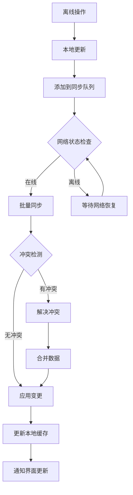
```mermaid
flowchart TD
OfflineOp[离线操作] --> LocalUpdate[本地更新]
LocalUpdate --> AddToQueue[添加到同步队列]
AddToQueue --> NetworkCheck{网络状态检查}
NetworkCheck --> |在线| BatchSync[批量同步]
NetworkCheck --> |离线| WaitNetwork[等待网络恢复]
BatchSync --> ConflictCheck{冲突检测}
ConflictCheck --> |无冲突| ApplyChanges[应用变更]
ConflictCheck --> |有冲突| ResolveConflict[解决冲突]
ResolveConflict --> MergeData[合并数据]
MergeData --> ApplyChanges
ApplyChanges --> UpdateLocal[更新本地缓存]
UpdateLocal --> NotifyUI[通知界面更新]
WaitNetwork --> NetworkCheck
```

**图表来源**
- [messages.js:44-60](file://js/messages.js#L44-L60)
- [storage.js:26-34](file://js/storage.js#L26-L34)

**章节来源**
- [cloud-storage.js:1-9](file://js/cloud-storage.js#L1-L9)
- [messages.js:1-369](file://js/messages.js#L1-L369)

## 数据迁移方案

### 数据模型演进

系统支持数据模型的平滑演进，通过版本控制和数据迁移脚本确保向后兼容性。

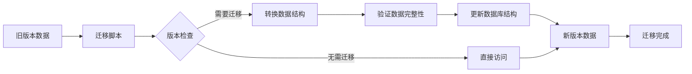
```mermaid
flowchart LR
OldVersion[旧版本数据] --> MigrationScript[迁移脚本]
MigrationScript --> VersionCheck{版本检查}
VersionCheck --> |需要迁移| TransformData[转换数据结构]
VersionCheck --> |无需迁移| DirectAccess[直接访问]
TransformData --> ValidateData[验证数据完整性]
ValidateData --> UpdateSchema[更新数据库结构]
UpdateSchema --> NewVersion[新版本数据]
DirectAccess --> NewVersion
NewVersion --> Complete[迁移完成]
```

**图表来源**
- [finance-journal.js:61-82](file://js/finance-journal.js#L61-L82)

### 数据备份与恢复

系统提供完整的数据备份和恢复机制，确保数据安全和业务连续性。

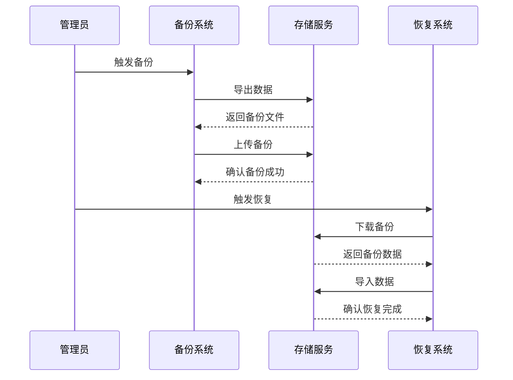
```mermaid
sequenceDiagram
participant Admin as 管理员
participant Backup as 备份系统
participant Storage as 存储服务
participant Recovery as 恢复系统
Admin->>Backup : 触发备份
Backup->>Storage : 导出数据
Storage-->>Backup : 返回备份文件
Backup->>Storage : 上传备份
Storage-->>Backup : 确认备份成功
Admin->>Recovery : 触发恢复
Recovery->>Storage : 下载备份
Storage-->>Recovery : 返回备份数据
Recovery->>Storage : 导入数据
Storage-->>Recovery : 确认恢复完成
```

**图表来源**
- [storage.js:76-87](file://js/storage.js#L76-L87)
- [finance-journal.js:101-103](file://js/finance-journal.js#L101-L103)

**章节来源**
- [finance-journal.js:1-800](file://js/finance-journal.js#L1-L800)
- [storage.js:1-208](file://js/storage.js#L1-L208)

## 性能优化建议

### 前端性能优化

系统采用多种前端性能优化技术，包括懒加载、虚拟滚动和缓存策略。

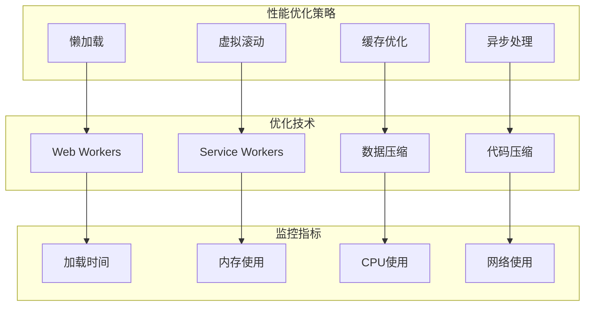
```mermaid
graph TB
subgraph "性能优化策略"
LazyLoad[懒加载]
VirtualScroll[虚拟滚动]
CacheOptimization[缓存优化]
AsyncProcessing[异步处理]
end
subgraph "优化技术"
WebWorkers[Web Workers]
ServiceWorkers[Service Workers]
Compression[数据压缩]
Minification[代码压缩]
end
subgraph "监控指标"
LoadTime[加载时间]
MemoryUsage[内存使用]
CPUUsage[CPU使用]
NetworkUsage[网络使用]
end
LazyLoad --> WebWorkers
VirtualScroll --> ServiceWorkers
CacheOptimization --> Compression
AsyncProcessing --> Minification
WebWorkers --> LoadTime
ServiceWorkers --> MemoryUsage
Compression --> CPUUsage
Minification --> NetworkUsage
```

### 数据库性能优化

系统通过索引优化、查询优化和连接池管理提升数据库性能。

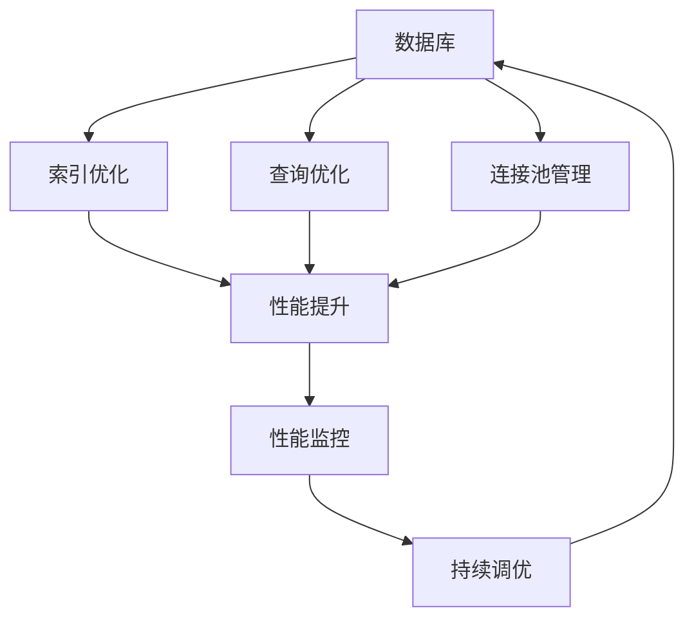
```mermaid
flowchart TD
Database[数据库] --> Indexing[索引优化]
Database --> QueryOptimization[查询优化]
Database --> ConnectionPooling[连接池管理]
Indexing --> Performance[性能提升]
QueryOptimization --> Performance
ConnectionPooling --> Performance
Performance --> Monitoring[性能监控]
Monitoring --> Tuning[持续调优]
Tuning --> Database
```

**图表来源**
- [database-setup.sql:66-75](file://database-setup.sql#L66-L75)
- [database-setup.sql:113-140](file://database-setup.sql#L113-L140)

**章节来源**
- [database-setup.sql:1-148](file://database-setup.sql#L1-L148)

## 故障排除指南

### 常见问题诊断

系统提供完善的故障排除工具和诊断机制。

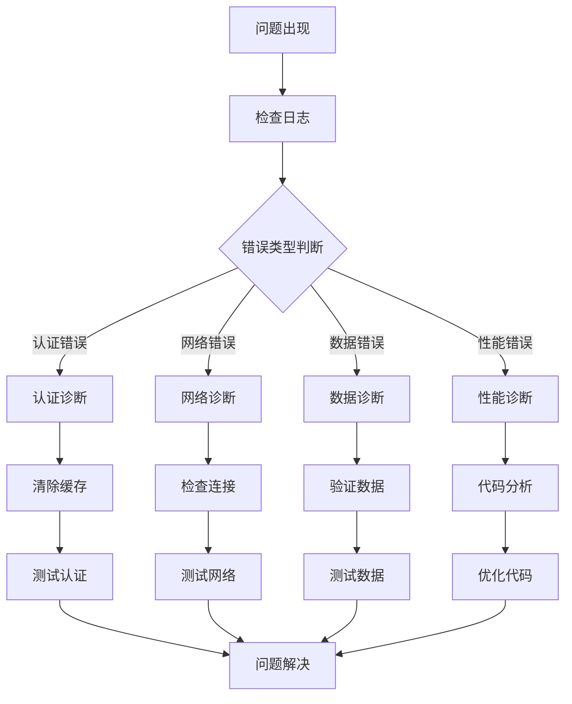
```mermaid
flowchart TD
Issue[问题出现] --> LogCheck[检查日志]
LogCheck --> ErrorType{错误类型判断}
ErrorType --> |认证错误| AuthDiagnosis[认证诊断]
ErrorType --> |网络错误| NetworkDiagnosis[网络诊断]
ErrorType --> |数据错误| DataDiagnosis[数据诊断]
ErrorType --> |性能错误| PerformanceDiagnosis[性能诊断]
AuthDiagnosis --> ClearCache[清除缓存]
NetworkDiagnosis --> CheckConnection[检查连接]
DataDiagnosis --> ValidateData[验证数据]
PerformanceDiagnosis --> ProfileCode[代码分析]
ClearCache --> TestAuth[测试认证]
CheckConnection --> TestNetwork[测试网络]
ValidateData --> TestData[测试数据]
ProfileCode --> OptimizeCode[优化代码]
TestAuth --> Resolution[问题解决]
TestNetwork --> Resolution
TestData --> Resolution
OptimizeCode --> Resolution
```

### 调试工具

系统内置多种调试工具，帮助开发者快速定位和解决问题。

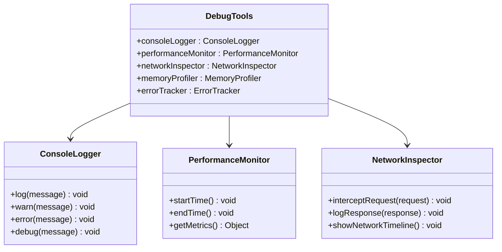
```mermaid
classDiagram
class DebugTools {
+consoleLogger : ConsoleLogger
+performanceMonitor : PerformanceMonitor
+networkInspector : NetworkInspector
+memoryProfiler : MemoryProfiler
+errorTracker : ErrorTracker
}
class ConsoleLogger {
+log(message) void
+warn(message) void
+error(message) void
+debug(message) void
}
class PerformanceMonitor {
+startTime() void
+endTime() void
+getMetrics() Object
}
class NetworkInspector {
+interceptRequest(request) void
+logResponse(response) void
+showNetworkTimeline() void
}
DebugTools --> ConsoleLogger
DebugTools --> PerformanceMonitor
DebugTools --> NetworkInspector
```

**图表来源**
- [auth.js:223-241](file://js/auth.js#L223-L241)
- [leads.js:10-20](file://js/leads.js#L10-L20)

**章节来源**
- [auth.js:1-259](file://js/auth.js#L1-L259)
- [leads.js:1-679](file://js/leads.js#L1-L679)

## 结论

陈苗系统的数据流设计体现了现代Web应用的最佳实践，通过合理的架构设计和完善的机制保障，实现了高效、安全、可靠的用户体验。

### 系统优势

1. **架构清晰**：模块化设计便于维护和扩展
2. **数据安全**：基于用户ID的数据隔离和RLS策略
3. **实时同步**：支持多设备数据同步和冲突解决
4. **性能优化**：多层缓存和异步处理机制
5. **错误处理**：完善的异常处理和用户友好提示

### 技术亮点

- **纯前端实现**：无需后端服务器，降低运维复杂度
- **云端集成**：基于Supabase的完整后端服务
- **实时协作**：支持多用户同时操作和数据同步
- **离线支持**：完善的离线数据管理和同步机制
- **数据迁移**：灵活的数据模型演进和迁移方案

### 未来发展方向

1. **WebSocket集成**：实现真正的实时数据同步
2. **移动端适配**：开发响应式设计和移动端应用
3. **团队协作**：增强多用户协作和权限管理功能
4. **数据分析**：集成更强大的数据可视化和分析功能
5. **自动化流程**：实现业务流程的自动化和智能化

通过持续的技术创新和功能完善，陈苗系统将成为一个功能完备、性能卓越的企业级数据管理平台。