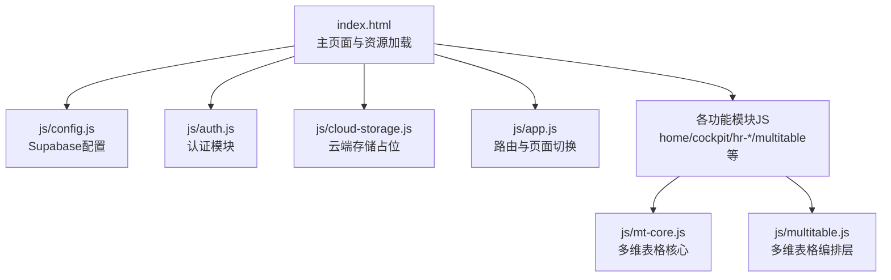
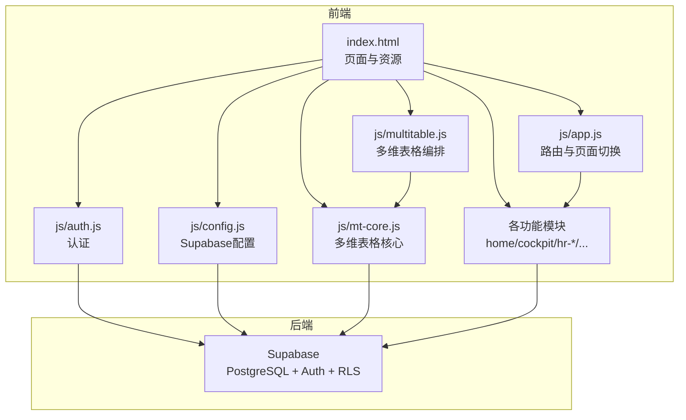
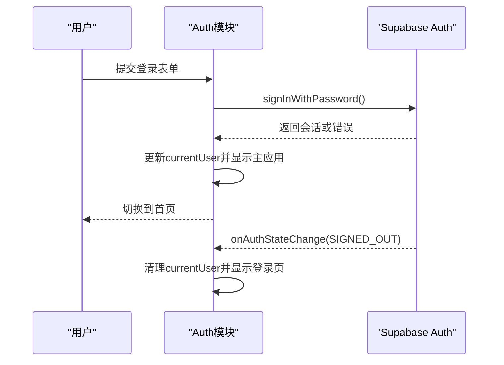
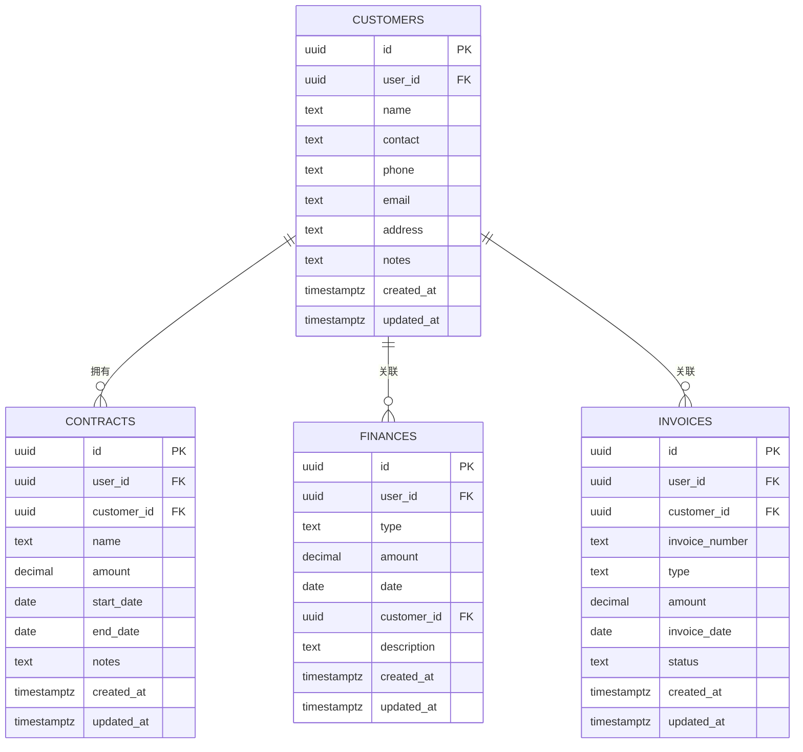
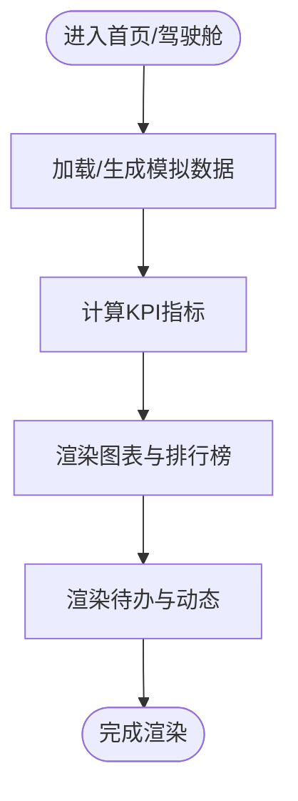
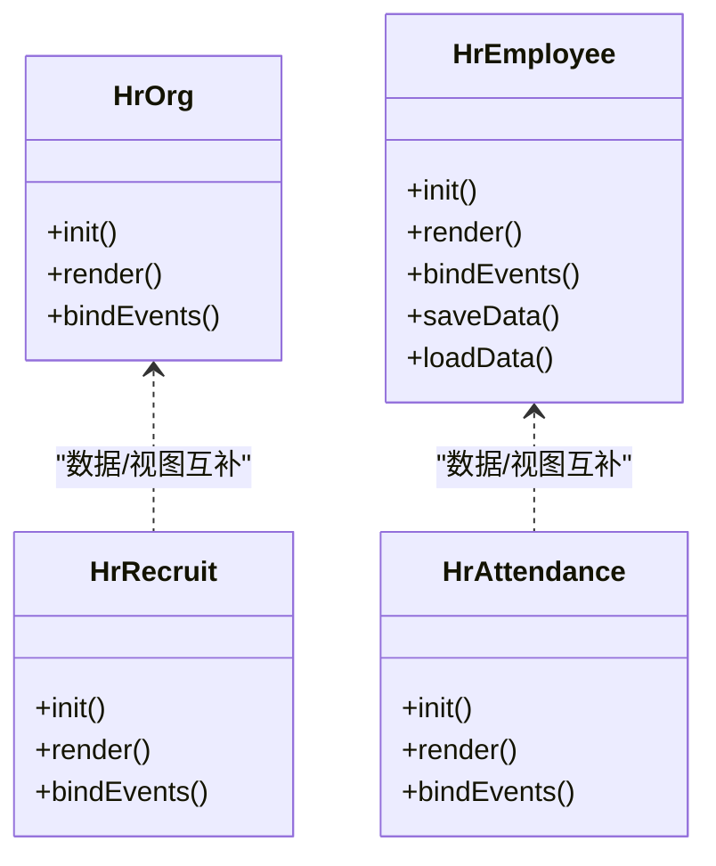
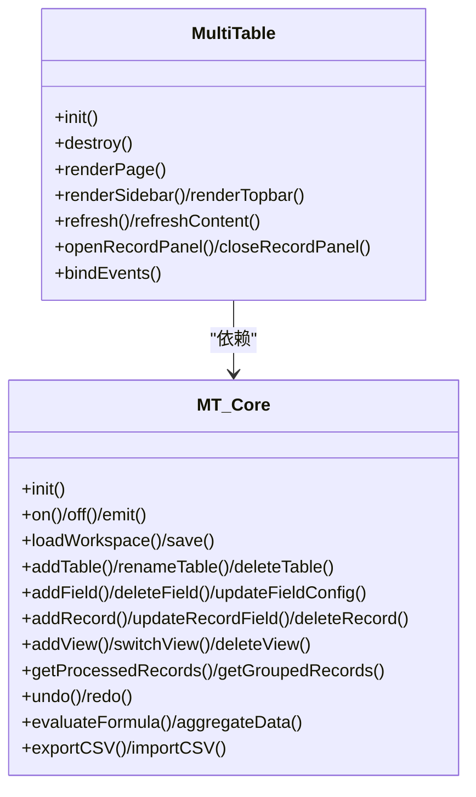
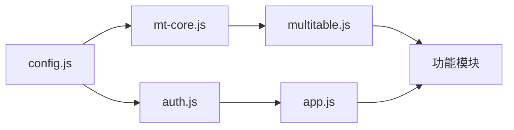

# 系统架构

<cite>
**本文档引用的文件**
- [README.md](file://README.md)
- [index.html](file://index.html)
- [js/app.js](file://js/app.js)
- [js/config.js](file://js/config.js)
- [js/auth.js](file://js/auth.js)
- [js/cloud-storage.js](file://js/cloud-storage.js)
- [js/home.js](file://js/home.js)
- [js/cockpit.js](file://js/cockpit.js)
- [js/hr-org.js](file://js/hr-org.js)
- [js/hr-employee.js](file://js/hr-employee.js)
- [js/hr-recruit.js](file://js/hr-recruit.js)
- [js/hr-attendance.js](file://js/hr-attendance.js)
- [js/multitable.js](file://js/multitable.js)
- [js/mt-core.js](file://js/mt-core.js)
- [database-setup.sql](file://database-setup.sql)
</cite>

## 目录
1. [简介](#简介)
2. [项目结构](#项目结构)
3. [核心组件](#核心组件)
4. [架构总览](#架构总览)
5. [详细组件分析](#详细组件分析)
6. [依赖分析](#依赖分析)
7. [性能考虑](#性能考虑)
8. [故障排查指南](#故障排查指南)
9. [结论](#结论)
10. [附录](#附录)

## 简介
本系统是一个基于前端SPA的财务CRM管理系统，采用HTML5/CSS3/JavaScript纯前端实现，结合Supabase作为后端数据库与认证服务，提供用户认证、云端数据存储、多设备同步与数据安全隔离能力。系统支持客户管理、合同管理、财务管理、发票管理、驾驶舱看板、人事管理（组织架构、员工档案、招聘管理、考勤管理）、多维表格等模块，并通过模块化的前端架构实现清晰的职责分离与可扩展性。

## 项目结构
系统采用“页面 + 模块化JS”的前端架构，页面由index.html承载，所有业务功能通过独立的JS模块实现，模块间通过全局命名空间与事件总线进行解耦协作。

**图表来源**
- [index.html:1-381](file://index.html#L1-L381)
- [js/config.js:1-20](file://js/config.js#L1-L20)
- [js/auth.js:1-259](file://js/auth.js#L1-L259)
- [js/cloud-storage.js:1-9](file://js/cloud-storage.js#L1-L9)
- [js/app.js:1-156](file://js/app.js#L1-L156)
- [js/mt-core.js:1-859](file://js/mt-core.js#L1-L859)
- [js/multitable.js:1-624](file://js/multitable.js#L1-L624)

**章节来源**
- [README.md:1-135](file://README.md#L1-L135)
- [index.html:1-381](file://index.html#L1-L381)

## 核心组件
- 应用入口与路由
  - app.js负责页面切换、模块生命周期管理与通用工具函数，提供navigateTo与destroy机制，确保离开页面时释放资源。
- 认证与会话
  - auth.js封装Supabase认证流程，支持登录、注册、登出与会话监听；同时兼容本地测试模式与本地会话持久化。
- Supabase集成
  - config.js初始化Supabase客户端；cloud-storage.js预留云端同步接口；database-setup.sql定义数据库表结构与RLS策略。
- 功能模块
  - home/cockpit/hr-*/multitable等模块各自实现init/destroy与事件绑定，遵循统一的页面渲染与交互模式。
- 多维表格系统
  - mt-core.js提供数据模型、CRUD、过滤排序、撤销重做、公式引擎与仪表盘聚合；multitable.js作为编排层协调UI与核心模块。

**章节来源**
- [js/app.js:1-156](file://js/app.js#L1-L156)
- [js/auth.js:1-259](file://js/auth.js#L1-L259)
- [js/config.js:1-20](file://js/config.js#L1-L20)
- [js/cloud-storage.js:1-9](file://js/cloud-storage.js#L1-L9)
- [js/mt-core.js:1-859](file://js/mt-core.js#L1-L859)
- [js/multitable.js:1-624](file://js/multitable.js#L1-L624)

## 架构总览
系统采用前后端分离的SPA架构，前端通过Supabase JS SDK与后端通信，实现用户认证、数据读写与安全策略。页面通过模块化JS实现功能解耦，多维表格系统采用“核心层 + 编排层 + 视图层”的分层设计，保证可扩展性与可维护性。

**图表来源**
- [index.html:1-381](file://index.html#L1-L381)
- [js/app.js:1-156](file://js/app.js#L1-L156)
- [js/auth.js:1-259](file://js/auth.js#L1-L259)
- [js/config.js:1-20](file://js/config.js#L1-L20)
- [js/mt-core.js:1-859](file://js/mt-core.js#L1-L859)
- [js/multitable.js:1-624](file://js/multitable.js#L1-L624)

## 详细组件分析

### 认证与会话模块（Auth）
- 职责
  - 初始化认证状态、绑定登录/注册/登出事件、监听Supabase认证状态变化、本地会话持久化与加载。
- 关键流程
  - 初始化：检查本地会话，若无则查询Supabase当前会话；绑定表单事件确保SDK不可用时仍可本地登录。
  - 登录/注册：调用Supabase Auth接口；注册成功且无需邮箱验证时自动登录。
  - 登出：调用Supabase登出并清理本地状态。
  - 会话监听：SIGNED_IN/SIGNED_OUT事件触发界面切换与数据刷新。
- 安全性
  - 依赖Supabase Auth与JWT；本地仅缓存最小必要信息；支持本地测试账号绕过网络。

**图表来源**
- [js/auth.js:1-259](file://js/auth.js#L1-L259)

**章节来源**
- [js/auth.js:1-259](file://js/auth.js#L1-L259)

### Supabase集成与数据库设计
- 配置
  - config.js初始化Supabase客户端，支持SDK不可用时的本地降级。
- 数据库设计
  - customers、contracts、finances、invoices四张核心表，均启用RLS并基于user_id进行数据隔离。
  - 索引优化常见查询维度；触发器自动维护updated_at。
- 云端存储
  - cloud-storage.js当前为占位实现，预留未来与Supabase Storage集成。

**图表来源**
- [database-setup.sql:10-63](file://database-setup.sql#L10-L63)

**章节来源**
- [js/config.js:1-20](file://js/config.js#L1-L20)
- [js/cloud-storage.js:1-9](file://js/cloud-storage.js#L1-L9)
- [database-setup.sql:1-148](file://database-setup.sql#L1-L148)

### 首页与驾驶舱模块
- 首页（Home）
  - 渲染欢迎语、快捷入口、公告列表与待办/快速数据面板；支持公告详情弹窗。
- 驾驶舱（Cockpit）
  - 通过模拟数据生成器生成客户、合同、财务、线索、发票等数据；计算KPI、渲染图表与排行榜、待办动态。
  - 图表使用Chart.js，支持多种视图与交互。

**图表来源**
- [js/home.js:1-266](file://js/home.js#L1-L266)
- [js/cockpit.js:1-624](file://js/cockpit.js#L1-L624)

**章节来源**
- [js/home.js:1-266](file://js/home.js#L1-L266)
- [js/cockpit.js:1-624](file://js/cockpit.js#L1-L624)

### 人事管理模块族
- 组织架构（HrOrg）
  - 展示公司组织树、员工花名册与部门信息；支持Tab切换与搜索过滤。
- 员工档案（HrEmployee）
  - 完整CRUD与localStorage持久化；支持列表/卡片视图、搜索与筛选、导出CSV。
- 招聘管理（HrRecruit）
  - 职位管理、候选人管理与招聘漏斗分析；支持Tab切换与状态管理。
- 考勤管理（HrAttendance）
  - 今日考勤、请假审批、部门统计与考勤规则；支持审批操作与报表导出占位。

**图表来源**
- [js/hr-org.js:1-293](file://js/hr-org.js#L1-L293)
- [js/hr-employee.js:1-628](file://js/hr-employee.js#L1-L628)
- [js/hr-recruit.js:1-257](file://js/hr-recruit.js#L1-L257)
- [js/hr-attendance.js:1-334](file://js/hr-attendance.js#L1-L334)

**章节来源**
- [js/hr-org.js:1-293](file://js/hr-org.js#L1-L293)
- [js/hr-employee.js:1-628](file://js/hr-employee.js#L1-L628)
- [js/hr-recruit.js:1-257](file://js/hr-recruit.js#L1-L257)
- [js/hr-attendance.js:1-334](file://js/hr-attendance.js#L1-L334)

### 多维表格系统（MT）
- 核心（mt-core.js）
  - 事件总线、工作区持久化、表/字段/记录CRUD、视图管理、数据管道（过滤/排序/分组/搜索）、撤销重做、公式引擎、仪表盘聚合与导入导出。
- 编排（multitable.js）
  - 页面骨架、侧边栏、顶部视图切换、工具栏、内容区渲染与事件委托；记录详情面板与模态框管理；全局快捷键支持。

**图表来源**
- [js/mt-core.js:1-859](file://js/mt-core.js#L1-L859)
- [js/multitable.js:1-624](file://js/multitable.js#L1-L624)

**章节来源**
- [js/mt-core.js:1-859](file://js/mt-core.js#L1-L859)
- [js/multitable.js:1-624](file://js/multitable.js#L1-L624)

### MVC思想与事件驱动架构
- MVC实现
  - Model：mt-core.js与各模块的数据模型（localStorage/Supabase），提供CRUD与数据管道。
  - View：各模块的render方法与模板字符串，负责UI渲染。
  - Controller：app.js的navigateTo与模块的bindEvents，负责事件处理与页面切换。
- 事件驱动
  - mt-core.js事件总线统一广播数据变更；multitable.js通过事件刷新UI；auth.js监听认证状态变化触发界面切换。

**章节来源**
- [js/app.js:1-156](file://js/app.js#L1-L156)
- [js/mt-core.js:1-859](file://js/mt-core.js#L1-L859)
- [js/multitable.js:1-624](file://js/multitable.js#L1-L624)
- [js/auth.js:1-259](file://js/auth.js#L1-L259)

## 依赖分析
- 外部依赖
  - Supabase JS SDK：认证与数据库访问。
  - Chart.js：驾驶舱图表渲染。
  - Font Awesome：图标。
- 内部模块依赖
  - app.js依赖各功能模块的init/destroy接口。
  - multitable.js依赖mt-core.js提供的数据与事件。
  - auth.js依赖config.js提供的Supabase客户端。

**图表来源**
- [js/config.js:1-20](file://js/config.js#L1-L20)
- [js/auth.js:1-259](file://js/auth.js#L1-L259)
- [js/app.js:1-156](file://js/app.js#L1-L156)
- [js/mt-core.js:1-859](file://js/mt-core.js#L1-L859)
- [js/multitable.js:1-624](file://js/multitable.js#L1-L624)

**章节来源**
- [index.html:1-381](file://index.html#L1-L381)
- [js/config.js:1-20](file://js/config.js#L1-L20)
- [js/auth.js:1-259](file://js/auth.js#L1-L259)
- [js/app.js:1-156](file://js/app.js#L1-L156)
- [js/mt-core.js:1-859](file://js/mt-core.js#L1-L859)
- [js/multitable.js:1-624](file://js/multitable.js#L1-L624)

## 性能考虑
- 前端性能
  - 模块懒加载：index.html按需引入模块脚本，避免一次性加载过多代码。
  - 事件委托：multitable.js集中处理大量DOM事件，减少事件绑定数量。
  - 本地持久化：mt-core.js与hr-employee.js使用localStorage，降低网络请求频率。
- 图表性能
  - 驾驶舱图表按需渲染，离开页面时销毁实例，避免内存泄漏。
- 数据处理
  - mt-core.js提供过滤/排序/分组的高效实现，支持大数据量场景下的虚拟滚动与分页（建议后续扩展）。

[本节为通用指导，不涉及具体文件分析]

## 故障排查指南
- 认证问题
  - 检查Supabase URL与Key配置是否正确；确认网络可达；查看控制台错误信息。
- 页面无法切换
  - 确认app.js中模块init/destroy调用是否正确；检查页面元素是否存在。
- 多维表格异常
  - 检查localStorage容量与格式；确认mt-core.js事件总线是否正常广播；核对视图配置。
- 驱动舱图表不显示
  - 确认Chart.js已加载；检查容器尺寸与DOM就绪时机。

**章节来源**
- [js/auth.js:1-259](file://js/auth.js#L1-L259)
- [js/app.js:1-156](file://js/app.js#L1-L156)
- [js/mt-core.js:1-859](file://js/mt-core.js#L1-L859)
- [js/multitable.js:1-624](file://js/multitable.js#L1-L624)

## 结论
本系统通过模块化JS与Supabase的结合，实现了功能完备的前端SPA应用。认证与数据安全通过Supabase Auth与RLS保障；多维表格系统提供了强大的数据建模与可视化能力；模块化的架构便于扩展与维护。建议后续在云端存储、实时同步与移动端适配上进一步完善，以满足更复杂的业务需求。

[本节为总结性内容，不涉及具体文件分析]

## 附录
- 技术决策与权衡
  - 采用纯前端SPA降低后端复杂度，适合中小规模团队与轻量业务。
  - Supabase提供一体化解决方案，但需关注免费额度与扩展性限制。
  - localStorage用于本地持久化，适合单设备场景；云端同步需在cloud-storage.js中实现。
- 安全性设计
  - RLS确保数据隔离；JWT会话认证；HTTPS传输；前端敏感信息最小化。
- 可扩展性
  - 模块化设计与事件总线便于新增功能；多维表格核心层抽象良好，可扩展更多视图与功能。

**章节来源**
- [README.md:1-135](file://README.md#L1-L135)
- [database-setup.sql:1-148](file://database-setup.sql#L1-L148)