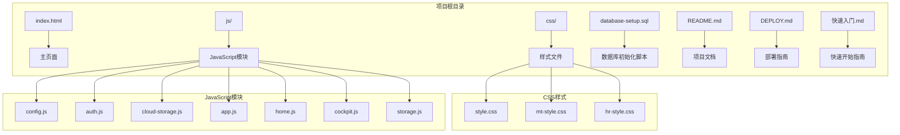
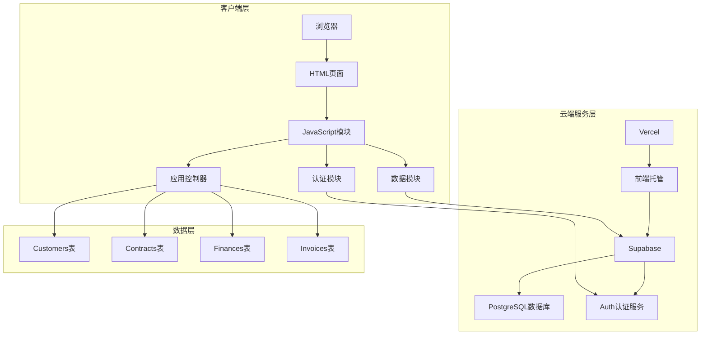
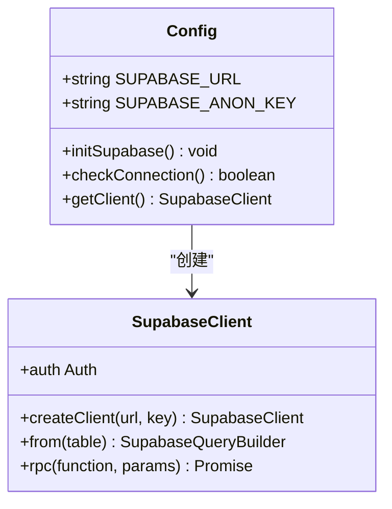
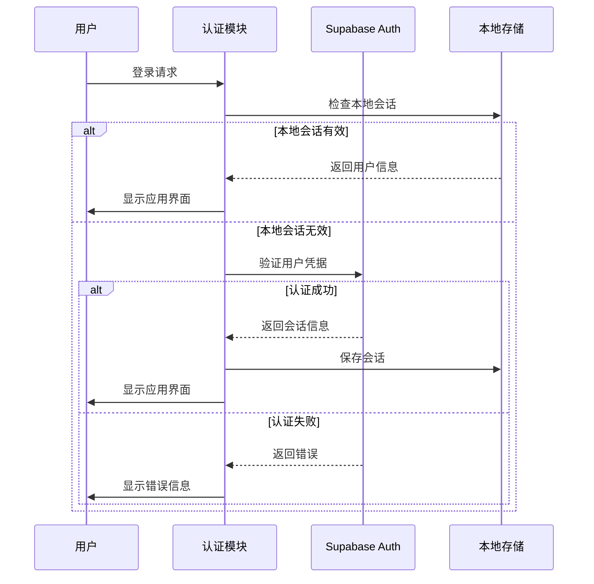
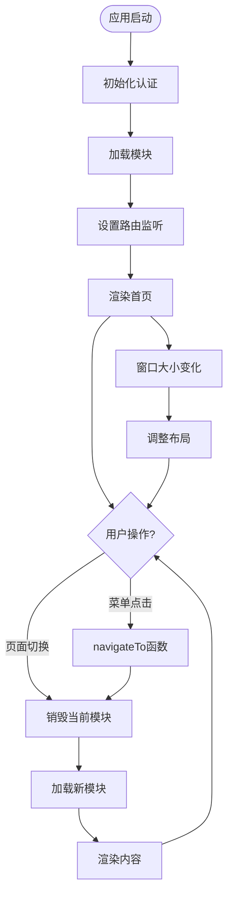
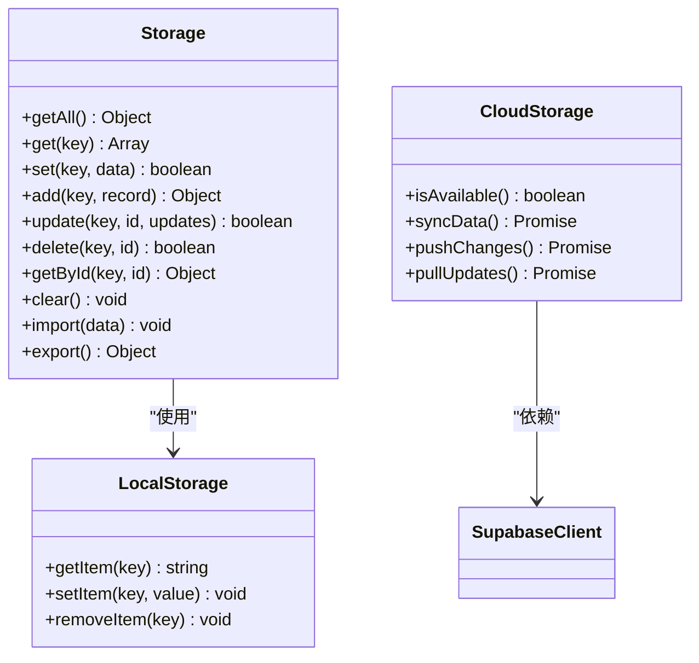
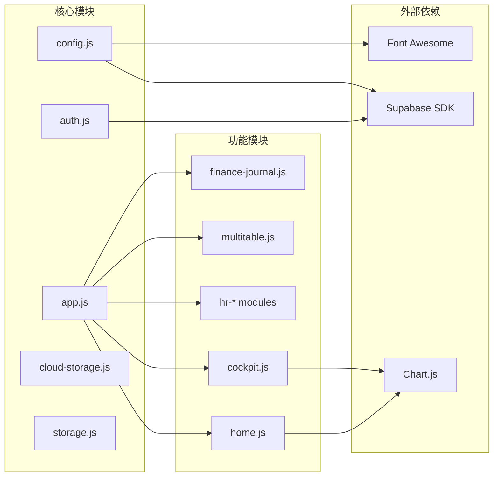

# 开发环境搭建

<cite>
**本文档引用的文件**
- [README.md](file://README.md)
- [DEPLOY.md](file://DEPLOY.md)
- [快速入门.md](file://快速入门.md)
- [index.html](file://index.html)
- [database-setup.sql](file://database-setup.sql)
- [js/config.js](file://js/config.js)
- [js/auth.js](file://js/auth.js)
- [js/cloud-storage.js](file://js/cloud-storage.js)
- [js/app.js](file://js/app.js)
- [js/home.js](file://js/home.js)
- [js/cockpit.js](file://js/cockpit.js)
- [js/storage.js](file://js/storage.js)
- [css/style.css](file://css/style.css)
</cite>

## 目录
1. [简介](#简介)
2. [项目结构](#项目结构)
3. [核心组件](#核心组件)
4. [架构概览](#架构概览)
5. [详细组件分析](#详细组件分析)
6. [依赖关系分析](#依赖关系分析)
7. [性能考虑](#性能考虑)
8. [故障排除指南](#故障排除指南)
9. [结论](#结论)
10. [附录](#附录)

## 简介

陈苗财务CRM管理系统是一个基于云端的财务公司客户关系管理解决方案。该项目采用纯前端技术栈，结合Supabase数据库和认证服务，实现了用户认证、云端数据存储、多设备同步等核心功能。

本项目具有以下特点：
- **云端架构**：基于Supabase PostgreSQL数据库和认证服务
- **多设备同步**：支持跨设备数据同步和访问
- **数据安全**：采用行级安全策略(RLS)确保用户数据隔离
- **开源免费**：完全免费的云服务组合

## 项目结构

项目采用简洁的文件组织结构，主要分为以下几个部分：

**图表来源**
- [index.html:1-381](file://index.html#L1-L381)
- [css/style.css:1-200](file://css/style.css#L1-L200)
- [js/config.js:1-20](file://js/config.js#L1-L20)

**章节来源**
- [README.md:48-65](file://README.md#L48-L65)
- [index.html:1-381](file://index.html#L1-L381)

## 核心组件

### Supabase配置模块
配置模块负责管理Supabase客户端的初始化和连接状态检测。

### 认证模块
认证模块处理用户登录、注册、登出以及会话管理功能。

### 应用主控制器
应用主控制器负责页面路由、菜单导航和模块初始化。

### 数据存储模块
数据存储模块提供本地数据管理和云端数据同步功能。

**章节来源**
- [js/config.js:1-20](file://js/config.js#L1-L20)
- [js/auth.js:1-259](file://js/auth.js#L1-L259)
- [js/app.js:1-156](file://js/app.js#L1-L156)
- [js/cloud-storage.js:1-9](file://js/cloud-storage.js#L1-L9)

## 架构概览

系统采用三层架构设计，实现了前后端分离和数据持久化：

**图表来源**
- [index.html:11-12](file://index.html#L11-L12)
- [js/config.js:8-19](file://js/config.js#L8-L19)
- [database-setup.sql:10-63](file://database-setup.sql#L10-L63)

## 详细组件分析

### Supabase配置组件

配置组件负责初始化Supabase客户端并处理连接状态：

**图表来源**
- [js/config.js:4-19](file://js/config.js#L4-L19)

配置组件的关键特性：
- **容错处理**：当Supabase SDK未加载时自动降级到本地模式
- **环境适配**：支持开发环境和生产环境的不同配置
- **错误监控**：提供详细的初始化失败诊断信息

**章节来源**
- [js/config.js:1-20](file://js/config.js#L1-L20)

### 认证组件

认证组件实现了完整的用户身份验证流程：

**图表来源**
- [js/auth.js:6-54](file://js/auth.js#L6-L54)
- [js/auth.js:108-137](file://js/auth.js#L108-L137)

认证组件的核心功能：
- **会话管理**：自动检测和维护用户登录状态
- **本地测试**：支持本地测试账号免认证访问
- **错误处理**：提供友好的错误提示和恢复机制

**章节来源**
- [js/auth.js:1-259](file://js/auth.js#L1-L259)

### 应用控制器

应用控制器负责页面路由和模块管理：

**图表来源**
- [js/app.js:85-135](file://js/app.js#L85-L135)
- [js/app.js:152-156](file://js/app.js#L152-L156)

应用控制器的主要职责：
- **模块化架构**：支持动态模块加载和卸载
- **内存管理**：及时清理不再使用的模块资源
- **响应式设计**：适配不同屏幕尺寸的设备

**章节来源**
- [js/app.js:1-156](file://js/app.js#L1-L156)

### 数据存储组件

数据存储组件提供了双层数据管理能力：

**图表来源**
- [js/storage.js:3-88](file://js/storage.js#L3-L88)
- [js/cloud-storage.js:4-8](file://js/cloud-storage.js#L4-L8)

数据存储组件的设计特点：
- **双层架构**：本地存储作为缓存层，云端存储作为持久层
- **数据同步**：支持双向数据同步和冲突解决
- **性能优化**：本地缓存减少网络请求频率

**章节来源**
- [js/storage.js:1-208](file://js/storage.js#L1-L208)
- [js/cloud-storage.js:1-9](file://js/cloud-storage.js#L1-L9)

## 依赖关系分析

项目依赖关系清晰，模块间耦合度较低：

**图表来源**
- [index.html:11-12](file://index.html#L11-L12)
- [index.html:354-378](file://index.html#L354-L378)

依赖关系特点：
- **单一外部依赖**：主要依赖Supabase SDK和第三方图表库
- **模块化设计**：各功能模块相对独立，便于维护和扩展
- **渐进式加载**：非关键模块按需加载，提升首屏性能

**章节来源**
- [index.html:11-12](file://index.html#L11-L12)
- [index.html:354-378](file://index.html#L354-L378)

## 性能考虑

### 加载优化
- **资源版本控制**：CSS和JS文件使用版本参数避免缓存问题
- **按需加载**：大型模块如多维表格按需加载，减少初始包体积
- **CDN加速**：关键依赖通过CDN加载，提升全球访问速度

### 内存管理
- **模块销毁**：离开页面时自动清理图表和事件监听器
- **数据缓存**：合理使用localStorage缓存常用数据
- **垃圾回收**：及时释放不再使用的DOM元素和事件处理器

### 网络优化
- **连接池**：Supabase客户端自动管理连接复用
- **批量操作**：支持批量数据操作减少网络往返
- **错误重试**：网络异常时提供自动重试机制

## 故障排除指南

### 常见问题及解决方案

#### Supabase连接问题
**症状**：页面空白或出现"Supabase未连接"提示
**原因**：
- Supabase SDK未正确加载
- 配置参数错误
- 网络连接异常

**解决方案**：
1. 检查Supabase SDK是否正确加载
2. 验证config.js中的URL和Key配置
3. 确认网络连接正常
4. 查看浏览器控制台错误信息

#### 认证失败问题
**症状**：登录后页面不跳转或显示认证错误
**原因**：
- 用户名或密码错误
- Supabase认证服务异常
- 本地存储损坏

**解决方案**：
1. 重新输入正确的用户名和密码
2. 检查Supabase项目状态
3. 清除浏览器缓存和localStorage
4. 重启应用重新登录

#### 数据同步问题
**症状**：数据在不同设备间不同步
**原因**：
- 云端数据访问权限不足
- 网络连接不稳定
- 行级安全策略限制

**解决方案**：
1. 确认用户已正确登录
2. 检查网络连接稳定性
3. 验证Supabase RLS策略配置
4. 重新登录以刷新会话

#### 性能问题
**症状**：页面加载缓慢或操作卡顿
**原因**：
- 浏览器缓存问题
- JavaScript内存泄漏
- 图表渲染性能瓶颈

**解决方案**：
1. 清除浏览器缓存
2. 检查是否有未清理的事件监听器
3. 优化图表数据量
4. 关闭不必要的浏览器标签页

**章节来源**
- [DEPLOY.md:164-183](file://DEPLOY.md#L164-L183)
- [js/auth.js:50-53](file://js/auth.js#L50-L53)

## 结论

陈苗财务CRM管理系统提供了一个完整的云端应用开发示例，展示了现代Web应用的最佳实践。通过合理的架构设计和模块化实现，该项目具备了良好的可维护性和扩展性。

开发环境搭建的关键要点：
- **环境准备**：确保Node.js和Vercel CLI正确安装配置
- **Supabase集成**：正确配置数据库和认证服务
- **本地测试**：利用本地模式进行开发和调试
- **部署准备**：遵循官方部署指南完成生产环境部署

该项目为学习云端应用开发提供了优秀的参考案例，其模块化设计和清晰的依赖关系使其成为学习前端架构的良好素材。

## 附录

### 开发工具推荐

#### 浏览器开发者工具
- **Chrome DevTools**：调试JavaScript、网络请求、性能分析
- **Firefox Developer Tools**：跨浏览器兼容性测试
- **Edge DevTools**：Microsoft生态系统的调试支持

#### 代码编辑器
- **VS Code**：丰富的插件生态系统，支持JavaScript调试
- **WebStorm**：专业的JavaScript IDE，提供智能代码补全
- **Sublime Text**：轻量级编辑器，适合快速代码编辑

#### 调试技巧
- **断点调试**：在关键函数入口设置断点观察变量状态
- **网络监控**：检查Supabase API调用的响应时间和错误
- **性能分析**：使用浏览器性能面板分析页面加载和渲染性能
- **控制台日志**：合理使用console.log输出调试信息

### 代码规范建议

#### JavaScript编码规范
- **命名约定**：使用驼峰命名法，常量使用大写加下划线
- **函数设计**：保持函数单一职责，避免过长函数
- **错误处理**：为异步操作提供适当的错误处理机制
- **注释规范**：为复杂逻辑添加必要的代码注释

#### 项目结构规范
- **模块划分**：按照功能模块组织JavaScript文件
- **CSS组织**：采用BEM命名法，保持样式文件结构清晰
- **文件命名**：使用语义化的文件名，避免缩写
- **版本控制**：遵循Git工作流程，提交有意义的commit信息

#### 开发最佳实践
- **渐进式增强**：先实现基本功能，再添加高级特性
- **测试驱动**：编写单元测试确保代码质量
- **文档维护**：及时更新项目文档和API说明
- **性能监控**：持续关注应用性能指标，及时优化