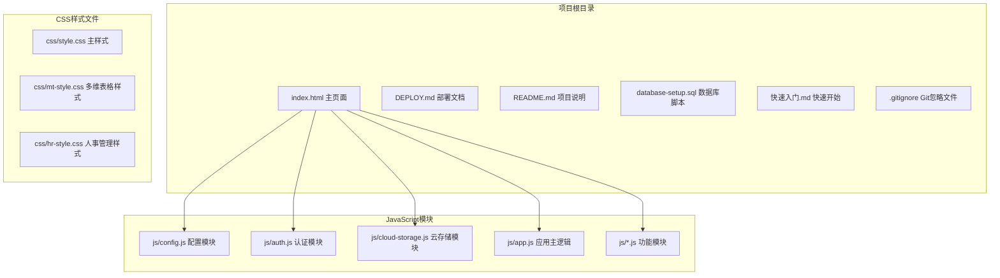
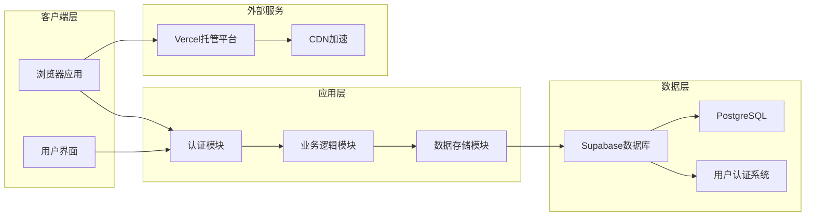
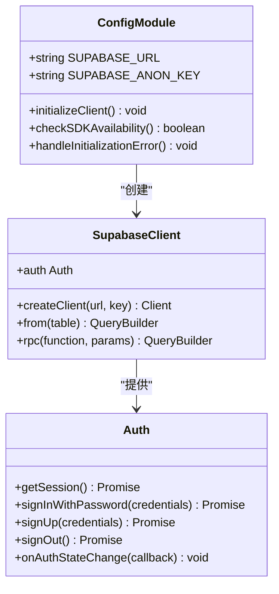
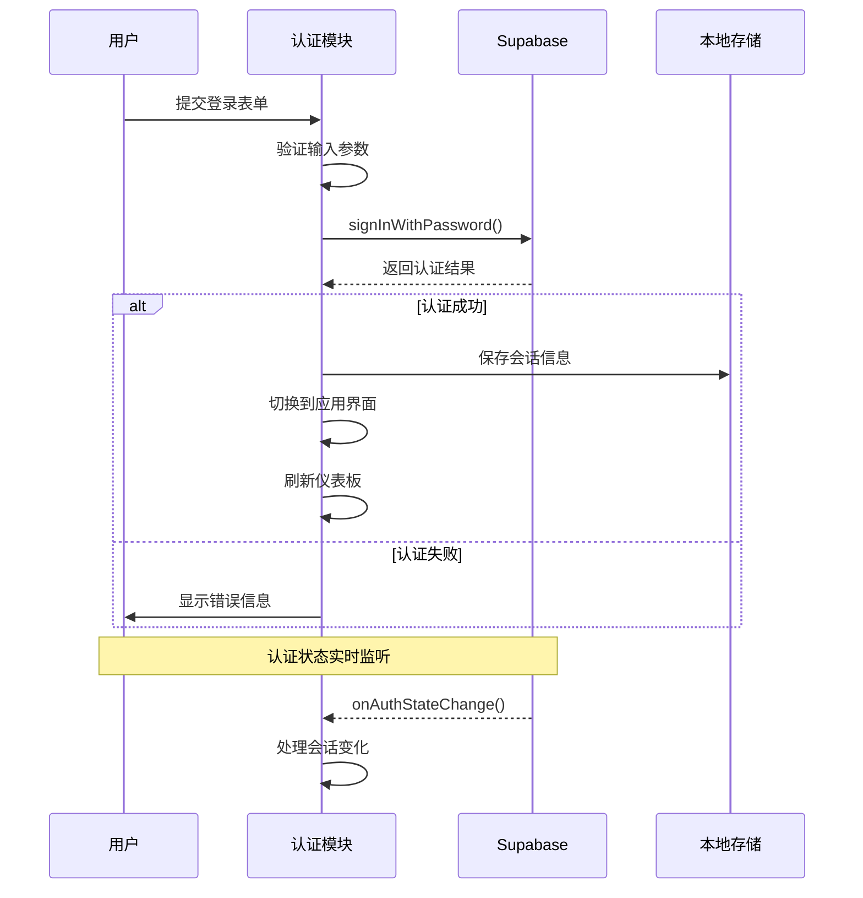
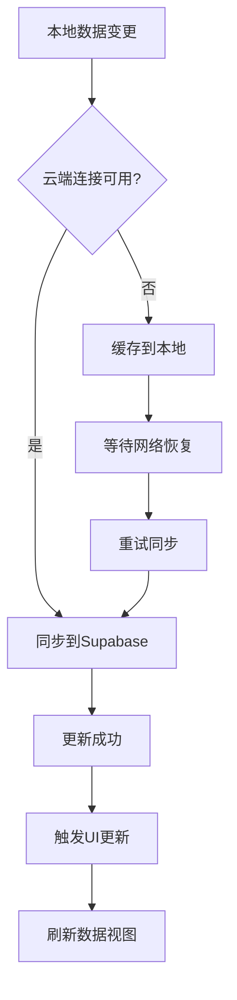
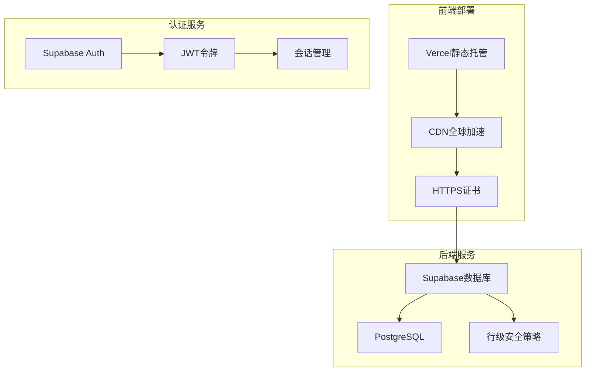
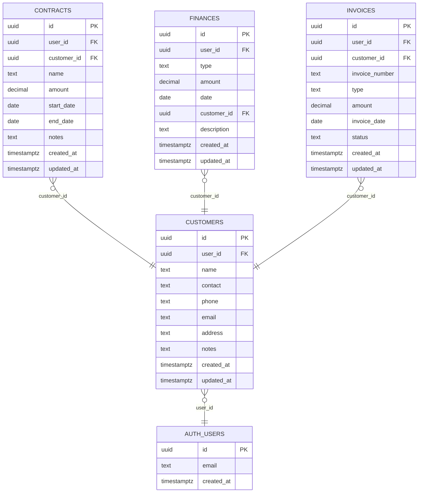
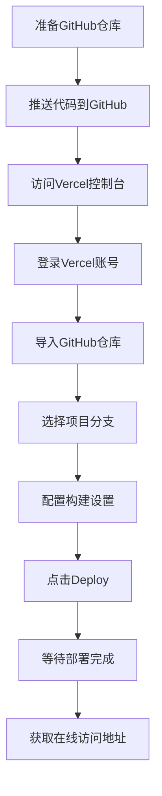
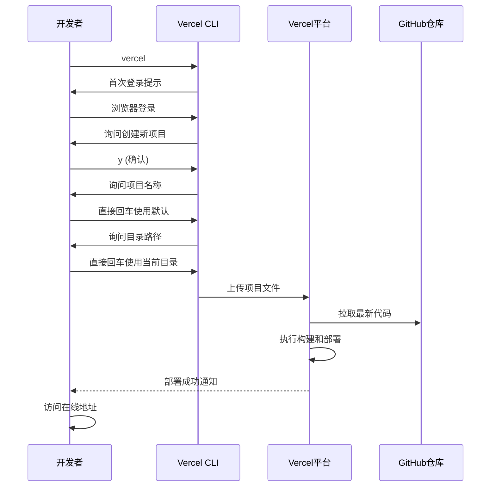
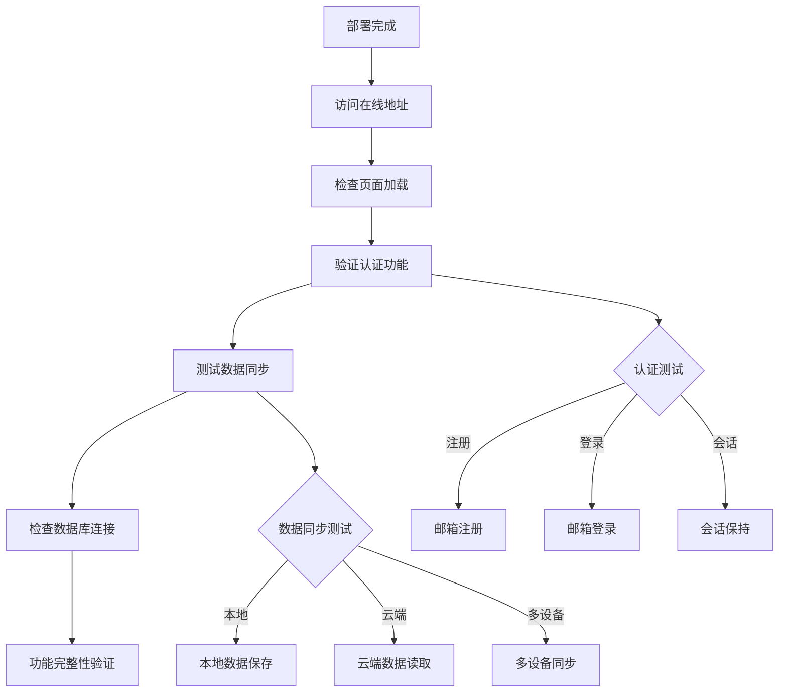

# 生产环境部署

<cite>
**本文档引用的文件**
- [DEPLOY.md](file://DEPLOY.md)
- [README.md](file://README.md)
- [database-setup.sql](file://database-setup.sql)
- [index.html](file://index.html)
- [js/config.js](file://js/config.js)
- [js/auth.js](file://js/auth.js)
- [js/cloud-storage.js](file://js/cloud-storage.js)
- [快速入门.md](file://快速入门.md)
</cite>

## 目录
1. [简介](#简介)
2. [项目结构](#项目结构)
3. [核心组件](#核心组件)
4. [架构概览](#架构概览)
5. [详细组件分析](#详细组件分析)
6. [部署流程详解](#部署流程详解)
7. [Supabase配置与数据库初始化](#supabase配置与数据库初始化)
8. [Vercel静态托管部署](#vercel静态托管部署)
9. [域名与HTTPS配置](#域名与https配置)
10. [部署验证与功能测试](#部署验证与功能测试)
11. [故障排除指南](#故障排除指南)
12. [性能与安全考虑](#性能与安全考虑)
13. [结论](#结论)

## 简介

陈苗财务CRM系统是一个基于云端技术栈构建的企业级管理系统，采用现代Web技术实现。该系统集成了用户认证、云端数据存储、多设备同步等核心功能，为企业提供完整的财务管理解决方案。

### 技术架构特点

- **前端技术栈**: HTML5 + CSS3 + JavaScript纯前端实现
- **后端服务**: Supabase PostgreSQL数据库 + Supabase Auth认证
- **部署方案**: Vercel静态托管平台
- **数据安全**: HTTPS加密传输 + 行级安全策略(RLS) + JWT会话认证
- **跨平台兼容**: 支持多设备数据同步

## 项目结构

项目采用模块化设计，主要包含以下核心目录和文件：



**图表来源**
- [index.html:1-381](file://index.html#L1-L381)
- [js/config.js:1-20](file://js/config.js#L1-L20)
- [js/auth.js:1-259](file://js/auth.js#L1-L259)

**章节来源**
- [README.md:48-65](file://README.md#L48-L65)
- [快速入门.md:32-44](file://快速入门.md#L32-L44)

## 核心组件

### 1. Supabase配置模块
负责管理Supabase数据库连接参数和客户端初始化。

### 2. 用户认证模块
实现完整的用户注册、登录、登出功能，支持会话管理和状态监听。

### 3. 云存储模块
提供云端数据存储接口，支持与Supabase数据库的双向同步。

### 4. 应用主逻辑
协调各个功能模块，处理用户界面交互和业务逻辑。

**章节来源**
- [js/config.js:1-20](file://js/config.js#L1-L20)
- [js/auth.js:1-259](file://js/auth.js#L1-L259)
- [js/cloud-storage.js:1-9](file://js/cloud-storage.js#L1-L9)

## 架构概览

系统采用前后端分离的架构设计，通过API接口实现数据通信：



**图表来源**
- [DEPLOY.md:3-7](file://DEPLOY.md#L3-L7)
- [README.md:7-12](file://README.md#L7-L12)

## 详细组件分析

### Supabase配置模块分析

配置模块是整个系统的核心基础设施，负责建立与Supabase数据库的安全连接。



**图表来源**
- [js/config.js:1-20](file://js/config.js#L1-L20)

#### 配置参数说明

| 参数名称 | 类型 | 描述 | 示例值 |
|---------|------|------|--------|
| SUPABASE_URL | string | Supabase项目URL | `https://your-project-id.supabase.co` |
| SUPABASE_ANON_KEY | string | 匿名访问密钥 | `eyJhbGciOiJIUzI1NiIsInR5cCI6IkpXVCJ9...` |

**章节来源**
- [js/config.js:1-20](file://js/config.js#L1-L20)

### 用户认证模块分析

认证模块实现了完整的用户生命周期管理，包括注册、登录、会话维护等功能。



**图表来源**
- [js/auth.js:56-82](file://js/auth.js#L56-L82)
- [js/auth.js:36-48](file://js/auth.js#L36-L48)

#### 认证流程特点

1. **双重认证机制**: 支持Supabase认证和本地测试模式
2. **会话持久化**: 自动保存和恢复用户会话状态
3. **实时状态监听**: 自动响应认证状态变化
4. **错误处理**: 完善的异常捕获和用户反馈

**章节来源**
- [js/auth.js:1-259](file://js/auth.js#L1-L259)

### 云存储模块分析

云存储模块提供云端数据同步能力，确保用户数据在不同设备间的一致性。



**图表来源**
- [js/cloud-storage.js:4-8](file://js/cloud-storage.js#L4-L8)

**章节来源**
- [js/cloud-storage.js:1-9](file://js/cloud-storage.js#L1-L9)

## 部署流程详解

### 整体部署架构

系统采用三层架构：前端静态资源托管、后端数据库服务、认证服务分离部署。



**图表来源**
- [DEPLOY.md:3-7](file://DEPLOY.md#L3-L7)

### 部署前置条件

在开始部署之前，需要完成以下准备工作：

1. **GitHub仓库准备**: 将项目代码推送到GitHub仓库
2. **Supabase项目创建**: 完成数据库和认证服务配置
3. **域名准备**: 准备自定义域名(可选)
4. **SSL证书**: 准备HTTPS证书(可选)

**章节来源**
- [DEPLOY.md:68-112](file://DEPLOY.md#L68-L112)

## Supabase配置与数据库初始化

### Supabase项目创建流程

#### 步骤1: 注册和项目创建
1. 访问Supabase官网并注册账号
2. 点击"New Project"创建新项目
3. 填写项目信息：
   - **项目名称**: finance-crm
   - **数据库密码**: 设置强密码
   - **区域选择**: 亚洲地区(新加坡/东京)

#### 步骤2: 获取API凭据
1. 进入项目设置 → API
2. 复制以下凭据：
   - **Project URL**: `https://xxxxx.supabase.co`
   - **anon public**: 长字符串密钥

#### 步骤3: 执行数据库初始化脚本
1. 打开SQL Editor
2. 新建查询窗口
3. 复制粘贴database-setup.sql内容
4. 点击"Run"执行

**章节来源**
- [DEPLOY.md:9-45](file://DEPLOY.md#L9-L45)
- [database-setup.sql:1-148](file://database-setup.sql#L1-L148)

### 数据库表结构设计

系统包含四个核心业务表，每个表都遵循统一的设计规范：



**图表来源**
- [database-setup.sql:10-63](file://database-setup.sql#L10-L63)

### 行级安全策略配置

系统采用Supabase的行级安全策略(RLS)确保数据隔离：

| 表名称 | 安全策略 | 访问控制 |
|-------|---------|---------|
| customers | user_data_policy_customers | auth.uid() = user_id |
| contracts | user_data_policy_contracts | auth.uid() = user_id |
| finances | user_data_policy_finances | auth.uid() = user_id |
| invoices | user_data_policy_invoices | auth.uid() = user_id |

**章节来源**
- [database-setup.sql:77-107](file://database-setup.sql#L77-L107)

## Vercel静态托管部署

### 方案A: GitHub集成部署(推荐)

这是最简单的部署方式，适合大多数用户：



**部署步骤详解**:

1. **访问Vercel控制台**: 打开 https://vercel.com/new
2. **GitHub登录**: 使用GitHub账号登录Vercel
3. **导入仓库**: 选择包含项目代码的GitHub仓库
4. **配置项目**: 
   - 项目名称: finance-crm
   - 构建设置: 默认配置即可
   - 环境变量: 添加Supabase配置
5. **部署执行**: 点击"Deploy"开始部署
6. **监控进度**: 等待部署完成，查看日志输出

### 方案B: Vercel CLI命令行部署

适合开发者和技术用户：



**CLI部署详细步骤**:

1. **安装Node.js**: 访问 https://nodejs.org 下载LTS版本
2. **安装Vercel CLI**: 
   ```bash
   npm install -g vercel
   ```
3. **部署项目**:
   ```bash
   cd 项目根目录
   vercel
   ```
4. **按提示操作**:
   - 首次登录: 选择浏览器登录
   - 项目创建: 输入 `y`
   - 项目名称: 直接回车使用默认
   - 目录选择: 直接回车使用当前目录
5. **获取访问地址**: 部署成功后显示类似 `https://finance-crm-xxxx.vercel.app`

### 部署环境配置

#### 环境变量设置

在Vercel控制台中设置以下环境变量：

| 环境变量名 | 值 | 用途 |
|-----------|----|-----|
| SUPABASE_URL | `https://your-project-id.supabase.co` | Supabase数据库URL |
| SUPABASE_ANON_KEY | `your-anon-key` | 匿名访问密钥 |

#### 构建配置

Vercel默认配置即可满足需求，无需额外配置。

**章节来源**
- [DEPLOY.md:68-112](file://DEPLOY.md#L68-L112)

## 域名与HTTPS配置

### 自定义域名配置

#### DNS配置步骤

1. **获取Vercel域名**: 部署完成后获得的在线地址
2. **DNS记录设置**:
   - A记录: 指向Vercel提供的IP地址
   - CNAME记录: 指向Vercel生成的域名
3. **域名验证**: 等待DNS解析生效

#### HTTPS证书自动配置

Vercel自动为所有部署提供免费的HTTPS证书，无需手动配置。

### 域名配置最佳实践

1. **子域名vs根域名**: 推荐使用子域名(如 `crm.yourcompany.com`)
2. **DNS TTL设置**: 建议设置为300秒(5分钟)
3. **CDN加速**: Vercel内置CDN，自动全球加速

**章节来源**
- [DEPLOY.md:113-126](file://DEPLOY.md#L113-L126)

## 部署验证与功能测试

### 部署后验证清单

部署完成后，需要进行以下验证测试：



### 功能测试详细步骤

#### 基础功能测试
- [ ] **注册功能**: 使用邮箱注册新账号
- [ ] **登录功能**: 验证邮箱密码登录
- [ ] **会话管理**: 验证登录状态保持
- [ ] **数据保存**: 添加客户信息并验证保存

#### 数据完整性测试
- [ ] **数据持久化**: 刷新页面后数据仍然存在
- [ ] **数据隔离**: 不同账号间数据完全隔离
- [ ] **数据同步**: 多设备登录同一账号数据同步

#### 性能测试
- [ ] **页面加载速度**: 验证首屏加载时间
- [ ] **API响应时间**: 检查数据库查询性能
- [ ] **并发访问**: 测试多用户同时访问

### 数据库验证方法

1. **回到Supabase控制台**
2. **点击Table Editor**
3. **查看customers、contracts等表**
4. **验证添加的数据是否存在**

**章节来源**
- [DEPLOY.md:113-126](file://DEPLOY.md#L113-L126)

## 故障排除指南

### 常见部署问题及解决方案

#### 1. Supabase配置错误

**问题症状**:
- 页面空白或加载失败
- 控制台出现"Supabase未连接"错误

**解决方案**:
1. 检查js/config.js中的URL和密钥
2. 确认Supabase项目已正确创建
3. 验证网络连接正常

**章节来源**
- [DEPLOY.md:169-170](file://DEPLOY.md#L169-L170)

#### 2. 认证失败问题

**问题症状**:
- 注册时提示"Email already exists"
- 登录后页面空白

**解决方案**:
1. 检查浏览器控制台错误信息
2. 验证Supabase认证服务正常运行
3. 确认邮箱验证设置正确

**章节来源**
- [DEPLOY.md:166-173](file://DEPLOY.md#L166-L173)

#### 3. 数据同步问题

**问题症状**:
- 添加数据时提示"未登录"
- 数据无法在多设备间同步

**解决方案**:
1. 检查JWT会话状态
2. 验证Supabase RLS策略
3. 确认网络连接稳定

**章节来源**
- [DEPLOY.md:172-173](file://DEPLOY.md#L172-L173)

#### 4. Vercel部署失败

**问题症状**:
- 构建过程中出现错误
- 部署超时或失败

**解决方案**:
1. 检查package.json配置
2. 验证环境变量设置
3. 查看Vercel构建日志

**章节来源**
- [DEPLOY.md:164-197](file://DEPLOY.md#L164-L197)

### 技术支持资源

- **Supabase官方文档**: https://supabase.com/docs
- **Vercel官方文档**: https://vercel.com/docs
- **浏览器控制台**: 按F12查看详细错误信息

**章节来源**
- [DEPLOY.md:215-219](file://DEPLOY.md#L215-L219)

## 性能与安全考虑

### 性能优化建议

#### 前端性能优化
1. **资源压缩**: 确保CSS和JavaScript文件经过压缩
2. **CDN加速**: 利用Vercel内置CDN提升全球访问速度
3. **懒加载**: 对非关键资源实施懒加载策略

#### 数据库性能优化
1. **索引优化**: 系统已自动创建常用查询索引
2. **查询优化**: 避免N+1查询问题
3. **缓存策略**: 合理使用浏览器缓存

### 安全最佳实践

#### 数据安全
1. **HTTPS强制**: 确保所有通信都通过HTTPS加密
2. **JWT令牌管理**: 定期轮换认证令牌
3. **行级安全策略**: 确保数据完全隔离

#### 访问控制
1. **最小权限原则**: 用户只能访问自己的数据
2. **会话超时**: 合理设置会话过期时间
3. **审计日志**: 记录重要的用户操作

**章节来源**
- [README.md:88-94](file://README.md#L88-L94)

## 结论

陈苗财务CRM系统的生产环境部署相对简单，主要依赖于Supabase的无服务器架构和Vercel的静态托管服务。通过遵循本文档的部署指南，可以快速完成从开发环境到生产环境的迁移。

### 关键成功因素

1. **正确的Supabase配置**: 确保数据库和认证服务正确设置
2. **完善的测试验证**: 部署后进行全面的功能和性能测试
3. **持续监控**: 建立监控机制及时发现和解决问题
4. **文档维护**: 保持部署文档与实际配置一致

### 后续升级方向

随着业务发展，可以考虑以下升级方案：
- **团队协作功能**: 支持多用户共享数据
- **角色权限管理**: 实现细粒度的访问控制
- **实时数据同步**: 支持多端同时编辑
- **移动端应用**: 开发原生移动应用

通过合理的技术选型和严格的部署流程，陈苗财务CRM系统能够为企业提供稳定可靠的云端管理解决方案。