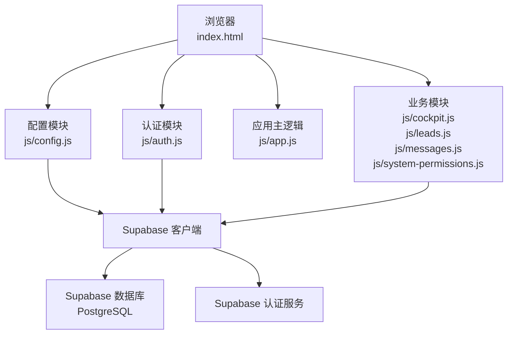
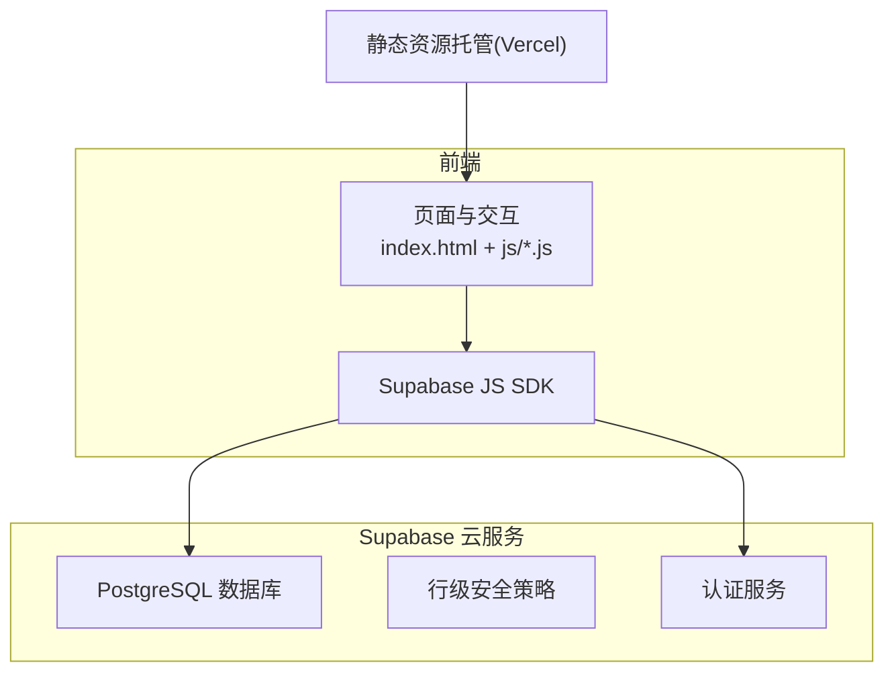
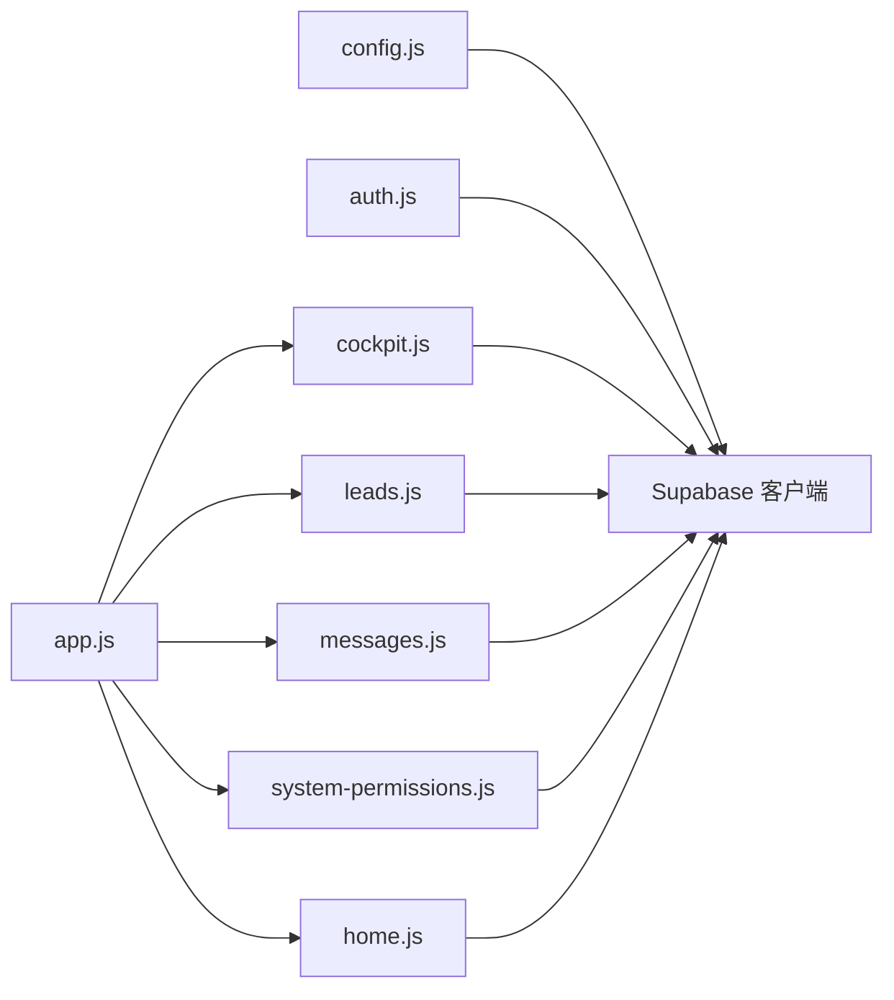

# 监控与维护

<cite>
**本文引用的文件**
- [README.md](file://README.md)
- [DEPLOY.md](file://DEPLOY.md)
- [database-setup.sql](file://database-setup.sql)
- [index.html](file://index.html)
- [js/config.js](file://js/config.js)
- [js/auth.js](file://js/auth.js)
- [js/cloud-storage.js](file://js/cloud-storage.js)
- [js/app.js](file://js/app.js)
- [js/cockpit.js](file://js/cockpit.js)
- [js/leads.js](file://js/leads.js)
- [js/home.js](file://js/home.js)
- [js/messages.js](file://js/messages.js)
- [js/system-permissions.js](file://js/system-permissions.js)
- [css/style.css](file://css/style.css)
</cite>

## 目录
1. [简介](#简介)
2. [项目结构](#项目结构)
3. [核心组件](#核心组件)
4. [架构总览](#架构总览)
5. [详细组件分析](#详细组件分析)
6. [依赖关系分析](#依赖关系分析)
7. [性能考量](#性能考量)
8. [故障排除指南](#故障排除指南)
9. [结论](#结论)
10. [附录](#附录)

## 简介
本指南面向“陈苗系统”的运维与维护，围绕 Supabase 数据库监控、应用性能监控、日常维护任务、故障排除、版本升级与数据迁移、以及成本控制与资源优化等方面，提供可操作的实践建议。系统采用前端纯静态页面 + Supabase 云端数据库与认证的架构，前端通过 Supabase JS SDK 与后端交互。

## 项目结构
系统主要由以下部分组成：
- 前端页面与样式：index.html、css 样式文件
- 前端业务模块：js 目录下的多个模块文件，负责认证、数据展示、权限管理等
- Supabase 配置与初始化：js/config.js
- 数据库初始化脚本：database-setup.sql
- 部署与使用文档：README.md、DEPLOY.md

**图示来源**
- [index.html:1-381](file://index.html#L1-L381)
- [js/config.js:1-20](file://js/config.js#L1-L20)
- [js/auth.js:1-259](file://js/auth.js#L1-L259)
- [js/app.js:1-156](file://js/app.js#L1-L156)
- [js/cockpit.js:1-624](file://js/cockpit.js#L1-L624)
- [js/leads.js:1-679](file://js/leads.js#L1-L679)
- [js/messages.js:1-369](file://js/messages.js#L1-L369)
- [js/system-permissions.js:1-323](file://js/system-permissions.js#L1-L323)

**章节来源**
- [README.md:48-65](file://README.md#L48-L65)
- [DEPLOY.md:3-7](file://DEPLOY.md#L3-L7)

## 核心组件
- Supabase 配置与客户端初始化：负责加载 SDK 并创建客户端实例，提供云端能力开关与降级处理
- 认证模块：负责登录、注册、登出、会话监听与UI切换
- 应用主逻辑：负责页面路由、菜单切换、模块生命周期管理
- 业务模块：驾驶舱、线索管理、消息、权限管理等，承载具体功能
- 数据库初始化脚本：定义表结构、索引、行级安全策略与触发器

**章节来源**
- [js/config.js:1-20](file://js/config.js#L1-L20)
- [js/auth.js:1-259](file://js/auth.js#L1-L259)
- [js/app.js:1-156](file://js/app.js#L1-L156)
- [js/cockpit.js:1-624](file://js/cockpit.js#L1-L624)
- [js/leads.js:1-679](file://js/leads.js#L1-L679)
- [js/messages.js:1-369](file://js/messages.js#L1-L369)
- [js/system-permissions.js:1-323](file://js/system-permissions.js#L1-L323)
- [database-setup.sql:1-148](file://database-setup.sql#L1-L148)

## 架构总览
系统采用“前端静态托管 + Supabase 云服务”的轻量架构。前端通过 Supabase JS SDK 与数据库和认证服务交互；Supabase 提供 PostgreSQL 数据库存储与行级安全策略（RLS），以及基于 JWT 的认证服务。

**图示来源**
- [DEPLOY.md:3-7](file://DEPLOY.md#L3-L7)
- [README.md:9-12](file://README.md#L9-L12)

## 详细组件分析

### Supabase 数据库监控与维护
- 查询性能分析
  - 建议在 Supabase Dashboard 的 SQL Editor 中执行 EXPLAIN/EXPLAIN ANALYZE，结合业务热点查询（如按用户过滤的列表查询）评估索引效果
  - 关注 customers、contracts、finances、invoices 等表的查询路径，必要时增加复合索引或调整现有索引
- 存储空间监控
  - 定期在 Supabase Dashboard 的 Project Settings 中查看数据库大小与使用情况
  - 结合业务增长趋势预估容量，必要时升级 Supabase 计划
- 用户活动跟踪
  - 利用 Supabase 的审计日志与访问日志（若开启）追踪用户行为
  - 通过 RLS 策略确保数据隔离，避免越权访问
- 行级安全策略与触发器
  - 数据库初始化脚本已启用 RLS 并为各表设置策略，确保每个用户仅能访问自身数据
  - 触发器自动维护 updated_at 字段，便于追踪数据变更时间

**章节来源**
- [database-setup.sql:66-148](file://database-setup.sql#L66-L148)
- [DEPLOY.md:191-198](file://DEPLOY.md#L191-L198)

### 应用性能监控（前端）
- 加载与交互性能
  - 使用浏览器开发者工具的 Performance 面板录制页面加载与关键交互（如切换模块、渲染图表）
  - 关注首屏渲染时间、模块懒加载与 Chart.js 渲染耗时
- 错误与异常监控
  - 在 js/config.js 中已内置 SDK 初始化失败的降级处理，建议在生产环境接入错误上报（如 Sentry）
  - 认证模块对会话异常与网络错误有基础处理，建议补充统一错误捕获与用户提示
- 用户体验监控
  - 通过页面切换与模块初始化的耗时，评估模块销毁与重建的开销
  - 驾驶舱模块使用 Chart.js 渲染图表，建议在大数据集场景下考虑分页或虚拟滚动

**章节来源**
- [js/config.js:8-19](file://js/config.js#L8-L19)
- [js/auth.js:36-48](file://js/auth.js#L36-L48)
- [js/app.js:85-135](file://js/app.js#L85-L135)
- [js/cockpit.js:342-408](file://js/cockpit.js#L342-L408)

### 日常维护任务清单
- 数据备份策略
  - 利用 Supabase 的备份与恢复功能，定期导出数据（SQL/CSV），并验证恢复流程
  - 对关键业务数据（如合同、财务）建立周期性导出与归档
- 安全更新
  - 定期更新 Supabase 项目凭据与密钥，确保匿名密钥与服务角色密钥分离
  - 检查并更新前端依赖（如 Chart.js、Supabase SDK）的安全版本
- 性能优化
  - 优化数据库索引与查询，减少全表扫描
  - 控制前端图表渲染规模，必要时引入分页或聚合
  - 使用静态资源缓存与 CDN 加速（Vercel 已提供）

**章节来源**
- [DEPLOY.md:191-198](file://DEPLOY.md#L191-L198)
- [database-setup.sql:66-76](file://database-setup.sql#L66-L76)

### 故障排除方法
- 常见错误诊断
  - “Supabase 未连接”：检查 js/config.js 中的 URL 与密钥是否正确，确认网络可达性
  - “登录后页面空白”：检查浏览器控制台错误，通常为配置错误或 SDK 未加载
  - “未登录”：检查会话是否过期，尝试重新登录
- 应急处理流程
  - 临时降级：在 js/config.js 中检测到 SDK 未加载时，系统进入本地模式，保障基本可用
  - 会话异常：认证模块监听 onAuthStateChange，发生 SIGNED_OUT 时自动回到登录页
  - 数据异常：通过 Supabase Dashboard 的 Table Editor 核对数据一致性，必要时回滚或修复

**章节来源**
- [js/config.js:8-19](file://js/config.js#L8-L19)
- [js/auth.js:36-53](file://js/auth.js#L36-L53)
- [DEPLOY.md:164-183](file://DEPLOY.md#L164-L183)

### 版本升级与数据迁移
- 版本升级
  - 前端：更新 js/*.js 与 css 文件，确保与最新 Supabase SDK 兼容
  - 后端：通过 Supabase Dashboard 的 SQL Editor 执行数据库迁移脚本，保持 RLS 与索引不变
- 数据迁移
  - 使用 Supabase 的导入/导出功能进行结构与数据迁移
  - 迁移前后核对数据完整性与查询性能，必要时重建索引

**章节来源**
- [DEPLOY.md:199-224](file://DEPLOY.md#L199-L224)
- [database-setup.sql:113-140](file://database-setup.sql#L113-L140)

### 成本控制与资源优化
- 成本说明
  - Supabase 免费版提供 500MB 数据库与 5 万月活用户，一般小团队完全够用
  - 建议按实际使用量评估升级计划，避免不必要的资源浪费
- 资源优化
  - 前端静态资源托管于 Vercel，充分利用缓存与边缘节点
  - 合理设计数据库索引，避免过度索引导致写入性能下降
  - 控制图表渲染规模，减少不必要的计算与 DOM 更新

**章节来源**
- [DEPLOY.md:191-198](file://DEPLOY.md#L191-L198)
- [database-setup.sql:66-76](file://database-setup.sql#L66-L76)

## 依赖关系分析
前端模块之间通过应用主逻辑进行编排，业务模块依赖 Supabase 客户端进行数据访问；认证模块贯穿整个应用生命周期。

**图示来源**
- [js/config.js:1-20](file://js/config.js#L1-L20)
- [js/auth.js:1-259](file://js/auth.js#L1-L259)
- [js/app.js:1-156](file://js/app.js#L1-L156)
- [js/cockpit.js:1-624](file://js/cockpit.js#L1-L624)
- [js/leads.js:1-679](file://js/leads.js#L1-L679)
- [js/messages.js:1-369](file://js/messages.js#L1-L369)
- [js/system-permissions.js:1-323](file://js/system-permissions.js#L1-L323)
- [js/home.js:1-266](file://js/home.js#L1-L266)

**章节来源**
- [js/app.js:50-135](file://js/app.js#L50-L135)

## 性能考量
- 前端性能
  - 模块化加载与延迟初始化，避免一次性渲染过多内容
  - 图表渲染建议分页或聚合，降低内存占用与重绘频率
- 数据库性能
  - 索引策略与查询优化，结合 EXPLAIN 分析热点查询
  - RLS 策略在保证安全的同时，关注查询成本
- 部署与缓存
  - 利用 Vercel 的边缘缓存与静态资源优化，减少带宽与延迟

[本节为通用指导，无需特定文件引用]

## 故障排除指南
- 配置类问题
  - 检查 js/config.js 中的 Supabase URL 与密钥是否正确
  - 确认浏览器控制台无 SDK 加载错误
- 认证类问题
  - 若出现“未登录”，检查会话状态与 onAuthStateChange 回调
  - 重新登录后刷新页面，确保数据同步
- 数据类问题
  - 使用 Supabase Dashboard 的 Table Editor 核对数据
  - 如需回滚，先备份再执行恢复脚本

**章节来源**
- [js/config.js:8-19](file://js/config.js#L8-L19)
- [js/auth.js:36-53](file://js/auth.js#L36-L53)
- [DEPLOY.md:164-183](file://DEPLOY.md#L164-L183)

## 结论
本指南提供了针对“陈苗系统”的监控与维护实践，涵盖 Supabase 数据库监控、前端性能与用户体验监控、日常维护任务、故障排除、版本升级与数据迁移、以及成本控制与资源优化。建议在生产环境中结合 Supabase 的审计与日志能力，持续优化查询与索引，并通过定期备份与演练保障数据安全与业务连续性。

[本节为总结性内容，无需特定文件引用]

## 附录
- Supabase 文档与技术支持链接
  - Supabase 文档：https://supabase.com/docs
  - Vercel 文档：https://vercel.com/docs

**章节来源**
- [README.md:129-131](file://README.md#L129-L131)
- [DEPLOY.md:215-220](file://DEPLOY.md#L215-L220)