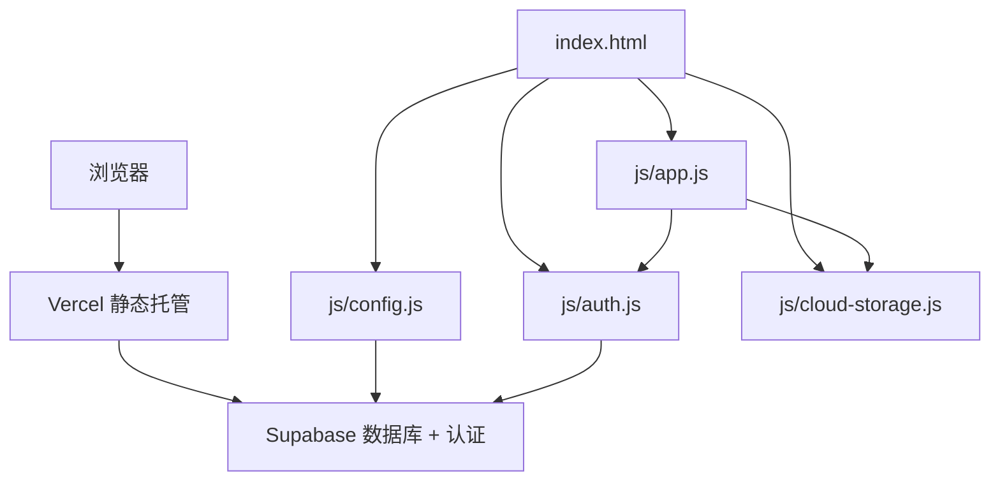
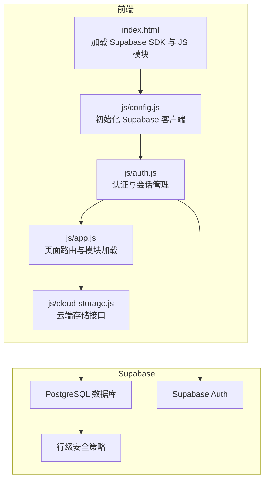
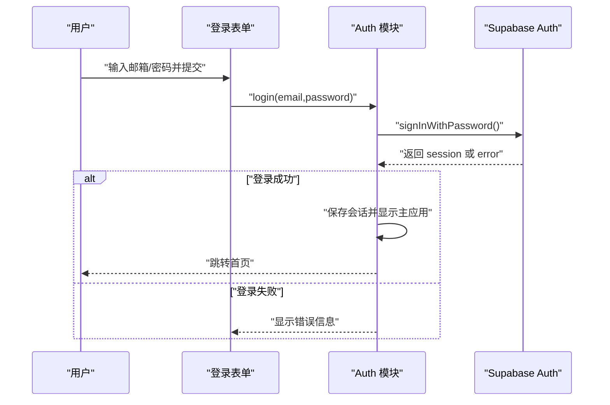
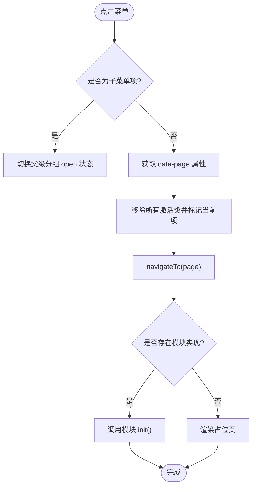
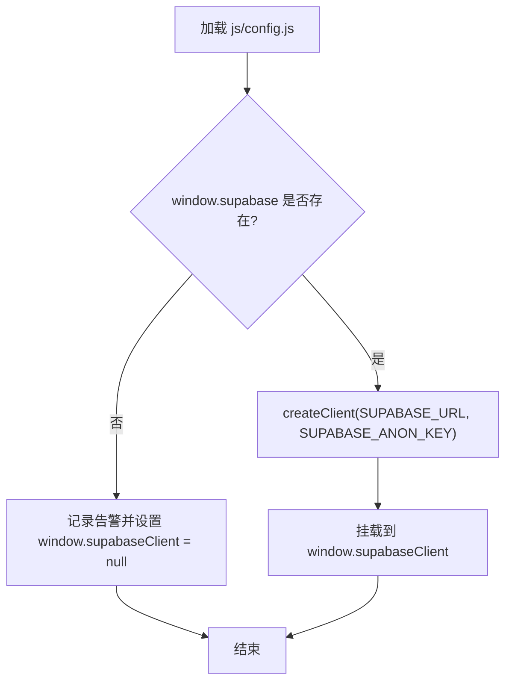
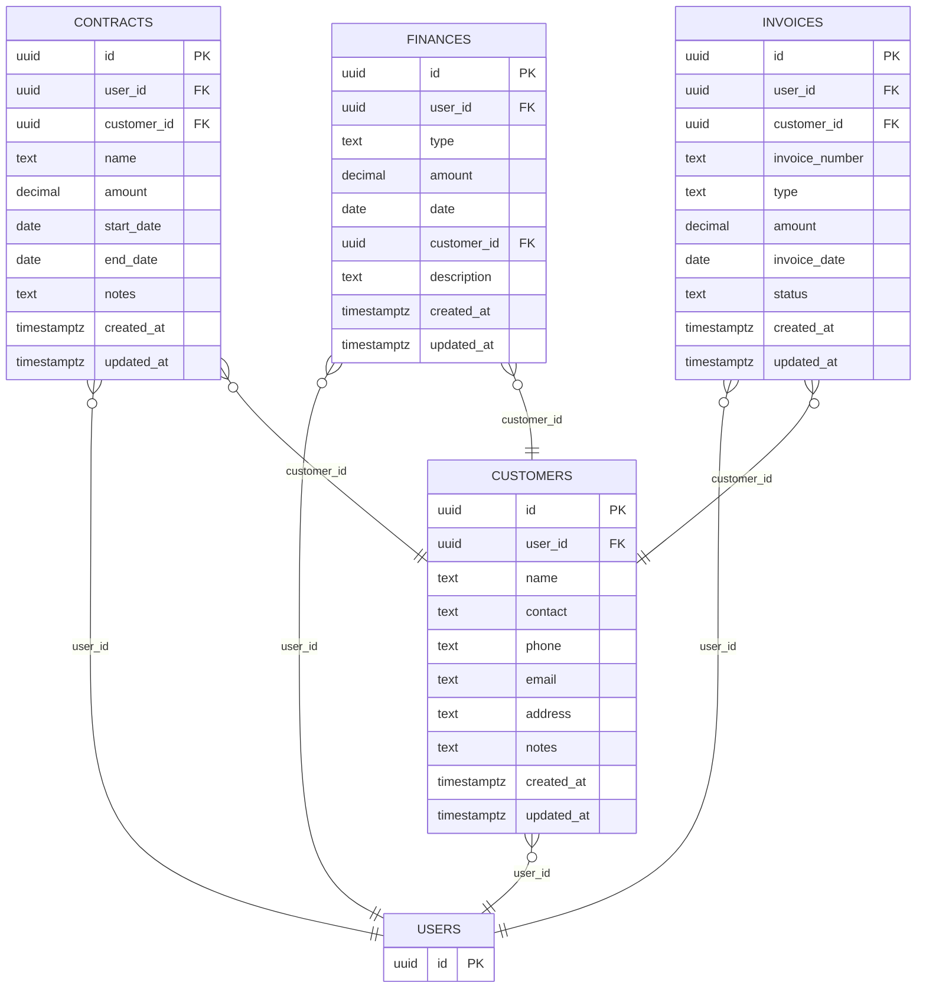
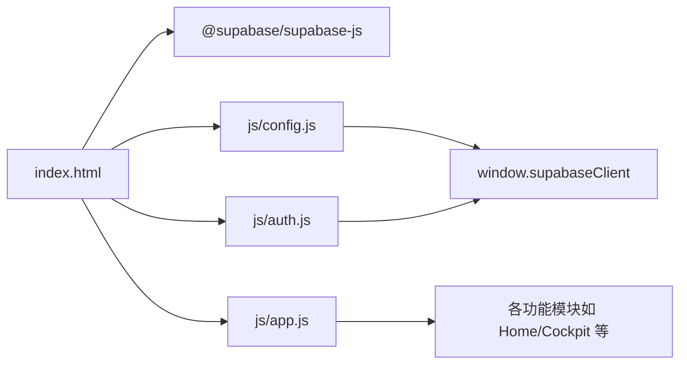

# 部署与运维

<cite>
**本文引用的文件**
- [README.md](file://README.md)
- [DEPLOY.md](file://DEPLOY.md)
- [快速入门.md](file://快速入门.md)
- [index.html](file://index.html)
- [js/config.js](file://js/config.js)
- [js/auth.js](file://js/auth.js)
- [js/cloud-storage.js](file://js/cloud-storage.js)
- [js/app.js](file://js/app.js)
- [css/style.css](file://css/style.css)
- [.gitignore](file://.gitignore)
- [database-setup.sql](file://database-setup.sql)
</cite>

## 目录
1. [简介](#简介)
2. [项目结构](#项目结构)
3. [核心组件](#核心组件)
4. [架构总览](#架构总览)
5. [详细组件分析](#详细组件分析)
6. [依赖关系分析](#依赖关系分析)
7. [性能考虑](#性能考虑)
8. [故障排除指南](#故障排除指南)
9. [结论](#结论)
10. [附录](#附录)

## 简介
本指南面向“陈苗系统”（财务CRM管理）的部署与运维，覆盖生产环境（Vercel + Supabase）、开发环境（本地调试）、版本与数据迁移、安全与备份、性能优化与容量规划，以及多环境与灰度发布的策略建议。系统采用纯前端架构，通过 Supabase 提供数据库与认证能力，前端通过 Vercel 静态托管。

## 项目结构
- 前端页面与资源
  - 入口页面：index.html
  - 样式：css/style.css、css/mt-style.css、css/hr-style.css
  - 脚本：js/config.js、js/auth.js、js/cloud-storage.js、js/app.js、js/*.js（模块化功能）
- 后端与数据库
  - Supabase：PostgreSQL 数据库 + Supabase Auth
  - 初始化脚本：database-setup.sql
- 文档与配置
  - README.md、DEPLOY.md、快速入门.md
  - .gitignore

**图示来源**
- [index.html:1-381](file://index.html#L1-L381)
- [js/config.js:1-20](file://js/config.js#L1-L20)
- [js/auth.js:1-259](file://js/auth.js#L1-L259)
- [js/cloud-storage.js:1-9](file://js/cloud-storage.js#L1-L9)
- [js/app.js:1-156](file://js/app.js#L1-L156)

**章节来源**
- [README.md:48-65](file://README.md#L48-L65)
- [index.html:1-381](file://index.html#L1-L381)

## 核心组件
- 配置模块（js/config.js）
  - 加载 Supabase SDK 并初始化客户端；若未加载则进入本地模式。
- 认证模块（js/auth.js）
  - 登录/注册/登出；监听认证状态变化；本地会话持久化；错误提示与加载态。
- 应用主逻辑（js/app.js）
  - 页面路由与模块化加载；菜单交互；占位页渲染；全局刷新仪表盘接口。
- 云存储模块（js/cloud-storage.js）
  - 云端可用性检测（当前为空实现，预留扩展）。
- 样式与页面（css/style.css、index.html）
  - 登录页与主应用布局、菜单、图标、样式资源版本参数等。

**章节来源**
- [js/config.js:1-20](file://js/config.js#L1-L20)
- [js/auth.js:1-259](file://js/auth.js#L1-L259)
- [js/app.js:1-156](file://js/app.js#L1-L156)
- [js/cloud-storage.js:1-9](file://js/cloud-storage.js#L1-L9)
- [css/style.css:1-200](file://css/style.css#L1-L200)
- [index.html:1-381](file://index.html#L1-L381)

## 架构总览
系统采用“前端静态 + Supabase 后端”的无服务器架构：
- 前端：Vercel 托管静态资源，浏览器直连 Supabase API。
- 后端：Supabase 提供数据库、认证、行级安全策略（RLS）与对象存储（可选）。
- 数据流：用户在浏览器中进行认证与操作，数据通过 Supabase 客户端写入数据库，实现多设备同步与数据隔离。

**图示来源**
- [index.html:11-12](file://index.html#L11-L12)
- [js/config.js:8-19](file://js/config.js#L8-L19)
- [js/auth.js:24-53](file://js/auth.js#L24-L53)
- [js/app.js:85-135](file://js/app.js#L85-L135)
- [database-setup.sql:78-107](file://database-setup.sql#L78-L107)

## 详细组件分析

### 组件A：认证与会话（js/auth.js）
- 初始化流程
  - 绑定登录/注册表单事件。
  - 优先读取本地会话；若无效则检查 Supabase 会话；监听认证状态变化。
- 登录/注册/登出
  - 使用 Supabase Auth 的密码登录与邮箱注册；登出后清除本地会话。
- 错误处理
  - 登录/注册异常捕获并提示；加载态遮罩。
- 本地测试账号
  - 提供测试账号逻辑以便本地调试。

**图示来源**
- [js/auth.js:57-65](file://js/auth.js#L57-L65)
- [js/auth.js:128-137](file://js/auth.js#L128-L137)

**章节来源**
- [js/auth.js:1-259](file://js/auth.js#L1-L259)

### 组件B：应用路由与页面加载（js/app.js）
- 菜单交互
  - 支持子菜单展开/收起与激活状态切换。
- 页面导航
  - 根据菜单点击加载对应模块（Home、Cockpit、HR、Finance、Multitable 等），未实现模块显示占位页。
- 清理与销毁
  - 离开页面时调用模块的 destroy 方法释放资源。
- 全局刷新
  - 暴露 refreshDashboard 接口供认证模块在登录后刷新仪表盘。

**图示来源**
- [js/app.js:50-83](file://js/app.js#L50-L83)
- [js/app.js:85-135](file://js/app.js#L85-L135)

**章节来源**
- [js/app.js:1-156](file://js/app.js#L1-L156)

### 组件C：Supabase 配置与初始化（js/config.js）
- 功能
  - 从全局加载 Supabase SDK 并创建客户端；若未加载则记录告警并进入本地模式。
- 注意
  - 生产部署前务必替换为真实项目 URL 与匿名密钥。

**图示来源**
- [js/config.js:8-19](file://js/config.js#L8-L19)

**章节来源**
- [js/config.js:1-20](file://js/config.js#L1-L20)

### 组件D：数据库与安全策略（database-setup.sql）
- 表结构
  - customers、contracts、finances、invoices，均包含 user_id 关联 Supabase auth.users，实现数据隔离。
- 索引
  - 针对 user_id、customer_id、type、date 等字段建立索引，提升查询性能。
- 行级安全策略（RLS）
  - 对四张表启用 RLS，并创建策略限制用户仅能访问自身数据。
- 触发器
  - 自动更新 updated_at 字段，保证数据变更时间一致性。

**图示来源**
- [database-setup.sql:10-63](file://database-setup.sql#L10-L63)
- [database-setup.sql:68-76](file://database-setup.sql#L68-L76)
- [database-setup.sql:78-107](file://database-setup.sql#L78-L107)
- [database-setup.sql:113-139](file://database-setup.sql#L113-L139)

**章节来源**
- [database-setup.sql:1-148](file://database-setup.sql#L1-L148)

## 依赖关系分析
- 前端依赖
  - index.html 引入 Supabase SDK 与多个 JS 模块；模块间通过 app.js 路由协调。
- 运行时依赖
  - js/config.js 依赖 window.supabase；js/auth.js 依赖 Supabase Auth；js/app.js 依赖各模块实现。
- 数据依赖
  - 所有业务数据通过 Supabase 写入数据库，RLS 保障隔离。

**图示来源**
- [index.html:11-12](file://index.html#L11-L12)
- [index.html:355-378](file://index.html#L355-L378)
- [js/config.js:8-19](file://js/config.js#L8-L19)
- [js/auth.js:24-53](file://js/auth.js#L24-L53)
- [js/app.js:85-135](file://js/app.js#L85-L135)

**章节来源**
- [index.html:1-381](file://index.html#L1-L381)
- [js/config.js:1-20](file://js/config.js#L1-L20)
- [js/auth.js:1-259](file://js/auth.js#L1-L259)
- [js/app.js:1-156](file://js/app.js#L1-L156)

## 性能考虑
- 静态资源优化
  - 使用 CDN 加速样式与脚本；为资源添加版本参数（如 ?v=3）以利用缓存。
- 查询性能
  - database-setup.sql 已创建关键索引；建议结合实际查询场景持续评估与补充索引。
- 前端渲染
  - app.js 的占位页与模块化加载避免一次性加载过多内容；建议对大列表分页或虚拟滚动。
- 网络与并发
  - 减少不必要的并发请求；对高频操作进行防抖与节流。
- 缓存策略
  - 利用浏览器缓存与 CDN 缓存；对不常变的静态资源设置较长缓存时间。

**章节来源**
- [index.html:7-10](file://index.html#L7-L10)
- [css/style.css:1-200](file://css/style.css#L1-L200)
- [database-setup.sql:68-76](file://database-setup.sql#L68-L76)
- [js/app.js:85-135](file://js/app.js#L85-L135)

## 故障排除指南
- 登录后页面空白
  - 检查浏览器控制台错误；通常为 js/config.js 配置错误或 Supabase SDK 未正确加载。
- 注册时报“邮箱已存在”
  - 使用未注册的邮箱；或直接登录已有账号。
- 添加数据时提示“未登录”
  - 会话过期，退出后重新登录。
- Supabase 连接失败
  - 确认 URL 与匿名密钥正确；检查网络与跨域设置；确认 Supabase 项目正常运行。
- 数据未同步
  - 确认使用 Supabase 模式而非本地模式；检查 RLS 策略与 user_id 关联。

**章节来源**
- [DEPLOY.md:164-183](file://DEPLOY.md#L164-L183)
- [js/config.js:12-19](file://js/config.js#L12-L19)
- [js/auth.js:50-53](file://js/auth.js#L50-L53)

## 结论
本指南提供了从零到一的部署与运维路径：基于 Vercel 的静态托管、Supabase 的认证与数据库、以及完善的开发与运维实践建议。遵循本文的配置、监控、安全与备份策略，可确保系统稳定、安全、可扩展地运行。

## 附录

### A. 生产环境部署流程（Vercel + Supabase）
- 步骤概览
  - 在 Supabase 创建项目并执行数据库初始化脚本。
  - 在 Vercel 导入仓库并部署；或使用 vercel CLI 命令行部署。
  - 在浏览器中验证注册、登录、数据保存与多设备同步。
- 参考
  - Supabase 项目创建、凭据获取、数据库初始化、邮箱认证启用。
  - 前端配置与本地测试。
  - 部署到 Vercel 的多种方式与验证清单。

**章节来源**
- [DEPLOY.md:9-45](file://DEPLOY.md#L9-L45)
- [DEPLOY.md:46-67](file://DEPLOY.md#L46-L67)
- [DEPLOY.md:68-112](file://DEPLOY.md#L68-L112)
- [DEPLOY.md:113-127](file://DEPLOY.md#L113-L127)

### B. 开发环境搭建与调试
- 本地开发
  - 直接双击打开 index.html 进行本地测试。
  - 使用浏览器开发者工具查看控制台与网络请求。
- 配置与调试
  - 修改 js/config.js 中的 Supabase URL 与匿名密钥。
  - 使用本地会话模拟与测试账号逻辑。
- 最佳实践
  - 使用 .gitignore 忽略 node_modules、.env、日志等文件。
  - 保持样式与脚本版本参数一致，便于缓存控制。

**章节来源**
- [快速入门.md:19-28](file://快速入门.md#L19-L28)
- [js/config.js:1-20](file://js/config.js#L1-L20)
- [js/auth.js:119-126](file://js/auth.js#L119-L126)
- [.gitignore:1-6](file://.gitignore#L1-L6)

### C. 版本管理与数据迁移
- 版本管理
  - 使用 Git 管理前端代码；在 Supabase 中通过 SQL Editor 执行数据库迁移脚本。
- 数据迁移
  - 新增/修改表结构或策略时，编写增量脚本并在测试环境验证后再在生产执行。
- 回滚策略
  - 保留最近一次迁移脚本快照；必要时回滚到上一个稳定版本。

**章节来源**
- [database-setup.sql:1-148](file://database-setup.sql#L1-L148)
- [DEPLOY.md:113-127](file://DEPLOY.md#L113-L127)

### D. 安全配置与备份策略
- 安全配置
  - 使用 HTTPS；启用 Supabase 的 RLS；限制匿名密钥权限；最小权限原则。
- 备份策略
  - 定期导出 Supabase 数据（可通过 SQL Editor 导出）；保留关键业务数据的备份副本。
- 日志与审计
  - 使用浏览器控制台与 Supabase 仪表盘监控错误与异常。

**章节来源**
- [README.md:88-94](file://README.md#L88-L94)
- [DEPLOY.md:175-183](file://DEPLOY.md#L175-L183)

### E. 性能优化与容量规划
- 前端
  - 合理拆分模块与懒加载；减少 DOM 操作；使用缓存与版本参数。
- 数据库
  - 基于索引与查询模式持续优化；监控慢查询；合理设计表结构。
- 容量规划
  - 参考免费额度与实际使用估算；超出后按需升级 Supabase/CDN。

**章节来源**
- [README.md:95-99](file://README.md#L95-L99)
- [database-setup.sql:68-76](file://database-setup.sql#L68-L76)

### F. 多环境与灰度发布策略
- 多环境
  - 开发/测试/预生产/生产四套环境；分别指向不同的 Supabase 项目与 Vercel 分支。
- 灰度发布
  - 通过 Vercel 的分支预览与域名管理，逐步放量；结合 Supabase 的 RLS 与数据隔离进行用户分批。
- 监控与回滚
  - 建立前端与后端监控指标；出现问题立即回滚至上一个稳定版本。

**章节来源**
- [DEPLOY.md:68-112](file://DEPLOY.md#L68-L112)