# 项目概述

<cite>
**本文档引用的文件**
- [README.md](file://README.md)
- [index.html](file://index.html)
- [js/config.js](file://js/config.js)
- [js/auth.js](file://js/auth.js)
- [js/cloud-storage.js](file://js/cloud-storage.js)
- [js/app.js](file://js/app.js)
- [js/home.js](file://js/home.js)
- [js/cockpit.js](file://js/cockpit.js)
- [js/leads.js](file://js/leads.js)
- [js/finance-journal.js](file://js/finance-journal.js)
- [css/style.css](file://css/style.css)
- [database-setup.sql](file://database-setup.sql)
- [DEPLOY.md](file://DEPLOY.md)
- [快速入门.md](file://快速入门.md)
</cite>

## 目录
1. [项目简介](#项目简介)
2. [项目结构](#项目结构)
3. [核心组件](#核心组件)
4. [架构概览](#架构概览)
5. [详细组件分析](#详细组件分析)
6. [依赖关系分析](#依赖关系分析)
7. [性能考虑](#性能考虑)
8. [故障排除指南](#故障排除指南)
9. [结论](#结论)
10. [附录](#附录)

## 项目简介

浙杭企服财务CRM管理系统是一个云端版的客户关系管理解决方案，专为财务公司设计。该项目实现了完整的云端数据存储、用户认证和多设备同步功能，为企业提供了一个现代化的财务管理平台。

### 核心目标
- 提供云端化的财务公司客户关系管理
- 实现用户认证和数据安全隔离
- 支持多设备实时数据同步
- 构建直观易用的财务管理工作流

### 主要功能特性
- **用户系统**: 邮箱注册/登录、会话管理、数据安全隔离
- **客户管理**: 客户信息录入、搜索、列表展示
- **合同管理**: 合同创建、状态跟踪、金额管理
- **财务管理**: 收入/支出记录、类型筛选、金额统计
- **发票管理**: 发票录入、类型管理、日期跟踪
- **数据看板**: 客户总数、合同总数、收入支出统计、趋势图表

### 技术架构选择
项目采用现代Web技术栈构建：
- **前端**: HTML5 + CSS3 + JavaScript (纯前端实现)
- **数据库**: Supabase PostgreSQL (云端数据库)
- **认证**: Supabase Auth (JWT会话认证)
- **部署**: Vercel (推荐静态托管)

### 与传统本地版本的区别
- **云端存储**: v2.0版本引入Supabase云端数据库，实现真正的云端数据持久化
- **用户认证**: 支持邮箱注册登录，而非本地存储模式
- **多设备同步**: 数据实时同步，跨设备访问一致
- **数据安全**: 行级安全策略(RLS)确保用户数据完全隔离
- **可扩展性**: 基于云原生架构，易于扩展和维护

## 项目结构

项目采用模块化架构设计，文件组织清晰，便于维护和扩展：

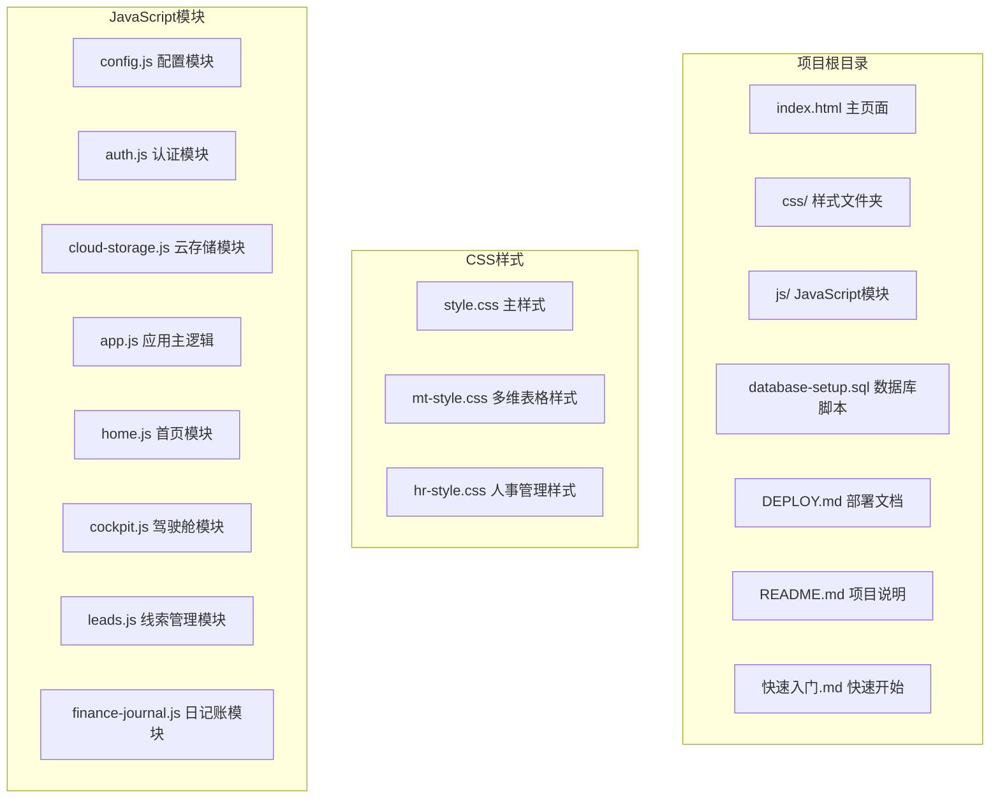

**图表来源**
- [index.html:1-381](file://index.html#L1-L381)
- [js/config.js:1-20](file://js/config.js#L1-L20)
- [js/auth.js:1-259](file://js/auth.js#L1-L259)

**章节来源**
- [README.md:48-65](file://README.md#L48-L65)
- [index.html:1-381](file://index.html#L1-L381)

## 核心组件

### 应用架构组件

项目采用模块化设计，每个功能模块都是独立的JavaScript对象，通过统一的应用路由系统进行管理：

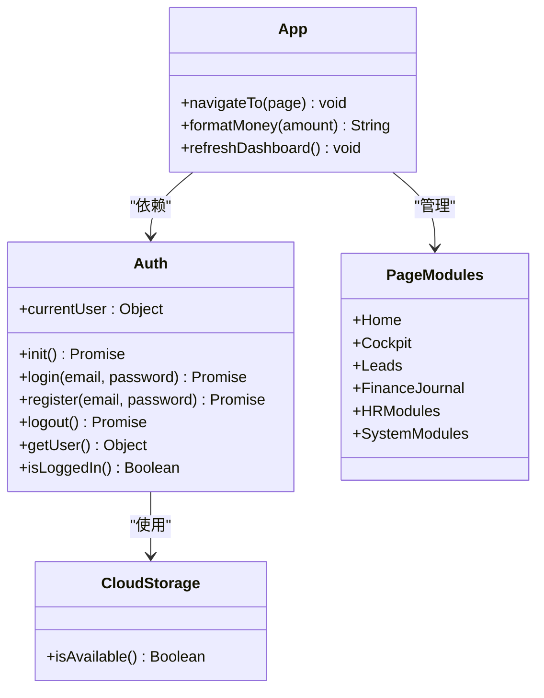

**图表来源**
- [js/auth.js:3-252](file://js/auth.js#L3-L252)
- [js/cloud-storage.js:4-8](file://js/cloud-storage.js#L4-L8)
- [js/app.js:3-155](file://js/app.js#L3-L155)

### 数据流架构

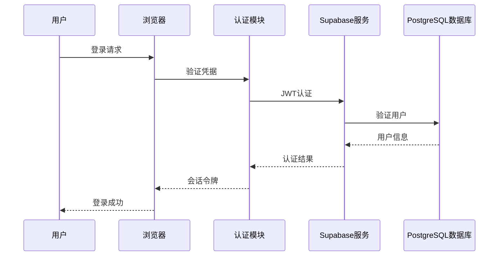

**图表来源**
- [js/auth.js:57-82](file://js/auth.js#L57-L82)
- [js/config.js:8-19](file://js/config.js#L8-L19)

**章节来源**
- [js/app.js:3-155](file://js/app.js#L3-L155)
- [js/auth.js:3-252](file://js/auth.js#L3-L252)

## 架构概览

### 系统架构图

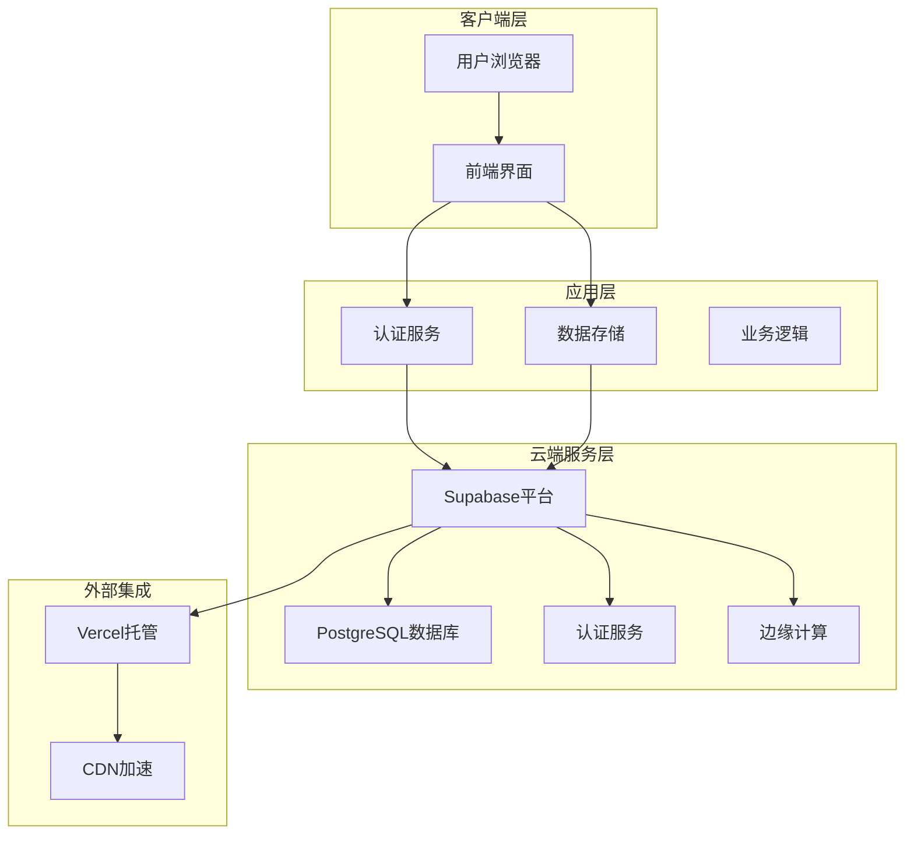

**图表来源**
- [DEPLOY.md:3-7](file://DEPLOY.md#L3-L7)
- [index.html:11-12](file://index.html#L11-L12)

### 技术栈决策说明

项目选择了以下技术栈组合，基于以下考虑：

1. **HTML5 + CSS3 + JavaScript**: 纯前端实现，无需服务器端逻辑，降低部署复杂度
2. **Supabase**: 提供完整的后端即服务(BaaS)解决方案，包括数据库、认证、存储
3. **Vercel**: 优秀的静态站点托管，支持CDN加速和全球分发
4. **Chart.js**: 专业的数据可视化库，满足财务看板需求

**章节来源**
- [README.md:7-12](file://README.md#L7-L12)
- [DEPLOY.md:106-111](file://DEPLOY.md#L106-L111)

## 详细组件分析

### 认证系统分析

认证系统是整个应用的核心安全组件，实现了完整的用户生命周期管理：

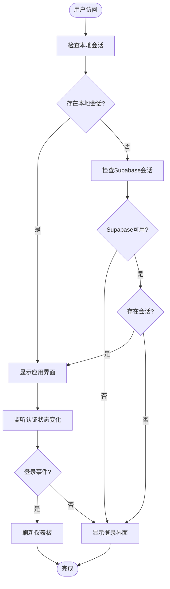

**图表来源**
- [js/auth.js:6-54](file://js/auth.js#L6-L54)
- [js/auth.js:36-48](file://js/auth.js#L36-L48)

#### 认证流程详解

1. **初始化阶段**: 系统首先检查本地存储的会话状态，如果不存在则尝试连接Supabase
2. **会话验证**: 通过Supabase的getSession方法验证当前用户的认证状态
3. **状态监听**: 注册onAuthStateChange回调，实时响应登录/登出事件
4. **界面切换**: 根据认证状态动态切换登录页和应用主界面

**章节来源**
- [js/auth.js:3-252](file://js/auth.js#L3-L252)

### 数据模型设计

系统基于Supabase PostgreSQL实现数据持久化，采用行级安全策略确保数据隔离：

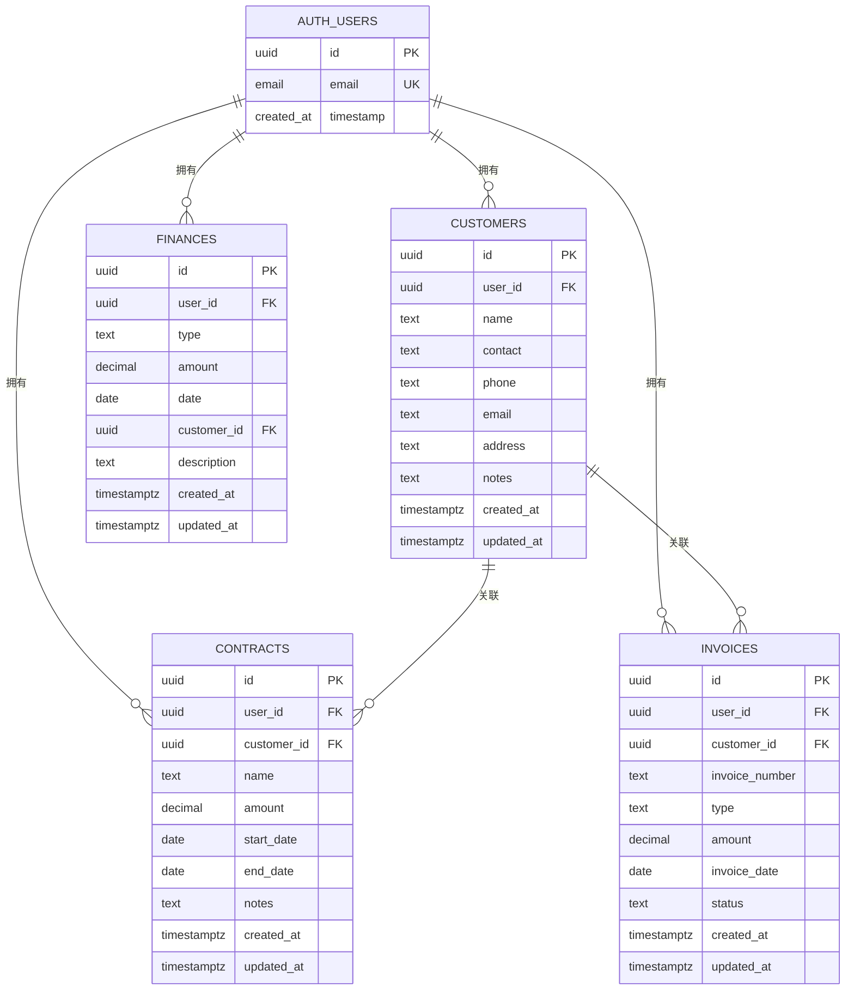

**图表来源**
- [database-setup.sql:10-63](file://database-setup.sql#L10-L63)

#### 数据安全机制

系统实现了多层次的数据安全保障：

1. **行级安全策略(RLS)**: 每个表都启用了RLS，确保用户只能访问自己的数据
2. **JWT认证**: 使用JSON Web Token进行无状态认证
3. **HTTPS传输**: 所有数据传输都经过加密保护
4. **用户隔离**: 通过user_id字段实现完全的数据隔离

**章节来源**
- [database-setup.sql:77-107](file://database-setup.sql#L77-L107)

### 业务模块分析

#### 首页模块 (Home)

首页模块提供了个性化的欢迎界面和快捷功能入口：

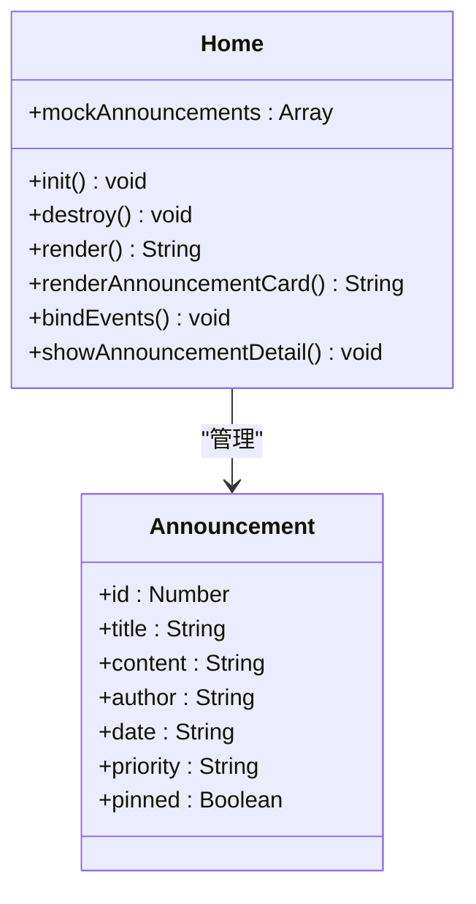

**图表来源**
- [js/home.js:8-266](file://js/home.js#L8-L266)

#### 老板驾驶舱 (Cockpit)

驾驶舱模块提供了丰富的数据分析和可视化功能：

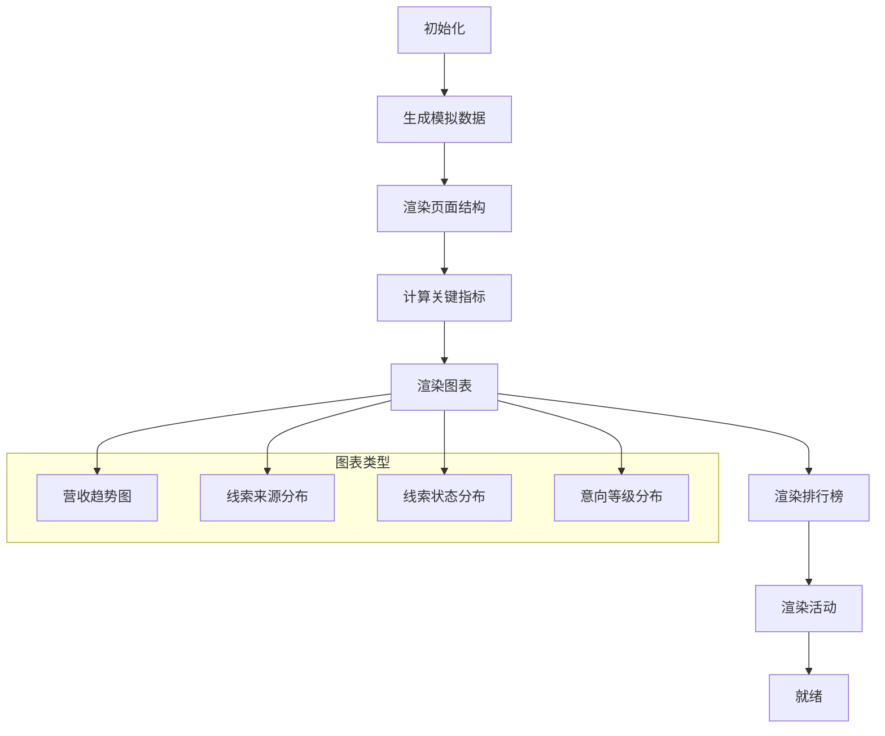

**图表来源**
- [js/cockpit.js:214-624](file://js/cockpit.js#L214-L624)

#### 线索管理 (Leads)

线索管理模块实现了完整的销售线索生命周期管理：

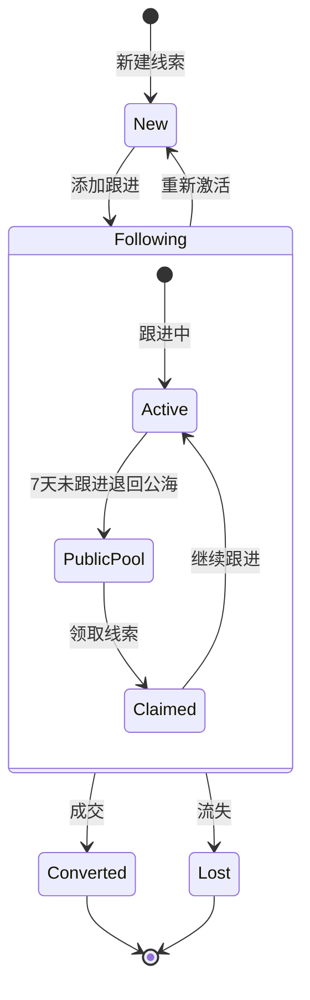

**图表来源**
- [js/leads.js:105-679](file://js/leads.js#L105-L679)

**章节来源**
- [js/home.js:8-266](file://js/home.js#L8-L266)
- [js/cockpit.js:214-624](file://js/cockpit.js#L214-L624)
- [js/leads.js:105-679](file://js/leads.js#L105-L679)

### 多维表格模块 (Finance Journal)

财务日记账模块提供了类似飞书多维表格的体验：

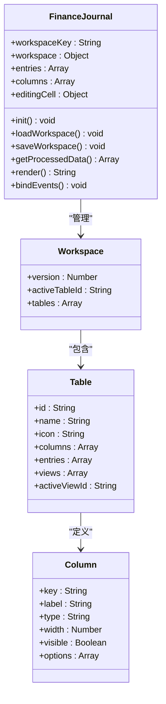

**图表来源**
- [js/finance-journal.js:4-800](file://js/finance-journal.js#L4-L800)

**章节来源**
- [js/finance-journal.js:4-800](file://js/finance-journal.js#L4-L800)

## 依赖关系分析

### 模块依赖图

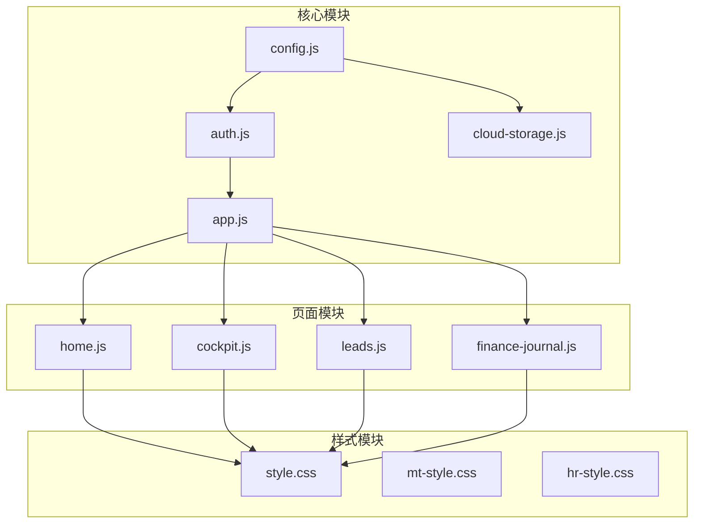

**图表来源**
- [js/config.js:1-20](file://js/config.js#L1-L20)
- [js/auth.js:1-259](file://js/auth.js#L1-L259)
- [js/app.js:1-156](file://js/app.js#L1-L156)

### 外部依赖

项目的主要外部依赖包括：

1. **Supabase SDK**: 提供数据库连接和认证功能
2. **Chart.js**: 用于数据可视化和图表渲染
3. **Font Awesome**: 提供图标字体支持
4. **Vercel**: 静态站点托管服务

**章节来源**
- [index.html:10-12](file://index.html#L10-L12)
- [index.html:354-378](file://index.html#L354-L378)

## 性能考虑

### 前端性能优化

1. **模块化加载**: 采用延迟加载策略，只在需要时加载对应模块
2. **内存管理**: 页面切换时正确销毁模块实例，释放内存资源
3. **DOM操作优化**: 最小化DOM操作次数，使用虚拟DOM概念
4. **缓存策略**: 合理使用localStorage缓存用户偏好设置

### 数据性能优化

1. **索引优化**: 为常用查询字段建立索引
2. **查询优化**: 使用WHERE条件限制查询范围
3. **分页处理**: 大数据集采用分页加载策略
4. **数据压缩**: 传输过程中进行数据压缩

### 云端性能优化

1. **CDN加速**: 通过Vercel的全球CDN节点加速静态资源加载
2. **数据库优化**: 合理设计表结构和索引
3. **连接池管理**: 优化数据库连接复用
4. **缓存策略**: 利用Supabase的缓存机制

## 故障排除指南

### 常见问题诊断

#### 认证相关问题

1. **登录失败**: 检查Supabase配置是否正确，网络连接是否正常
2. **会话丢失**: 确认浏览器是否允许第三方Cookie，检查localStorage权限
3. **JWT错误**: 验证Supabase项目配置，检查密钥有效性

#### 数据同步问题

1. **数据不同步**: 检查网络连接，确认Supabase服务状态
2. **数据丢失**: 验证RLS策略配置，确认用户权限
3. **查询超时**: 检查数据库索引，优化查询语句

#### 部署相关问题

1. **页面空白**: 检查浏览器控制台错误，确认资源路径正确
2. **静态资源加载失败**: 验证Vercel部署状态，检查CDN缓存
3. **认证失败**: 确认环境变量配置，检查防火墙设置

**章节来源**
- [DEPLOY.md:164-224](file://DEPLOY.md#L164-L224)

### 开发调试技巧

1. **浏览器开发者工具**: 使用Network标签监控API请求
2. **控制台日志**: 添加详细的错误日志输出
3. **断点调试**: 在关键逻辑处设置断点分析执行流程
4. **性能分析**: 使用Performance标签分析页面加载性能

## 结论

浙杭企服财务CRM管理系统是一个设计精良的云端财务管理系统，具有以下突出特点：

### 技术优势
- **架构清晰**: 模块化设计，职责分离明确
- **技术先进**: 采用最新的Web技术和云原生架构
- **扩展性强**: 基于Supabase的可扩展架构
- **开发友好**: 纯前端实现，降低开发复杂度

### 业务价值
- **功能完整**: 覆盖财务公司的核心业务场景
- **用户体验**: 现代化的界面设计和交互体验
- **数据安全**: 多层次的安全保障机制
- **成本效益**: 基于云的服务模式，降低运维成本

### 发展前景
项目已经完成了v2.0云端版的核心功能实现，为未来的功能扩展奠定了坚实基础。建议重点关注团队协作、角色权限管理和移动端支持等方向的升级。

## 附录

### 快速开始指南

1. **环境准备**: 确保有稳定的网络连接和现代浏览器
2. **Supabase配置**: 按照DEPLOY.md文档创建和配置Supabase项目
3. **本地测试**: 修改config.js配置，测试基本功能
4. **生产部署**: 部署到Vercel或其他静态托管服务

### 版本演进

- **v2.0 云端版**: 引入Supabase云端存储和用户认证
- **v1.0 本地版**: 纯前端实现，localStorage存储
- **未来规划**: 团队协作、角色权限、实时同步等功能

### 支持资源

- **官方文档**: Supabase和Vercel官方文档
- **社区支持**: GitHub Issues和社区讨论
- **技术支持**: 按需提供定制化开发服务

**章节来源**
- [README.md:101-135](file://README.md#L101-L135)
- [快速入门.md:1-61](file://快速入门.md#L1-L61)